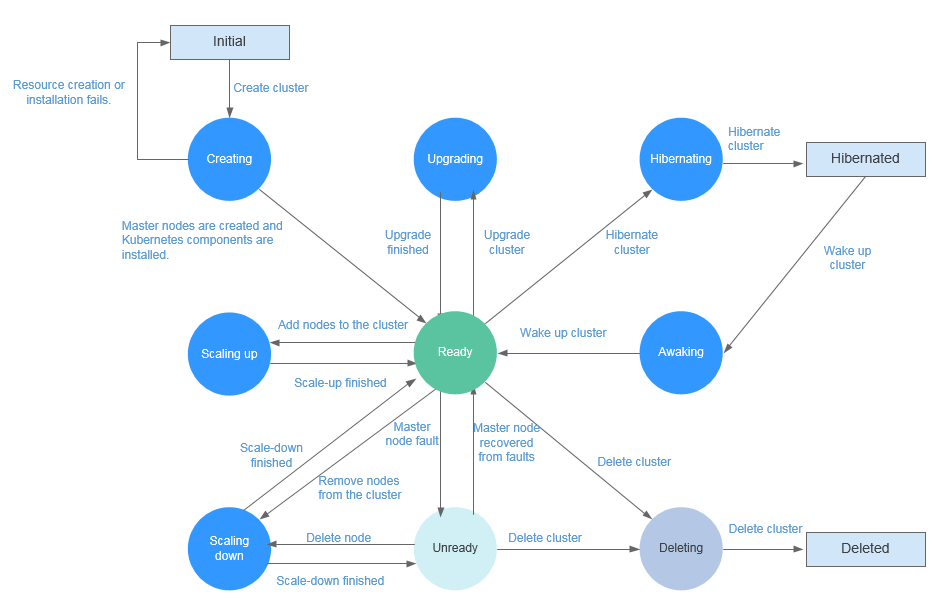

# Cluster Lifecycle

This section describes the status of each cluster lifecycle, helping you understand the running status of the cluster in different phases.

**Table  1**  Cluster status description

<table><thead align="left"><tr id="row222012402006"><th class="cellrowborder" valign="top" width="26%" id="mcps1.2.3.1.1">
Status

</th>
<th class="cellrowborder" valign="top" width="74%" id="mcps1.2.3.1.2">
Description

</th>
</tr>
</thead>
<tbody><tr id="row6220640203"><td class="cellrowborder" valign="top" width="26%" headers="mcps1.2.3.1.1 ">
Creating

</td>
<td class="cellrowborder" valign="top" width="74%" headers="mcps1.2.3.1.2 ">
A cluster is being created and is applying for cloud resources.

</td>
</tr>
<tr id="row1822020409010"><td class="cellrowborder" valign="top" width="26%" headers="mcps1.2.3.1.1 ">
Normal

</td>
<td class="cellrowborder" valign="top" width="74%" headers="mcps1.2.3.1.2 ">
The cluster is running properly.

</td>
</tr>
<tr id="row14220840606"><td class="cellrowborder" valign="top" width="26%" headers="mcps1.2.3.1.1 ">
Scaling-out

</td>
<td class="cellrowborder" valign="top" width="74%" headers="mcps1.2.3.1.2 ">
A node is being added to the cluster.

</td>
</tr>
<tr id="row12220440503"><td class="cellrowborder" valign="top" width="26%" headers="mcps1.2.3.1.1 ">
Scaling-in

</td>
<td class="cellrowborder" valign="top" width="74%" headers="mcps1.2.3.1.2 ">
A node is being deleted from the cluster.

</td>
</tr>
<tr id="row1224521014401"><td class="cellrowborder" valign="top" width="26%" headers="mcps1.2.3.1.1 ">
Hibernating

</td>
<td class="cellrowborder" valign="top" width="74%" headers="mcps1.2.3.1.2 ">
The cluster is hibernating.

</td>
</tr>
<tr id="row1450522112209"><td class="cellrowborder" valign="top" width="26%" headers="mcps1.2.3.1.1 ">
Awaking

</td>
<td class="cellrowborder" valign="top" width="74%" headers="mcps1.2.3.1.2 ">
The cluster is being woken up.

</td>
</tr>
<tr id="row13614111762019"><td class="cellrowborder" valign="top" width="26%" headers="mcps1.2.3.1.1 ">
Upgrading

</td>
<td class="cellrowborder" valign="top" width="74%" headers="mcps1.2.3.1.2 ">
The cluster is being upgraded.

</td>
</tr>
<tr id="row142095617205"><td class="cellrowborder" valign="top" width="26%" headers="mcps1.2.3.1.1 ">
Unavailable

</td>
<td class="cellrowborder" valign="top" width="74%" headers="mcps1.2.3.1.2 ">
The current cluster is unavailable.

</td>
</tr>
<tr id="row2056716914216"><td class="cellrowborder" valign="top" width="26%" headers="mcps1.2.3.1.1 ">
Deleting

</td>
<td class="cellrowborder" valign="top" width="74%" headers="mcps1.2.3.1.2 ">
The cluster is being deleted.

</td>
</tr>
</tbody>
</table>

**Figure  1**  Cluster status transition  

