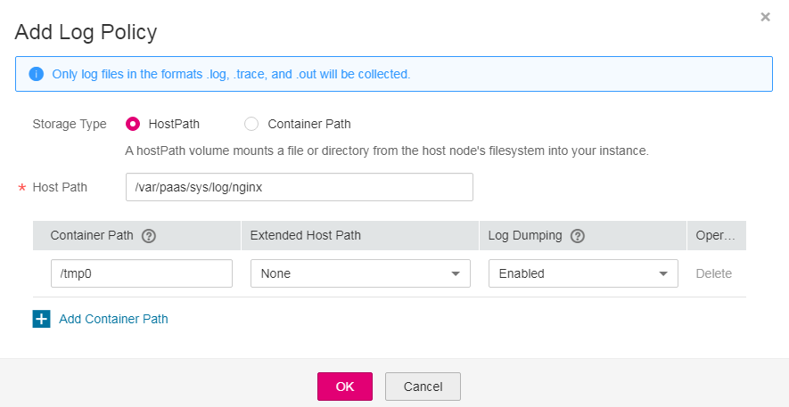

# Collecting Container Logs from Specified Paths

CCE allows you to configure policies for collecting, managing, and analyzing workload logs periodically to prevent logs from being over-sized.

This section describes how to collect container logs from specified paths. If you want to collect standard output logs of containers, see  [Collecting Standard Output Logs of Containers](collecting-standard-output-logs-of-containers.md).

## Procedure

1.  When creating a  containerized workload, add a  container. Then, expand  **Log Policies**.

    **Figure  1**  Container logs  
    

2.  In the  **Log Policies**  area, click  **Add Log Policy**. Configure parameters in the log policy. The following uses Nginx as an example.

    **Figure  2**  Adding log policies  
    

3.  Set  **Storage Type**. There are two storage types:  **Host Path**  and  **Container Path**.
    -   **Host Path**: You can mount a path on the host to a specified container path. Set the log policy parameters as follows:

        **Table  1**  Parameters for adding log policies \(Host Path\)

        
        <table><thead align="left"><tr id="row45851074554"><th class="cellrowborder" valign="top" width="22.12%" id="mcps1.2.3.1.1">
Parameter

        </th>
        <th class="cellrowborder" valign="top" width="77.88000000000001%" id="mcps1.2.3.1.2">
Description

        </th>
        </tr>
        </thead>
        <tbody><tr id="row1458511725510"><td class="cellrowborder" valign="top" width="22.12%" headers="mcps1.2.3.1.1 ">
Storage Type

        </td>
        <td class="cellrowborder" valign="top" width="77.88000000000001%" headers="mcps1.2.3.1.2 ">
Set this parameter to <strong id="b15588848114310">Host Path</strong>.

        </td>
        </tr>
        <tr id="row75867795518"><td class="cellrowborder" colspan="2" valign="top" headers="mcps1.2.3.1.1 mcps1.2.3.1.2 ">
<strong id="b17502441102718">Add Container Path</strong>

        </td>
        </tr>
        <tr id="row19587147165512"><td class="cellrowborder" valign="top" width="22.12%" headers="mcps1.2.3.1.1 ">
Container Path

        </td>
        <td class="cellrowborder" valign="top" width="77.88000000000001%" headers="mcps1.2.3.1.2 ">
Container path (for example, <strong id="b8656121314711">/tmp</strong>) to which the host path volume will be mounted.
 NOTICE: 
<ul id="ul14587570556"><li>The container path cannot be a system directory, such as <strong id="b129971541125317">/</strong> or <strong id="b109981941175318">/var/run</strong>. Otherwise, the container may not function properly. You are advised to mount the container to an empty directory. If the directory is not empty, ensure that there are no files affecting container startup in the directory. Otherwise, such files will be replaced, resulting in failures to start the container and create the workload.</li><li>When the container is mounted to a high-risk directory, you are advised to use an account with minimum permissions to start the container; otherwise, high-risk files on the host machine may be damaged.</li></ul>
        

        

        </td>
        </tr>
        <tr id="row6588187135510"><td class="cellrowborder" valign="top" width="22.12%" headers="mcps1.2.3.1.1 ">
Extended Host Path

        </td>
        <td class="cellrowborder" valign="top" width="77.88000000000001%" headers="mcps1.2.3.1.2 ">
A level-3 directory is added to the original volume directory/subdirectory. You can easily obtain the files output by a single Pod.

        <ul id="ul1358877135514"><li><strong id="b67128281231">None</strong>: No extended path is configured.</li><li><strong id="b37109352310">PodUID</strong>: ID of a pod.</li><li><strong id="b1246417411639">PodName</strong>: name of a pod.</li><li><strong id="b1232314820315">PodUID/ContainerName</strong>: ID of a pod or name of a container.</li><li><strong id="b15921753534">PodName/ContainerName</strong>: name of a pod or container.</li></ul>
        </td>
        </tr>
        <tr id="row85891275552"><td class="cellrowborder" valign="top" width="22.12%" headers="mcps1.2.3.1.1 ">
Log Dumping

        </td>
        <td class="cellrowborder" valign="top" width="77.88000000000001%" headers="mcps1.2.3.1.2 ">
Log files in <strong id="b1261316312237">.log</strong>, <strong id="b196131313230">.trace</strong>, and <strong id="b1561316372312">.out</strong> formats can be collected.

        <ul id="ul1261353202317"><li><strong id="b861310319237">Enabled</strong>: A log file larger than 50 MB will be dumped and a maximum of 20 dump files will be retained.</li></ul>
        <ul id="ul18126151412317"><li><strong id="b196131038235">Disabled</strong>: The default Docker dumping mechanism is used.</li></ul>
        </td>
        </tr>
        </tbody>
        </table>

    -   **Container Path**: Logs are exported only to the container path. You do not need to mount the host path. Set the log policy parameters as follows:

        > **NOTE:**   
        >This function requires that the ICAgent be upgraded to 5.10.79 or a later version.  

        **Table  2**  Parameters for adding log policies \(Container Path\)

        
        <table><thead align="left"><tr id="row1739912520361"><th class="cellrowborder" valign="top" width="22.08%" id="mcps1.2.3.1.1">
Parameter

        </th>
        <th class="cellrowborder" valign="top" width="77.92%" id="mcps1.2.3.1.2">
Description

        </th>
        </tr>
        </thead>
        <tbody><tr id="row12882033163811"><td class="cellrowborder" valign="top" width="22.08%" headers="mcps1.2.3.1.1 ">
Storage Type

        </td>
        <td class="cellrowborder" valign="top" width="77.92%" headers="mcps1.2.3.1.2 ">
Set this parameter to <strong id="b341864818552">Container Path</strong>.

        </td>
        </tr>
        <tr id="row1440272519365"><td class="cellrowborder" colspan="2" valign="top" headers="mcps1.2.3.1.1 mcps1.2.3.1.2 ">
<strong id="b2116925853">Add Container Path</strong>

        </td>
        </tr>
        <tr id="row19403122523618"><td class="cellrowborder" valign="top" width="22.08%" headers="mcps1.2.3.1.1 ">
Container Path

        </td>
        <td class="cellrowborder" valign="top" width="77.92%" headers="mcps1.2.3.1.2 ">
Container path (for example, <strong id="b6256372566">/tmp</strong>) to which the host path volume will be mounted.
 NOTICE: 
<ul id="ul540382573617"><li>The container path cannot be a system directory, such as <strong id="b16693194125613">/</strong> or <strong id="b116957413565">/var/run</strong>. Otherwise, the container may not function properly. You are advised to mount the container to an empty directory. If the directory is not empty, ensure that there are no files affecting container startup in the directory. Otherwise, such files will be replaced, resulting in failures to start the container and create the workload.</li><li>If the file system is mounted to a high-risk directory, you are advised to use an account with minimum permissions to start the container; otherwise, high-risk files on the host machine may be damaged.</li></ul>
        

        

        </td>
        </tr>
        <tr id="row1840532563617"><td class="cellrowborder" valign="top" width="22.08%" headers="mcps1.2.3.1.1 ">
Log Dumping

        </td>
        <td class="cellrowborder" valign="top" width="77.92%" headers="mcps1.2.3.1.2 ">
Log files in the format of .log, .trace, and .out. are supported. If the size of a log file is greater than 50 MB, a maximum of 20 files are dumped.

        <ul id="ul12405325153613"><li><strong id="b4724126135720">Enabled</strong>: Log files are dumped.</li><li><strong id="b28101931194413">Disabled</strong>: Log files are not dumped.</li></ul>
        </td>
        </tr>
        </tbody>
        </table>

4.  Click  **OK**.
5.  View logs.

    After the workload is created, access Nginx. Go to the workload details page and click the  **Log**  button in the upper right corner to view the log details.

