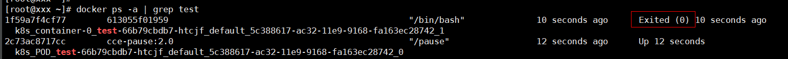
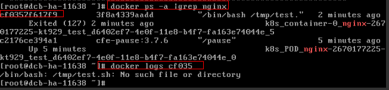
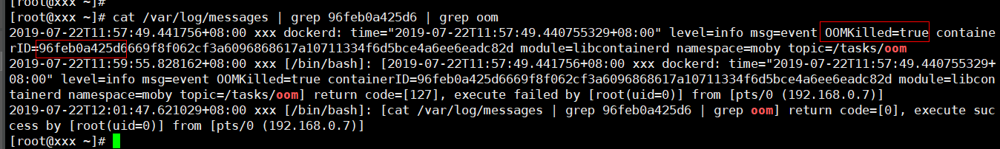
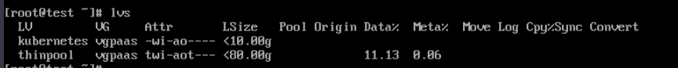
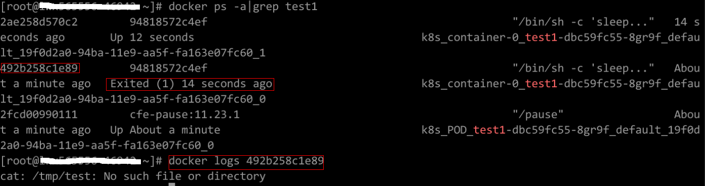

# Failed to Restart a Container<a name="cce_faq_00018"></a>

On the details page of a workload, if an event is displayed indicating that the container fails to be restarted, perform the following operations to locate the fault:

1.  Log in to the node where the abnormal workload is located.
2.  Check the ID of the container where the workload pod exits abnormally.

    ```
    docker ps -a | grep $podName
    ```

3.  View the logs of the corresponding container.

    ```
    docker logs $containerID
    ```

    Rectify the fault of the workload based on logs.

4.  Check the error logs.

    ```
    cat /var/log/messages | grep $containerID  | grep oom
    ```

    Check whether the system OOM is triggered based on the logs.


## Fault Locating<a name="en-us_topic_0242566252_section1120918586517"></a>

-   [Check Item 1: Whether There Are Processes that Keep Running in the Container](#en-us_topic_0242566252_section2524165018111)
-   [Check Item 2: Whether Health Check Fails to Be Performed](#en-us_topic_0242566252_section1766510426482)
-   [Check Item 3: Whether the User Service Has a Bug](#en-us_topic_0242566252_section1833513213713)
-   [Check Item 4: Whether the Upper Limit of Container Resources Has Been Reached](#en-us_topic_0242566252_section060854916109)
-   [Check Item 5: Whether the Container Disk Space Is Insufficient](#en-us_topic_0242566252_section169421237111219)
-   [Check Item 6: Whether the Resource Limits Are Improperly Set for the Container](#en-us_topic_0242566252_section1548114151414)
-   [Check Item 7: Whether the Container Ports in the Same Pod Conflict with Each Other](#en-us_topic_0242566252_section17679197145618)
-   [Check Item 8: Whether the Container Startup Command Is Correctly Configured](#en-us_topic_0242566252_section1842111295128)

## Check Item 1: Whether There Are Processes that Keep Running in the Container<a name="en-us_topic_0242566252_section2524165018111"></a>

1.  Log in to the node where the abnormal workload is located.
2.  View the container status.

    ```
    docker ps -a | grep $podName
    ```

    Example:

    

    If no running process in the container, the status code  **Exited \(0\)**  is displayed.


## Check Item 2: Whether Health Check Fails to Be Performed<a name="en-us_topic_0242566252_section1766510426482"></a>

The health check configured for a workload is performed on services periodically. If an exception occurs, the pod reports an event and the pod fails to be restarted.

If the liveness-type \(workload liveness probe\) health check is configured for the workload and the number of health check failures exceeds the threshold, the containers in the pod will be restarted. On the workload details page, if K8s events contain  **Liveness probe failed: Get http...**, the health check fails.

**Solution**

On the workload details page, choose  **Upgrade**  \>  **Advanced Settings**  \>  **Health Check**  to check whether the health check policy is properly set and whether services are normal.

## Check Item 3: Whether the User Service Has a Bug<a name="en-us_topic_0242566252_section1833513213713"></a>

Check whether the workload startup command is correctly executed or whether the workload has a bug.

1.  Log in to the node where the abnormal workload is located.
2.  Check the ID of the container where the workload pod exits abnormally.

    ```
    docker ps -a | grep $podName
    ```

3.  View the logs of the corresponding container.

    ```
    docker logs $containerID
    ```

    Note: In the preceding command,  **containerID**  indicates the ID of the container that has exited.

    **Figure  1**  Incorrect startup command of the container<a name="en-us_topic_0242566252_fig13787193210479"></a>  
    

    As shown above, the container fails to be started due to an incorrect startup command. For other errors, rectify the bugs based on the logs.

    Solution: Re-create a workload and configure a correct startup command.


## Check Item 4: Whether the Upper Limit of Container Resources Has Been Reached<a name="en-us_topic_0242566252_section060854916109"></a>

If the upper limit of container resources has been reached, OOM will be displayed in the event details as well as in the log:

```
cat /var/log/messages | grep 96feb0a425d6 | grep oom
```



When a workload is created, if the requested resources exceed the configured upper limit, the system OOM is triggered and the container exits unexpectedly.

## Check Item 5: Whether the Container Disk Space Is Insufficient<a name="en-us_topic_0242566252_section169421237111219"></a>

The following message refers to the Thin Pool disk that is allocated from the Docker disk selected during node creation. You can run the  **lvs**  command as user  **root**  to view the current disk usage.

```
Thin Pool has 15991 free data blocks which is less than minimum required 16383 free data blocks. Create more free space in thin pool or use dm.min_free_space option to change behavior
```



**Solution**

1.  Release used disk space.

    ```
    docker rmi -f `docker images | grep 20202 | awk '{print $3}'` 
    ```

2.  Expand the disk capacity. For details, see the method of expanding the data disk capacity of a node.

## Check Item 6: Whether the Resource Limits Are Improperly Set for the Container<a name="en-us_topic_0242566252_section1548114151414"></a>

If the resource limits set for the container during workload creation are less than required, the container fails to be restarted.

```
Back-off restarting failed container
```

**Solution**

Modify the container specifications.

## Check Item 7: Whether the Container Ports in the Same Pod Conflict with Each Other<a name="en-us_topic_0242566252_section17679197145618"></a>

1.  Log in to the node where the abnormal workload is located.
2.  Check the ID of the container where the workload pod exits abnormally.

    **docker ps -a | grep **_$podName_

3.  View the logs of the corresponding container.

    **docker logs **_$containerID_

    Rectify the fault of the workload based on logs. As shown in the following figure, container ports in the same pod conflict. As a result, the container fails to be started.

    **Figure  2**  Container restart failure due to a container port conflict<a name="en-us_topic_0242566252_fig15903038171615"></a>  
    


**Solution**

Re-create the workload and set a port number that is not used by any other pod.

## Check Item 8: Whether the Container Startup Command Is Correctly Configured<a name="en-us_topic_0242566252_section1842111295128"></a>

The error messages are as follows:



**Solution**

Log in to the CCE console. On the workload details page, click  **Upgrade**  \>  **Advanced Settings**  \>  **Lifecycle**  to see whether the startup command is correctly configured.

