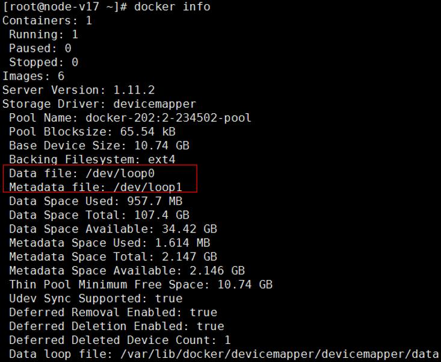
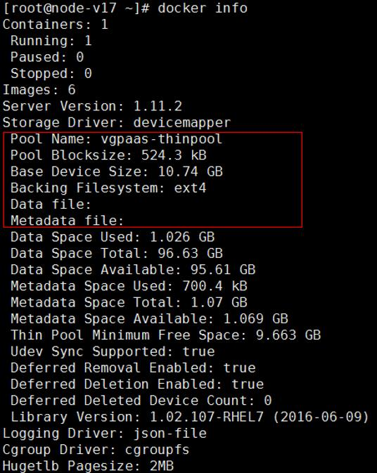

# How Do I Change the Mode of the Docker Device Mapper?<a name="cce_faq_00096"></a>

Currently, private CCE clusters use Device Mapper as the Docker storage driver.

Device Mapper is developed based on the kernel framework and supports many advanced volume management technologies on Linux.

Docker Device Mapper storage driver leverages the thin provisioning and snapshot capabilities of this framework to manage images and containers.

For CCE clusters in v1.7.3-r6 or earlier versions, the Docker Device Mapper is set to the loop-lvm mode by default. By default, Docker generates data and metadata files in the  **/var/lib/docker/devicemapper/devicemapper**  directory. The two files are attached to loop devices and used as block devices. After multiple containers are attached to the files, the performance deteriorates dramatically.

The loop-lvm mode enables you to use Docker out of the box, without additional configuration. This mode is not recommended in the production environment. The Docker Device Mapper also supports the direct-lvm mode. This mode enables you to use raw partitions \(no file systems\). In the medium-load and high-density environments, this mode provides better performance.

To ensure system stability, you need to set the Docker Device Mapper to the direct-lvm mode.

CCE allows you to change the mode of the Device Mapper on VM nodes running on EulerOS.

> **NOTICE:** 
>-   Changing the Docker Device Mapper mode on a node requires a data disk. Therefore, in the change process, the system automatically creates a 100 GB SATA disk and binds it to the node.
>-   When the Docker Device Mapper mode on a node is changed to  **direct-lvm**, the container and image data on the node will be deleted. Therefore, you must back up the container and image data of the node to a private image repository or Docker Hub repository before changing the mode.

## Procedure<a name="en-us_topic_0242566241_section1552313010166"></a>

1.  Check whether the Docker Device Mapper mode on a node is  **direct-lvm**.

    Method 1:

    1.  Log in to a node on which you want to view the Docker Device Mapper mode.
    2.  Query the configuration information under  **Storage-driver**.

        **docker info**

        -   If the values of the  **Data file**  and  **Metadata file**  parameters under  **Storage-driver**  are  **/dev/loopx**, the Docker Device Mapper mode of the current node is  **loop-lvm**. Change the mode by following  [2](#en-us_topic_0242566241_li5148151113134).

            Example:

            

        -   If the values of the  **Data file**  and  **Metadata file**  parameters under  **Storage-driver**  are left blank and the value of  **Pool Name**  is  **vgpaas-thinpool**, the Docker Device Mapper mode of the current node is  **direct-lvm**. You do not need to change the mode.

            Example:

            


    Method 2:

    1.  Log in to a node on which you want to view the Docker Device Mapper mode.
    2.  Check whether the following information is displayed:

        **cat /etc/docker/daemon.json**

        ```
        "dm.thinpooldev=/dev/mapper/vgpaas-thinpool"
        ```

        -   If the command output contains the preceding information, the Docker Device Mapper mode of the current node is  **direct-lvm**. You do not need to change the mode.
        -   If the command output does not contain the preceding information or a message indicating that a file such as  **daemon.json**  is unavailable is displayed, the Docker Device Mapper mode of the current node is not  **direct-lvm**. Change the mode by following  [2](#en-us_topic_0242566241_li5148151113134).

2.  <a name="en-us_topic_0242566241_li5148151113134"></a>\(Optional\) If no elastic IP address is bound to the node for which the Docker Device Mapper mode needs to be changed, bind an elastic IP address.
3.  Log in to the node with an elastic IP address as the root user.
4.  Create a configuration file.

    **touch config.yaml**

5.  Copy the following content to the configuration file:

    ```
    user:
      domainName: 
      username: 
      password: 
      projectName: 
    apiGatewayIp: 
    iamHostname: 
    ecsHostname: 
    evsHostname: 
    swrAddr: 
    defaultPassword: 
    defaultPrivateKey: 
    hosts:
      - host: <node_ip_01>
        user: root
        password: 
        privateKey:
        serverId: 
      - host: <node_ip_02>
        user: root
        password: 
        privateKey: 
        serverId:
    ```

    **Table  1**  Parameter description

    <a name="en-us_topic_0242566241_table43203543121749"></a>
    <table><thead align="left"><tr id="en-us_topic_0242566241_row65292176121749"><th class="cellrowborder" colspan="2" valign="top" id="mcps1.2.4.1.1"><p id="en-us_topic_0242566241_p17812310121749"><a name="en-us_topic_0242566241_p17812310121749"></a><a name="en-us_topic_0242566241_p17812310121749"></a>Parameter</p>
    </th>
    <th class="cellrowborder" valign="top" id="mcps1.2.4.1.2"><p id="en-us_topic_0242566241_p33510994121749"><a name="en-us_topic_0242566241_p33510994121749"></a><a name="en-us_topic_0242566241_p33510994121749"></a>Description</p>
    </th>
    </tr>
    </thead>
    <tbody><tr id="en-us_topic_0242566241_row1888131121749"><td class="cellrowborder" colspan="2" valign="top" headers="mcps1.2.4.1.1 "><p id="en-us_topic_0242566241_p18720917121749"><a name="en-us_topic_0242566241_p18720917121749"></a><a name="en-us_topic_0242566241_p18720917121749"></a>domainName</p>
    </td>
    <td class="cellrowborder" valign="top" headers="mcps1.2.4.1.2 "><p id="en-us_topic_0242566241_p39999295121749"><a name="en-us_topic_0242566241_p39999295121749"></a><a name="en-us_topic_0242566241_p39999295121749"></a>Tenant name</p>
    </td>
    </tr>
    <tr id="en-us_topic_0242566241_row34239615121749"><td class="cellrowborder" colspan="2" valign="top" headers="mcps1.2.4.1.1 "><p id="en-us_topic_0242566241_p21945454121749"><a name="en-us_topic_0242566241_p21945454121749"></a><a name="en-us_topic_0242566241_p21945454121749"></a>username</p>
    </td>
    <td class="cellrowborder" valign="top" headers="mcps1.2.4.1.2 "><p id="en-us_topic_0242566241_p32751345121749"><a name="en-us_topic_0242566241_p32751345121749"></a><a name="en-us_topic_0242566241_p32751345121749"></a>User name</p>
    </td>
    </tr>
    <tr id="en-us_topic_0242566241_row52084219121749"><td class="cellrowborder" colspan="2" valign="top" headers="mcps1.2.4.1.1 "><p id="en-us_topic_0242566241_p58072192121749"><a name="en-us_topic_0242566241_p58072192121749"></a><a name="en-us_topic_0242566241_p58072192121749"></a>password</p>
    </td>
    <td class="cellrowborder" valign="top" headers="mcps1.2.4.1.2 "><p id="en-us_topic_0242566241_p6227126121749"><a name="en-us_topic_0242566241_p6227126121749"></a><a name="en-us_topic_0242566241_p6227126121749"></a>User password, which is enclosed in quotation marks ('' '')</p>
    </td>
    </tr>
    <tr id="en-us_topic_0242566241_row43281388121749"><td class="cellrowborder" colspan="2" valign="top" headers="mcps1.2.4.1.1 "><p id="en-us_topic_0242566241_p16131571121749"><a name="en-us_topic_0242566241_p16131571121749"></a><a name="en-us_topic_0242566241_p16131571121749"></a>projectName</p>
    </td>
    <td class="cellrowborder" valign="top" headers="mcps1.2.4.1.2 "><p id="en-us_topic_0242566241_p31588837121749"><a name="en-us_topic_0242566241_p31588837121749"></a><a name="en-us_topic_0242566241_p31588837121749"></a>Name of the project to which the to-be-configured node belongs</p>
    </td>
    </tr>
    <tr id="en-us_topic_0242566241_row9922323121749"><td class="cellrowborder" colspan="2" valign="top" headers="mcps1.2.4.1.1 "><p id="en-us_topic_0242566241_p65510708121749"><a name="en-us_topic_0242566241_p65510708121749"></a><a name="en-us_topic_0242566241_p65510708121749"></a>apiGatewayIp</p>
    </td>
    <td class="cellrowborder" valign="top" headers="mcps1.2.4.1.2 "><p id="en-us_topic_0242566241_p22247003122527"><a name="en-us_topic_0242566241_p22247003122527"></a><a name="en-us_topic_0242566241_p22247003122527"></a>IP address of an API gateway</p>
    </td>
    </tr>
    <tr id="en-us_topic_0242566241_row52688566121749"><td class="cellrowborder" colspan="2" valign="top" headers="mcps1.2.4.1.1 "><p id="en-us_topic_0242566241_p39915452121749"><a name="en-us_topic_0242566241_p39915452121749"></a><a name="en-us_topic_0242566241_p39915452121749"></a>iamHostname</p>
    </td>
    <td class="cellrowborder" valign="top" headers="mcps1.2.4.1.2 "><p id="en-us_topic_0242566241_p35764110122642"><a name="en-us_topic_0242566241_p35764110122642"></a><a name="en-us_topic_0242566241_p35764110122642"></a>Endpoint of the IAM service</p>
    </td>
    </tr>
    <tr id="en-us_topic_0242566241_row37120100121749"><td class="cellrowborder" colspan="2" valign="top" headers="mcps1.2.4.1.1 "><p id="en-us_topic_0242566241_p53938120121749"><a name="en-us_topic_0242566241_p53938120121749"></a><a name="en-us_topic_0242566241_p53938120121749"></a>ecsHostname</p>
    </td>
    <td class="cellrowborder" valign="top" headers="mcps1.2.4.1.2 "><p id="en-us_topic_0242566241_p33930085122819"><a name="en-us_topic_0242566241_p33930085122819"></a><a name="en-us_topic_0242566241_p33930085122819"></a>Endpoint of the ECS service</p>
    </td>
    </tr>
    <tr id="en-us_topic_0242566241_row5455090121915"><td class="cellrowborder" colspan="2" valign="top" headers="mcps1.2.4.1.1 "><p id="en-us_topic_0242566241_p39209165121915"><a name="en-us_topic_0242566241_p39209165121915"></a><a name="en-us_topic_0242566241_p39209165121915"></a>evsHostname</p>
    </td>
    <td class="cellrowborder" valign="top" headers="mcps1.2.4.1.2 "><p id="en-us_topic_0242566241_p8980908122821"><a name="en-us_topic_0242566241_p8980908122821"></a><a name="en-us_topic_0242566241_p8980908122821"></a>Endpoint of the EVS service</p>
    </td>
    </tr>
    <tr id="en-us_topic_0242566241_row3583828121915"><td class="cellrowborder" colspan="2" valign="top" headers="mcps1.2.4.1.1 "><p id="en-us_topic_0242566241_p21854665121915"><a name="en-us_topic_0242566241_p21854665121915"></a><a name="en-us_topic_0242566241_p21854665121915"></a>swrAddr</p>
    </td>
    <td class="cellrowborder" valign="top" headers="mcps1.2.4.1.2 "><p id="en-us_topic_0242566241_p30500755122852"><a name="en-us_topic_0242566241_p30500755122852"></a><a name="en-us_topic_0242566241_p30500755122852"></a>Address of a software repository</p>
    </td>
    </tr>
    <tr id="en-us_topic_0242566241_row27594648121915"><td class="cellrowborder" colspan="2" valign="top" headers="mcps1.2.4.1.1 "><p id="en-us_topic_0242566241_p20573979121915"><a name="en-us_topic_0242566241_p20573979121915"></a><a name="en-us_topic_0242566241_p20573979121915"></a>defaultPassword</p>
    </td>
    <td class="cellrowborder" valign="top" headers="mcps1.2.4.1.2 "><p id="en-us_topic_0242566241_p55879640121915"><a name="en-us_topic_0242566241_p55879640121915"></a><a name="en-us_topic_0242566241_p55879640121915"></a>(Optional) Default login password of a node. The value must be enclosed in quotation marks ('' '').</p>
    </td>
    </tr>
    <tr id="en-us_topic_0242566241_row45558794121916"><td class="cellrowborder" colspan="2" valign="top" headers="mcps1.2.4.1.1 "><p id="en-us_topic_0242566241_p66383670121916"><a name="en-us_topic_0242566241_p66383670121916"></a><a name="en-us_topic_0242566241_p66383670121916"></a>defaultPrivateKey</p>
    </td>
    <td class="cellrowborder" valign="top" headers="mcps1.2.4.1.2 "><p id="en-us_topic_0242566241_p8368215121916"><a name="en-us_topic_0242566241_p8368215121916"></a><a name="en-us_topic_0242566241_p8368215121916"></a>(Optional) Absolute path to the default key file for logging in to a node. The value must be enclosed in quotation marks ('' '').</p>
    </td>
    </tr>
    <tr id="en-us_topic_0242566241_row59290514548"><td class="cellrowborder" colspan="2" valign="top" headers="mcps1.2.4.1.1 "><p id="en-us_topic_0242566241_p53647876145413"><a name="en-us_topic_0242566241_p53647876145413"></a><a name="en-us_topic_0242566241_p53647876145413"></a>hosts</p>
    </td>
    <td class="cellrowborder" valign="top" headers="mcps1.2.4.1.2 "><p id="en-us_topic_0242566241_p832112014552"><a name="en-us_topic_0242566241_p832112014552"></a><a name="en-us_topic_0242566241_p832112014552"></a>Host array structure [1]. You can set multiple nodes for which you want to change the Device Mapper mode. The following parameters must be included: <span class="parmvalue" id="en-us_topic_0242566241_parmvalue2666781599311"><a name="en-us_topic_0242566241_parmvalue2666781599311"></a><a name="en-us_topic_0242566241_parmvalue2666781599311"></a><b>user</b></span>, <span class="parmvalue" id="en-us_topic_0242566241_parmvalue17290617889311"><a name="en-us_topic_0242566241_parmvalue17290617889311"></a><a name="en-us_topic_0242566241_parmvalue17290617889311"></a><b>password/privateKey</b></span>, and <span class="parmvalue" id="en-us_topic_0242566241_parmvalue12401233449311"><a name="en-us_topic_0242566241_parmvalue12401233449311"></a><a name="en-us_topic_0242566241_parmvalue12401233449311"></a><b>serverId</b></span>. For details about the host array structure, see <a href="#en-us_topic_0242566241_table1718722614567">Table 2</a>.</p>
    </td>
    </tr>
    </tbody>
    </table>

    **Table  2**  Parameter description about the host array structure

    <a name="en-us_topic_0242566241_table1718722614567"></a>
    <table><thead align="left"><tr id="en-us_topic_0242566241_row3124120714567"><th class="cellrowborder" valign="top" width="41.72%" id="mcps1.2.3.1.1"><p id="en-us_topic_0242566241_p44912539145617"><a name="en-us_topic_0242566241_p44912539145617"></a><a name="en-us_topic_0242566241_p44912539145617"></a>Parameter</p>
    </th>
    <th class="cellrowborder" valign="top" width="58.28%" id="mcps1.2.3.1.2"><p id="en-us_topic_0242566241_p27831315145617"><a name="en-us_topic_0242566241_p27831315145617"></a><a name="en-us_topic_0242566241_p27831315145617"></a>Description</p>
    </th>
    </tr>
    </thead>
    <tbody><tr id="en-us_topic_0242566241_row2152667814567"><td class="cellrowborder" valign="top" width="41.72%" headers="mcps1.2.3.1.1 "><p id="en-us_topic_0242566241_p61707268145639"><a name="en-us_topic_0242566241_p61707268145639"></a><a name="en-us_topic_0242566241_p61707268145639"></a>host</p>
    </td>
    <td class="cellrowborder" valign="top" width="58.28%" headers="mcps1.2.3.1.2 "><p id="en-us_topic_0242566241_p32232843145639"><a name="en-us_topic_0242566241_p32232843145639"></a><a name="en-us_topic_0242566241_p32232843145639"></a>IP address of the node for which you want to change the Device Mapper mode. This node must be in the same subnet as the current logged-in node.</p>
    </td>
    </tr>
    <tr id="en-us_topic_0242566241_row6490579814567"><td class="cellrowborder" valign="top" width="41.72%" headers="mcps1.2.3.1.1 "><p id="en-us_topic_0242566241_p42656363145639"><a name="en-us_topic_0242566241_p42656363145639"></a><a name="en-us_topic_0242566241_p42656363145639"></a>user</p>
    </td>
    <td class="cellrowborder" valign="top" width="58.28%" headers="mcps1.2.3.1.2 "><p id="en-us_topic_0242566241_p32613388145639"><a name="en-us_topic_0242566241_p32613388145639"></a><a name="en-us_topic_0242566241_p32613388145639"></a>User name. Set this parameter to <strong id="en-us_topic_0242566241_b8423527069547"><a name="en-us_topic_0242566241_b8423527069547"></a><a name="en-us_topic_0242566241_b8423527069547"></a>root</strong>.</p>
    </td>
    </tr>
    <tr id="en-us_topic_0242566241_row4053437514567"><td class="cellrowborder" valign="top" width="41.72%" headers="mcps1.2.3.1.1 "><p id="en-us_topic_0242566241_p32017230145639"><a name="en-us_topic_0242566241_p32017230145639"></a><a name="en-us_topic_0242566241_p32017230145639"></a>password</p>
    </td>
    <td class="cellrowborder" valign="top" width="58.28%" headers="mcps1.2.3.1.2 "><p id="en-us_topic_0242566241_p43258836145639"><a name="en-us_topic_0242566241_p43258836145639"></a><a name="en-us_topic_0242566241_p43258836145639"></a>Password for the <strong id="en-us_topic_0242566241_b8423527069617"><a name="en-us_topic_0242566241_b8423527069617"></a><a name="en-us_topic_0242566241_b8423527069617"></a>root</strong> user on the node for which you want to change the Device Mapper mode. The value must be enclosed in quotation marks ('' '').</p>
    <div class="note" id="en-us_topic_0242566241_note53785205145639"><a name="en-us_topic_0242566241_note53785205145639"></a><a name="en-us_topic_0242566241_note53785205145639"></a><span class="notetitle"> NOTE: </span><div class="notebody"><p id="en-us_topic_0242566241_p14304798145639"><a name="en-us_topic_0242566241_p14304798145639"></a><a name="en-us_topic_0242566241_p14304798145639"></a>Set either <strong id="en-us_topic_0242566241_b842352706971"><a name="en-us_topic_0242566241_b842352706971"></a><a name="en-us_topic_0242566241_b842352706971"></a>password</strong> or <strong id="en-us_topic_0242566241_b842352706976"><a name="en-us_topic_0242566241_b842352706976"></a><a name="en-us_topic_0242566241_b842352706976"></a>privateKey</strong>.</p>
    </div></div>
    </td>
    </tr>
    <tr id="en-us_topic_0242566241_row3799907814567"><td class="cellrowborder" valign="top" width="41.72%" headers="mcps1.2.3.1.1 "><p id="en-us_topic_0242566241_p51871520145639"><a name="en-us_topic_0242566241_p51871520145639"></a><a name="en-us_topic_0242566241_p51871520145639"></a>privateKey</p>
    </td>
    <td class="cellrowborder" valign="top" width="58.28%" headers="mcps1.2.3.1.2 "><p id="en-us_topic_0242566241_p40843621145639"><a name="en-us_topic_0242566241_p40843621145639"></a><a name="en-us_topic_0242566241_p40843621145639"></a>Absolute path to the key file of the <strong id="en-us_topic_0242566241_b8423527069727"><a name="en-us_topic_0242566241_b8423527069727"></a><a name="en-us_topic_0242566241_b8423527069727"></a>root</strong> user on the node for which you want to change the Device Mapper mode. The value must be enclosed in quotation marks ('' '').</p>
    <div class="note" id="en-us_topic_0242566241_note32048275145639"><a name="en-us_topic_0242566241_note32048275145639"></a><a name="en-us_topic_0242566241_note32048275145639"></a><span class="notetitle"> NOTE: </span><div class="notebody"><p id="en-us_topic_0242566241_p19999027145639"><a name="en-us_topic_0242566241_p19999027145639"></a><a name="en-us_topic_0242566241_p19999027145639"></a>Set either <strong id="en-us_topic_0242566241_b19644629"><a name="en-us_topic_0242566241_b19644629"></a><a name="en-us_topic_0242566241_b19644629"></a>password</strong> or <strong id="en-us_topic_0242566241_b2122582263"><a name="en-us_topic_0242566241_b2122582263"></a><a name="en-us_topic_0242566241_b2122582263"></a>privateKey</strong>.</p>
    </div></div>
    </td>
    </tr>
    <tr id="en-us_topic_0242566241_row2953951614567"><td class="cellrowborder" valign="top" width="41.72%" headers="mcps1.2.3.1.1 "><p id="en-us_topic_0242566241_p7875779145639"><a name="en-us_topic_0242566241_p7875779145639"></a><a name="en-us_topic_0242566241_p7875779145639"></a>serverId</p>
    </td>
    <td class="cellrowborder" valign="top" width="58.28%" headers="mcps1.2.3.1.2 "><p id="en-us_topic_0242566241_p33958353145639"><a name="en-us_topic_0242566241_p33958353145639"></a><a name="en-us_topic_0242566241_p33958353145639"></a>ID of the ECS corresponding to the node for which you want to change the Device Mapper mode</p>
    </td>
    </tr>
    </tbody>
    </table>

6.  Modify the configuration of the nodes in the cluster.

    It takes about 3 to 5 minutes to configure a node.

    **curl -k https://<swr-address\>:20202/swr/v2/domains/op\_svc\_servicestage/namespaces/op\_svc\_servicestage/repositories/default/packages/cluster-versions/versions/base/file\_paths/cceadm -1 -O;chmod u+x cceadm; ./cceadm batch-config-docker --conf=./config.yaml**

    Replace  _<swr-address\>_  with the address of a software repository, which is the same as the value of  **swrAddr**  in  [Table 1](#en-us_topic_0242566241_table43203543121749).


