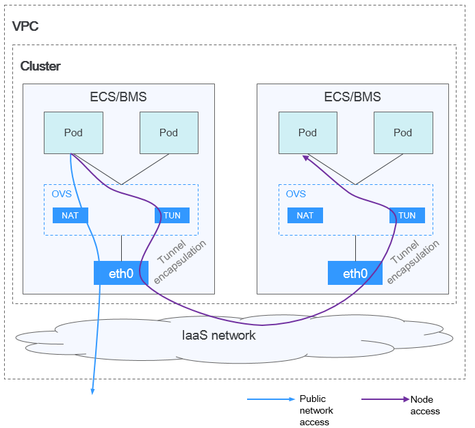
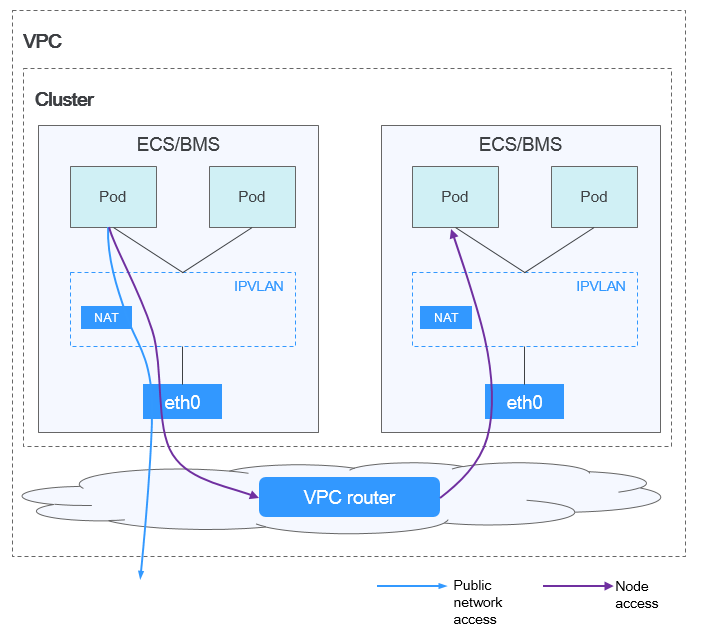

# How Do I Select a Network Model When Creating a CCE Cluster? What Are the Differences Between These Models?

CCE uses high-performance container network add-ons, which support the tunnel network and the VPC network models.

> **CAUTION:** 
>After a cluster is created, the network model cannot be changed. Exercise caution when selecting a network model.

-   **Tunnel network**: The container network is an overlay tunnel network on top of a VPC network and uses the VXLAN technology. This network model is applicable when there is no high requirements on performance. VXLAN encapsulates Ethernet packets as UDP packets for tunnel transmission. Though at some cost of performance, the tunnel encapsulation enables higher interoperability and compatibility with advanced features \(such as network policy-based isolation\), meeting the requirements of most applications.

    **Figure  1**  Container tunnel network  
    

-   **VPC network**: The container network uses VPC routing to integrate with the underlying network. This network model is applicable to performance-intensive scenarios. The maximum number of nodes allowed in a cluster depends on the route quota in a VPC network. Each node is assigned a CIDR block of a fixed size. VPC networks are free from tunnel encapsulation overhead and outperform container tunnel networks. In addition, as VPC routing includes routes to node IP addresses and container network segment, container pods in the cluster can be directly accessed from outside the cluster.

    **Figure  2**  VPC network  
    

The following table lists the differences between the network models.

**Table  1**  Network comparison

<table><thead align="left"><tr id="en-us_topic_0242566245_row015822213316"><th class="cellrowborder" valign="top" width="22.45%" id="mcps1.2.4.1.1">
<strong id="en-us_topic_0242566245_b7212104043613">Dimension</strong>

</th>
<th class="cellrowborder" valign="top" width="36.69%" id="mcps1.2.4.1.2">
<strong id="en-us_topic_0242566245_b29012400369">Tunnel Network</strong>

</th>
<th class="cellrowborder" valign="top" width="40.86%" id="mcps1.2.4.1.3">
<strong id="en-us_topic_0242566245_b15481184218360">VPC Network</strong>

</th>
</tr>
</thead>
<tbody><tr id="en-us_topic_0242566245_row3364165414382"><td class="cellrowborder" valign="top" width="22.45%" headers="mcps1.2.4.1.1 ">
Core components

</td>
<td class="cellrowborder" valign="top" width="36.69%" headers="mcps1.2.4.1.2 ">
OVS

</td>
<td class="cellrowborder" valign="top" width="40.86%" headers="mcps1.2.4.1.3 ">
IPVlan

</td>
</tr>
<tr id="en-us_topic_0242566245_row9184022123919"><td class="cellrowborder" valign="top" width="22.45%" headers="mcps1.2.4.1.1 ">
Applicable clusters

</td>
<td class="cellrowborder" valign="top" width="36.69%" headers="mcps1.2.4.1.2 ">
Hybrid cluster

VM cluster

</td>
<td class="cellrowborder" valign="top" width="40.86%" headers="mcps1.2.4.1.3 ">
Hybrid cluster

VM cluster

</td>
</tr>
<tr id="en-us_topic_0242566245_row18748936104718"><td class="cellrowborder" valign="top" width="22.45%" headers="mcps1.2.4.1.1 ">
Support for network policies

(networkpolicy)

</td>
<td class="cellrowborder" valign="top" width="36.69%" headers="mcps1.2.4.1.2 ">
Yes

</td>
<td class="cellrowborder" valign="top" width="40.86%" headers="mcps1.2.4.1.3 ">
No

</td>
</tr>
<tr id="en-us_topic_0242566245_row26521844204715"><td class="cellrowborder" valign="top" width="22.45%" headers="mcps1.2.4.1.1 ">
Support for ENI

</td>
<td class="cellrowborder" valign="top" width="36.69%" headers="mcps1.2.4.1.2 ">
No

</td>
<td class="cellrowborder" valign="top" width="40.86%" headers="mcps1.2.4.1.3 ">
Yes. The container network is deeply integrated with the VPC network, and ENI is used for pods to communicate.

</td>
</tr>
<tr id="en-us_topic_0242566245_row96181615010"><td class="cellrowborder" valign="top" width="22.45%" headers="mcps1.2.4.1.1 ">
IP address management

</td>
<td class="cellrowborder" valign="top" width="36.69%" headers="mcps1.2.4.1.2 ">
IP addresses can be migrated.

</td>
<td class="cellrowborder" valign="top" width="40.86%" headers="mcps1.2.4.1.3 "><ul id="en-us_topic_0242566245_ul1259224495118"><li>Each node is allocated with a small subnet.</li><li>A static route is added on the VPC router with the next hop set to the node IP address.</li></ul>
</td>
</tr>
<tr id="en-us_topic_0242566245_row1661816105018"><td class="cellrowborder" valign="top" width="22.45%" headers="mcps1.2.4.1.1 ">
Network performance

</td>
<td class="cellrowborder" valign="top" width="36.69%" headers="mcps1.2.4.1.2 ">
Performance loss due to VXLAN tunnel encapsulation

</td>
<td class="cellrowborder" valign="top" width="40.86%" headers="mcps1.2.4.1.3 "><ul id="en-us_topic_0242566245_ul4143192791019"><li>No performance loss as no tunnel encapsulation is required; performance comparable to bare metal networks</li><li>Data forwarded across nodes through the VPC router</li></ul>
</td>
</tr>
<tr id="en-us_topic_0242566245_row262191685013"><td class="cellrowborder" valign="top" width="22.45%" headers="mcps1.2.4.1.1 ">
Network scale

</td>
<td class="cellrowborder" valign="top" width="36.69%" headers="mcps1.2.4.1.2 ">
1,000 nodes

</td>
<td class="cellrowborder" valign="top" width="40.86%" headers="mcps1.2.4.1.3 ">
Limited by the VPC route table.

</td>
</tr>
<tr id="en-us_topic_0242566245_row265119104479"><td class="cellrowborder" valign="top" width="22.45%" headers="mcps1.2.4.1.1 ">
External dependency

</td>
<td class="cellrowborder" valign="top" width="36.69%" headers="mcps1.2.4.1.2 ">
None

</td>
<td class="cellrowborder" valign="top" width="40.86%" headers="mcps1.2.4.1.3 ">
Static route table of the VPC router

</td>
</tr>
<tr id="en-us_topic_0242566245_row14400144693816"><td class="cellrowborder" valign="top" width="22.45%" headers="mcps1.2.4.1.1 ">
Application scenarios

</td>
<td class="cellrowborder" valign="top" width="36.69%" headers="mcps1.2.4.1.2 "><ul id="en-us_topic_0242566245_ul619513457509"><li>Common container service scenarios</li><li>Scenarios that do not have high requirements on network latency and bandwidth</li></ul>
</td>
<td class="cellrowborder" valign="top" width="40.86%" headers="mcps1.2.4.1.3 "><ul id="en-us_topic_0242566245_ul1659212532511"><li>Scenarios that have high requirements on network latency and bandwidth</li><li>Containers can communicate with VMs using a microservice registration framework, such as Dubbo and CSE.</li></ul>
</td>
</tr>
</tbody>
</table>

> **NOTICE:** 
>1.  The actual cluster scale is limited by the quota of custom routes of the VPC. Therefore, estimate the number of required nodes before creating a VPC.
>2.  By default, the VPC network model supports direct communication between containers and hosts in the same VPC. If a peering connection policy is configured between the VPC and another VPC, the containers can directly communicate with hosts on the peer VPC. In addition, in hybrid networking scenarios such as cloud private line and VPN, communication between containers and hosts on the peer end can also be achieved with proper planning.

