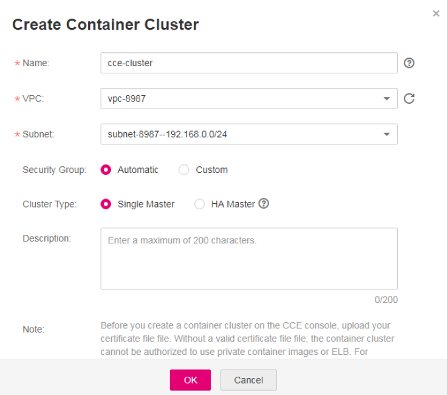

# Migrating Clusters

Create VM clusters on the CCE 2.0 console. These new VM clusters should have the same specifications with those created on CCE 1.0.

To create clusters using APIs, see  _Cloud Container Engine API Reference 2.0_.

## Procedure

1.  Log in to the CCE console. In the navigation pane, choose  **Resource Management**  \>  **Clusters**. Click  **Create VM Cluster**.
2.  Set cluster parameters. Parameters with \* are mandatory.

    **Figure  1**  Cluster specifications in CCE 1.0  
    

    **Table  1**  Parameters for creating a cluster

    
    <table><thead align="left"><tr id="row41944465471"><th class="cellrowborder" valign="top" width="33.32666733326668%" id="mcps1.2.4.1.1">
Parameter in CCE 2.0

    </th>
    <th class="cellrowborder" valign="top" width="33.33666633336666%" id="mcps1.2.4.1.2">
Parameter in CCE 1.0

    </th>
    <th class="cellrowborder" valign="top" width="33.33666633336666%" id="mcps1.2.4.1.3">
Configuration

    </th>
    </tr>
    </thead>
    <tbody><tr id="row111944461478"><td class="cellrowborder" valign="top" width="33.32666733326668%" headers="mcps1.2.4.1.1 ">
* Cluster Name

    </td>
    <td class="cellrowborder" valign="top" width="33.33666633336666%" headers="mcps1.2.4.1.2 ">
Name

    </td>
    <td class="cellrowborder" valign="top" width="33.33666633336666%" headers="mcps1.2.4.1.3 ">
Name of the cluster to be created.

    </td>
    </tr>
    <tr id="row61941446114718"><td class="cellrowborder" valign="top" width="33.32666733326668%" headers="mcps1.2.4.1.1 ">
*Version

    </td>
    <td class="cellrowborder" valign="top" width="33.33666633336666%" headers="mcps1.2.4.1.2 ">
This parameter does not exist in CCE 1.0. Retain the default value.

    </td>
    <td class="cellrowborder" valign="top" width="33.33666633336666%" headers="mcps1.2.4.1.3 ">
Cluster version, namely, corresponding Kubernetes baseline version.

    </td>
    </tr>
    <tr id="row819554684711"><td class="cellrowborder" valign="top" width="33.32666733326668%" headers="mcps1.2.4.1.1 ">
*Management Scale

    </td>
    <td class="cellrowborder" valign="top" width="33.33666633336666%" headers="mcps1.2.4.1.2 ">
This parameter does not exist in CCE 1.0. Set this parameter based on your requirements.

    </td>
    <td class="cellrowborder" valign="top" width="33.33666633336666%" headers="mcps1.2.4.1.3 ">
Maximum number of nodes that can be managed by the cluster.

    </td>
    </tr>
    <tr id="row15195104634719"><td class="cellrowborder" valign="top" width="33.32666733326668%" headers="mcps1.2.4.1.1 ">
* High Availability

    </td>
    <td class="cellrowborder" valign="top" width="33.33666633336666%" headers="mcps1.2.4.1.2 ">
Cluster Type

    </td>
    <td class="cellrowborder" valign="top" width="33.33666633336666%" headers="mcps1.2.4.1.3 "><ul id="ul327822913496"><li><strong id="b842352706171012">Yes</strong>: The cluster has three master nodes. The cluster is still available even when two master nodes are down.</li><li><strong id="b842352706172612">No</strong>: The cluster has only one master node. If the master node is down, the whole cluster becomes unavailable, but existing applications are not affected.</li></ul>
    </td>
    </tr>
    <tr id="row41950463470"><td class="cellrowborder" valign="top" width="33.32666733326668%" headers="mcps1.2.4.1.1 ">
*VPC

    </td>
    <td class="cellrowborder" valign="top" width="33.33666633336666%" headers="mcps1.2.4.1.2 ">
VPCs created in CCE 1.0 can be used in CCE 2.0.

    </td>
    <td class="cellrowborder" valign="top" width="33.33666633336666%" headers="mcps1.2.4.1.3 ">
VPC where the new cluster is located.

    
If no VPCs are available, click <b>Create a VPC</b>.

    </td>
    </tr>
    <tr id="row4195446174711"><td class="cellrowborder" valign="top" width="33.32666733326668%" headers="mcps1.2.4.1.1 ">
*Subnet

    </td>
    <td class="cellrowborder" valign="top" width="33.33666633336666%" headers="mcps1.2.4.1.2 ">
Subnets created in CCE 1.0 can be used in CCE 2.0.

    </td>
    <td class="cellrowborder" valign="top" width="33.33666633336666%" headers="mcps1.2.4.1.3 ">
Subnet in which the cluster will run.

    </td>
    </tr>
    <tr id="row15195104604716"><td class="cellrowborder" valign="top" width="33.32666733326668%" headers="mcps1.2.4.1.1 ">
*Network Model

    </td>
    <td class="cellrowborder" valign="top" width="33.33666633336666%" headers="mcps1.2.4.1.2 ">
This parameter does not exist in CCE 1.0. Set this parameter based on your requirements.

    </td>
    <td class="cellrowborder" valign="top" width="33.33666633336666%" headers="mcps1.2.4.1.3 "><ul id="ul9659865509"><li><strong id="b134963219220">Tunnel network</strong>: An independent container network constructed using VXLAN tunnels based on the underlying VPC network. This model is appropriate for typical scenarios.</li><li><strong id="b101229131337">VPC network</strong>: The VPC routing mode is used to deeply integrate with the underlying network. This mode applies to high-performance scenarios where the number of nodes is limited by the VPC routing quota. Only one cluster using the VPC network model can be created in a single VPC.</li></ul>
    </td>
    </tr>
    <tr id="row15435442162514"><td class="cellrowborder" valign="top" width="33.32666733326668%" headers="mcps1.2.4.1.1 ">
Container Network Segment

    </td>
    <td class="cellrowborder" valign="top" width="33.33666633336666%" headers="mcps1.2.4.1.2 ">
This parameter does not exist in CCE 1.0. Set this parameter based on your requirements.

    </td>
    <td class="cellrowborder" valign="top" width="33.33666633336666%" headers="mcps1.2.4.1.3 ">
Select a container network segment based on service requirements. Container instances will be assigned with IP addresses within the planned network segment.

    <ul id="ul1423120351449"><li>If <strong id="b754142617017">Automatically select</strong> is deselected, enter a CIDR block manually. If the selected CIDR block conflicts with a subnet CIDR block, the system prompts you to select another CIDR block. The recommended CIDR blocks are 10.0.0.0/12-19, 172.16.0.0/16-19, and 192.168.0.0/16-19.
If different clusters share a container network segment, an IP address conflict will occur and access to the applications in the clusters may fail.

    </li><li>If <strong id="b71579715212">Automatically select</strong> is selected, the system automatically assigns a CIDR block that does not conflict with any subnet CIDR block.</li></ul>
    
The mask of the container CIDR block must be appropriate. It determines the number of available nodes in a cluster. A too small mask value will cause the cluster to soon fall short of nodes. After the mask is set, the estimated maximum number of containers supported by the current CIDR block will be displayed.

    </td>
    </tr>
    <tr id="row18518105316198"><td class="cellrowborder" valign="top" width="33.32666733326668%" headers="mcps1.2.4.1.1 ">
Service Network Segment

    </td>
    <td class="cellrowborder" valign="top" width="33.33666633336666%" headers="mcps1.2.4.1.2 ">
This parameter does not exist in CCE 1.0. Set this parameter based on your requirements.

    </td>
    <td class="cellrowborder" valign="top" width="33.33666633336666%" headers="mcps1.2.4.1.3 ">
This parameter is left unspecified, by default. This parameter applies only to clusters of v1.11.7 and later versions.

    
This parameter indicates a CIDR block of Kubernetes services. The mask of the service CIDR block must be appropriate. It determines the number of available nodes in a cluster.

    </td>
    </tr>
    <tr id="row18755646142217"><td class="cellrowborder" valign="top" width="33.32666733326668%" headers="mcps1.2.4.1.1 ">
Open EIP

    </td>
    <td class="cellrowborder" valign="top" width="33.33666633336666%" headers="mcps1.2.4.1.2 ">
This parameter does not exist in CCE 1.0. Set this parameter based on your requirements.

    </td>
    <td class="cellrowborder" valign="top" width="33.33666633336666%" headers="mcps1.2.4.1.3 ">
A public IP address that is reachable from public networks. Select an EIP that has not been bound to any node. A cluster's EIP is preset in the cluster's certificate. Do no delete the EIP after the cluster has been created. Otherwise, two-way authentication will fail.

    <ul id="ul126461217182315"><li><strong id="b3774148151915">Do no configure</strong>: No EIP will be preset in the cluster certificate.</li><li><strong id="b62171020122020">Configure now</strong>: If no EIP is available for selection, create a new EIP.</li></ul>
    </td>
    </tr>
    <tr id="row112688564198"><td class="cellrowborder" valign="top" width="33.32666733326668%" headers="mcps1.2.4.1.1 ">
Authorization Mode

    </td>
    <td class="cellrowborder" valign="top" width="33.33666633336666%" headers="mcps1.2.4.1.2 ">
This parameter does not exist in CCE 1.0. Set this parameter based on your requirements.

    </td>
    <td class="cellrowborder" valign="top" width="33.33666633336666%" headers="mcps1.2.4.1.3 ">
By default, <b>RBAC</b> is selected. Read <a href="granting-namespace-level-permissions-(kubernetes-rbac-authorization).md">CCE Role Management Instructions</a> and select <b>I am aware of the above limitations and read the CCE Role Management Instructions</b>.

    
After RBAC is enabled, users access resources in the cluster according to fine-grained permissions policies.

    </td>
    </tr>
    <tr id="row12131512162315"><td class="cellrowborder" valign="top" width="33.32666733326668%" headers="mcps1.2.4.1.1 ">
Authentication Mode

    </td>
    <td class="cellrowborder" valign="top" width="33.33666633336666%" headers="mcps1.2.4.1.2 ">
This parameter does not exist in CCE 1.0. Set this parameter based on your requirements.

    </td>
    <td class="cellrowborder" valign="top" width="33.33666633336666%" headers="mcps1.2.4.1.3 ">
The authentication mechanism performs permission control on resources in a cluster. For example, you can grant user A to read and write applications in a namespace, while granting user B to only read resources in a cluster. For details about role-based permission control, see <a href="cluster-management-permission-control.md">3.7- Cluster Management Permission Control</a>.

    <ul id="ul208851410646"><li>By default, X.509 authentication instead of <b>Enhanced authentication</b> is enabled. X.509 is a standard defining the format of public key certificates. X.509 certificates are used in many Internet protocols.</li><li>If permission control on a cluster is required, select <strong id="b1631132022213">Enhanced authentication</strong> and then <strong id="b113212042216">Authenticating Proxy</strong>.
Click <strong id="b185463373227">Upload</strong> next to <strong id="b1354616374228">CA Root Certificate</strong> to upload a valid certificate. Select the check box to confirm that the uploaded certificate is valid.

    
If the certificate is invalid, the cluster cannot be created. The uploaded certificate file must be smaller than 1 MB and in .crt or .cer format.

    </li></ul>
    </td>
    </tr>
    <tr id="row1519564604716"><td class="cellrowborder" valign="top" width="33.32666733326668%" headers="mcps1.2.4.1.1 ">
Cluster Description

    </td>
    <td class="cellrowborder" valign="top" width="33.33666633336666%" headers="mcps1.2.4.1.2 ">
Description

    </td>
    <td class="cellrowborder" valign="top" width="33.33666633336666%" headers="mcps1.2.4.1.3 ">
Description of the cluster.

    </td>
    </tr>
    </tbody>
    </table>

3.  After the configuration is complete, click  **Next**  to add a node.
4.  Continue to add a node.
5.  Set the parameters based on  [Table 2](#table16351025186).

    **Table  2**  Parameters for adding a node

    
    <table><thead align="left"><tr id="row1380143111819"><th class="cellrowborder" valign="top" width="22%" id="mcps1.2.4.1.1">
Parameter in CCE 2.0

    </th>
    <th class="cellrowborder" valign="top" width="22%" id="mcps1.2.4.1.2">
Parameter in CCE 1.0

    </th>
    <th class="cellrowborder" valign="top" width="56.00000000000001%" id="mcps1.2.4.1.3">
Configuration

    </th>
    </tr>
    </thead>
    <tbody><tr id="row138010391812"><td class="cellrowborder" colspan="3" valign="top" headers="mcps1.2.4.1.1 mcps1.2.4.1.2 mcps1.2.4.1.3 ">
Region

    </td>
    </tr>
    <tr id="row926763182720"><td class="cellrowborder" valign="top" width="22%" headers="mcps1.2.4.1.1 ">
Current Region

    </td>
    <td class="cellrowborder" rowspan="2" valign="top" width="22%" headers="mcps1.2.4.1.2 ">
Region

    </td>
    <td class="cellrowborder" valign="top" width="56.00000000000001%" headers="mcps1.2.4.1.3 ">
Physical location of the node.

    </td>
    </tr>
    <tr id="row14803371815"><td class="cellrowborder" valign="top" headers="mcps1.2.4.1.1 ">
AZ

    </td>
    <td class="cellrowborder" valign="top" headers="mcps1.2.4.1.2 ">
An AZ is an isolated area in which physical resources use independent power supplies and networks. AZs are interconnected through internal networks. To enhance application availability, create nodes in different AZs.

    </td>
    </tr>
    <tr id="row18011321814"><td class="cellrowborder" colspan="3" valign="top" headers="mcps1.2.4.1.1 mcps1.2.4.1.2 mcps1.2.4.1.3 ">
Specifications

    </td>
    </tr>
    <tr id="row18317361811"><td class="cellrowborder" valign="top" width="22%" headers="mcps1.2.4.1.1 ">
Node Name

    </td>
    <td class="cellrowborder" rowspan="3" valign="top" width="22%" headers="mcps1.2.4.1.2 ">
Specifications

    </td>
    <td class="cellrowborder" valign="top" width="56.00000000000001%" headers="mcps1.2.4.1.3 ">
Name of the node.

    </td>
    </tr>
    <tr id="row9836311812"><td class="cellrowborder" valign="top" headers="mcps1.2.4.1.1 ">
Specifications

    </td>
    <td class="cellrowborder" valign="top" headers="mcps1.2.4.1.2 "><ul id="ul13834318182"><li><strong id="b84381459326">General-purpose</strong>: provides general computing, storage, and network configurations that can meet a majority of scenarios. General-purpose nodes can be used for web servers, workload development, workload testing, and small databases.</li><li><strong id="b0853353123213">Memory-optimized</strong>: provides higher memory capacity than general-purpose nodes and is suitable for relational databases, NoSQL, and other workloads that are both memory-intensive and data-intensive.</li><li><strong id="b6795175616321">GPU-accelerated</strong>: provides powerful floating-point computing and is suitable for real-time, highly concurrent massive computing. Graphical processing units (GPUs) of P series are suitable for deep learning, scientific computing, and CAE. GPUs of G series are suitable for 3D animation rendering and CAD. Currently, only clusters of v1.11 support GPU-accelerated nodes. If the cluster version is v1.13 or later, <strong id="b358315533315">GPU-accelerated</strong> is not displayed on the page.</li></ul>
    </td>
    </tr>
    <tr id="row178313381813"><td class="cellrowborder" valign="top" headers="mcps1.2.4.1.1 ">
OS

    </td>
    <td class="cellrowborder" valign="top" headers="mcps1.2.4.1.2 ">
Select an operating system for the node.

    
Reinstalling OSs or modifying OS configurations could make nodes unavailable. Exercise caution when performing these operations. For more information, see <a href="risky-operations-on-cluster-nodes.md">Risky Operations on Cluster Nodes</a>.

    </td>
    </tr>
    <tr id="row950585532910"><td class="cellrowborder" valign="top" width="22%" headers="mcps1.2.4.1.1 ">
VPC

    </td>
    <td class="cellrowborder" valign="top" width="22%" headers="mcps1.2.4.1.2 ">
This parameter does not exist in CCE 1.0. Set this parameter based on your requirements.

    </td>
    <td class="cellrowborder" valign="top" width="56.00000000000001%" headers="mcps1.2.4.1.3 ">
The value cannot be changed. This parameter is supported only in v1.13.10-r0 and later versions of clusters. It is not displayed in versions earlier than v1.13.10-r0.

    </td>
    </tr>
    <tr id="row18842158122911"><td class="cellrowborder" valign="top" width="22%" headers="mcps1.2.4.1.1 ">
Subnet

    </td>
    <td class="cellrowborder" valign="top" width="22%" headers="mcps1.2.4.1.2 ">
This parameter does not exist in CCE 1.0. Set this parameter based on your requirements.

    </td>
    <td class="cellrowborder" valign="top" width="56.00000000000001%" headers="mcps1.2.4.1.3 ">
A subnet improves network security by providing exclusive network resources that are isolated from other networks.

    
You can select any subnet in the cluster VPC. Cluster nodes can belong to different subnets. This parameter is supported only in v1.13.10-r0 and later versions of clusters. It is not displayed in versions earlier than v1.13.10-r0.

    </td>
    </tr>
    <tr id="row6831538187"><td class="cellrowborder" valign="top" width="22%" headers="mcps1.2.4.1.1 ">
Nodes

    </td>
    <td class="cellrowborder" valign="top" width="22%" headers="mcps1.2.4.1.2 ">
Quantity

    </td>
    <td class="cellrowborder" valign="top" width="56.00000000000001%" headers="mcps1.2.4.1.3 ">
Number of nodes to be created.

    </td>
    </tr>
    <tr id="row12831038186"><td class="cellrowborder" colspan="3" valign="top" headers="mcps1.2.4.1.1 mcps1.2.4.1.2 mcps1.2.4.1.3 ">
Network

    
 NOTE: 

If the nodes to be created require Internet access, select <strong id="b167012020101215">Automatically assign</strong> or <strong id="b14701520131217">Use existing</strong> for <strong id="b070112010123">EIP</strong>. If an EIP is not bound to a node, applications running on the node cannot be accessed by the external network.

    

    </td>
    </tr>
    <tr id="row11841033189"><td class="cellrowborder" valign="top" width="22%" headers="mcps1.2.4.1.1 ">
EIP

    </td>
    <td class="cellrowborder" valign="top" width="22%" headers="mcps1.2.4.1.2 ">
EIP

    </td>
    <td class="cellrowborder" valign="top" width="56.00000000000001%" headers="mcps1.2.4.1.3 ">
A public IP address that is reachable from public networks.

    <ul id="ul14841934185"><li><strong id="b22048311322">Do not use</strong>: A node without an EIP cannot access the Internet. It can be used only as an elastic cloud server (ECS) for deploying services or clusters on a private network.</li><li><strong id="b1504126181514">Automatically assign</strong>: An EIP with exclusive bandwidth is automatically assigned to each ECS. When creating an ECS, ensure that the elastic IP address quota is sufficient. Set the specifications, required quantity, billing mode, and bandwidth as required.</li><li><strong id="b2299857182012">Use existing</strong>: Existing EIPs are assigned to the nodes to be created.</li></ul>
    </td>
    </tr>
    <tr id="row98413311820"><td class="cellrowborder" valign="top" width="22%" headers="mcps1.2.4.1.1 ">
Disk

    </td>
    <td class="cellrowborder" valign="top" width="22%" headers="mcps1.2.4.1.2 ">
Storage

    </td>
    <td class="cellrowborder" valign="top" width="56.00000000000001%" headers="mcps1.2.4.1.3 ">
Disk type, which can be <strong id="b912017972517">System Disk</strong> or <strong id="b51202982512">Data Disk</strong>.<ul id="ul1848032811217"><li>The system disk capacity ranges from 40 to 1024 GB. The default value is 40 GB.</li><li>The data disk capacity ranges from 100 to 32678 GB. The default value is 100 GB.</li></ul>
    

    
Data disks deliver three levels of I/O performance:

    <ul id="ul64951628112115"><li><strong id="b1965924217581">Common I/O</strong>: uses SATA drives to store data. EVS disks of this level provide reliable block storage and a maximum IOPS of 1,000 per disk. They are suitable for key applications.</li><li><strong id="b449525045915">High I/O</strong>: uses SAS drives to store data. EVS disks of this level provide a maximum IOPS of 3,000 and a minimum read/write latency of 1 ms. They are suitable for RDS, NoSQL, data warehouse, and file system applications.</li><li><strong id="b389210152012">Ultra-high I/O</strong>: uses SSD drives to store data. EVS disks of this level provide a maximum IOPS of 20,000 and a minimum read/write latency of 1 ms. They are suitable for RDS, NoSQL, and data warehouse applications.</li></ul>
    </td>
    </tr>
    <tr id="row13851631189"><td class="cellrowborder" colspan="3" valign="top" headers="mcps1.2.4.1.1 mcps1.2.4.1.2 mcps1.2.4.1.3 ">
Login information

    </td>
    </tr>
    <tr id="row1085193111812"><td class="cellrowborder" valign="top" width="22%" headers="mcps1.2.4.1.1 ">
Key Pair

    </td>
    <td class="cellrowborder" valign="top" width="22%" headers="mcps1.2.4.1.2 ">
Key Pair

    </td>
    <td class="cellrowborder" valign="top" width="56.00000000000001%" headers="mcps1.2.4.1.3 ">
A key pair is used for identity authentication when you remotely log in to a node. If no key pair is available, click <strong id="b1066412472518">Create a key pair</strong> and create one.

    </td>
    </tr>
    <tr id="row485103201812"><td class="cellrowborder" colspan="3" valign="top" headers="mcps1.2.4.1.1 mcps1.2.4.1.2 mcps1.2.4.1.3 ">
Advanced ECS Settings

    </td>
    </tr>
    <tr id="row1980213371444"><td class="cellrowborder" valign="top" width="22%" headers="mcps1.2.4.1.1 ">
ECS Group

    </td>
    <td class="cellrowborder" rowspan="7" valign="top" width="22%" headers="mcps1.2.4.1.2 ">
This parameter does not exist in CCE 1.0. Set this parameter based on your requirements.

    </td>
    <td class="cellrowborder" valign="top" width="56.00000000000001%" headers="mcps1.2.4.1.3 ">
Select an existing ECS group, or click <b>Create ECS Group</b> to create a new one. After the ECS group is created, click the refresh icon.

    
An ECS group allows you to create ECSs on different hosts, thereby improving service reliability.

    </td>
    </tr>
    <tr id="row770816592447"><td class="cellrowborder" valign="top" headers="mcps1.2.4.1.1 ">
Resource Tags

    </td>
    <td class="cellrowborder" valign="top" headers="mcps1.2.4.1.2 ">
By adding tags to resources, you can classify resources.

    
You can create predefined tags in Tag Management Service (TMS). Predefined tags are visible to all service resources that support the tagging function. You can use predefined tags to improve tag creation and migration efficiency. For details, see <a href="https://docs.otc.t-systems.com/en-us/usermanual/tms/en-us_topic_0144368884.html" target="_blank" rel="noopener noreferrer">Creating Predefined Tags</a>.

    
CCE will automatically create the "CCE-Dynamic-Provisioning-Node=node id" tag. A maximum of 20 tags can be added.

    </td>
    </tr>
    <tr id="row10556133134513"><td class="cellrowborder" valign="top" headers="mcps1.2.4.1.1 ">
Agency Name

    </td>
    <td class="cellrowborder" valign="top" headers="mcps1.2.4.1.2 ">
The agency is created by the account administrator on the IAM console. By creating an agency, you can share your resources with another account, or delegate a more professional person or team to manage your resources. When creating an agency, set the agency type to <strong id="b56366226449">Cloud service</strong>. Click <strong id="b13411946104411">Select</strong>, and select <strong id="b197501418459">ECS BMS</strong> in the dialog box displayed, which allows ECS or BMS to call cloud services.

    </td>
    </tr>
    <tr id="row16961102914515"><td class="cellrowborder" valign="top" headers="mcps1.2.4.1.1 ">
Pre-installation Script

    </td>
    <td class="cellrowborder" valign="top" headers="mcps1.2.4.1.2 ">
Script commands. Enter 0 to 1000 characters.

    
The script will be executed before Kubernetes software is installed. Note that if the script is incorrect, Kubernetes software may not be installed successfully. The script is usually used to format data disks.

    </td>
    </tr>
    <tr id="row474002711458"><td class="cellrowborder" valign="top" headers="mcps1.2.4.1.1 ">
Post-installation Script

    </td>
    <td class="cellrowborder" valign="top" headers="mcps1.2.4.1.2 ">
Script commands. Enter 0 to 1000 characters.

    
The script will be executed after Kubernetes software is installed and will not affect the installation. The script is usually used to modify Docker parameters.

    </td>
    </tr>
    <tr id="row014232420462"><td class="cellrowborder" valign="top" headers="mcps1.2.4.1.1 ">
Add Data Disk

    </td>
    <td class="cellrowborder" valign="top" headers="mcps1.2.4.1.2 ">
Click <strong id="b650211569524">Add Data Disk</strong> to add a data disk and set the capacity of the data disk. Enter a disk formatting command in the input box of <a href="how-do-i-add-a-second-data-disk-to-a-cce-node.md">Pre-installation Script</a>. For a sample command, see <a href="how-do-i-add-a-second-data-disk-to-a-cce-node.md">How Do I Add a Second Data Disk to a CCE Node?</a>.

    </td>
    </tr>
    <tr id="row1510851394712"><td class="cellrowborder" valign="top" headers="mcps1.2.4.1.1 ">
Subnet IP Address

    </td>
    <td class="cellrowborder" valign="top" headers="mcps1.2.4.1.2 ">
Select <strong id="b929155565520">Automatically assign IP address</strong> (recommended) or <strong id="b6305556555">Manually assigning IP addresses</strong>.

    </td>
    </tr>
    <tr id="row1366141311492"><td class="cellrowborder" colspan="3" valign="top" headers="mcps1.2.4.1.1 mcps1.2.4.1.2 mcps1.2.4.1.3 ">
Advanced Kubernetes Settings

    </td>
    </tr>
    <tr id="row13385113320498"><td class="cellrowborder" valign="top" width="22%" headers="mcps1.2.4.1.1 ">
Max Pods

    </td>
    <td class="cellrowborder" rowspan="2" valign="top" width="22%" headers="mcps1.2.4.1.2 ">
This parameter does not exist in CCE 1.0. Set this parameter based on your requirements.

    </td>
    <td class="cellrowborder" valign="top" width="56.00000000000001%" headers="mcps1.2.4.1.3 ">
The maximum number of pods that can be created on a node, including the system's default pods. Value range: 16 to 250.

    
This maximum limit prevents the node from being overloaded by managing too many instances.

    </td>
    </tr>
    <tr id="row47510365497"><td class="cellrowborder" valign="top" headers="mcps1.2.4.1.1 ">
insecure-registries

    </td>
    <td class="cellrowborder" valign="top" headers="mcps1.2.4.1.2 ">
Click <strong id="b65644457574">Add insecure-registry</strong> and enter a repository address.

    
Add the address of the custom image repository with no valid SSL certificate to the docker startup option to avoid unsuccessful image pulling from the personal image repository. The address is in the format of IP address:Port number (or domain name). Post-installation script and insecure-registries cannot be used together.

    </td>
    </tr>
    <tr id="row2078953145011"><td class="cellrowborder" valign="top" width="22%" headers="mcps1.2.4.1.1 ">
Maximum Data Space per Container

    </td>
    <td class="cellrowborder" valign="top" width="22%" headers="mcps1.2.4.1.2 ">
This parameter does not exist in CCE 1.0. Set this parameter based on your requirements.

    </td>
    <td class="cellrowborder" valign="top" width="56.00000000000001%" headers="mcps1.2.4.1.3 ">
The maximum data space that can be used by a container. Value range: 10 GB to 80 GB. If the value of this field is larger than the data disk space allocated to Docker, the latter will override the value specified here. Typically, 90% of the data disk space is allocated to Docker. This parameter is supported only in v1.13.10-r0 and later versions of clusters. It is not displayed in versions earlier than v1.13.10-r0.

    </td>
    </tr>
    </tbody>
    </table>

6.  Click  **Next**  to install add-ons.

    System resource add-ons must be installed. Advanced functional add-ons are optional.

    You can also install optional add-ons after the cluster is created. To do so, choose  **Add-ons**  in the navigation pane of the CCE console and select the add-on you will install. For details, see  [13 Add-on Management](autoscaler.md).

7.  Click  **Create Now**. Check all the configurations, and click  **Submit**.

    It takes 6 to 10 minutes to create a cluster. Information indicating the progress of the creation process will be displayed.

