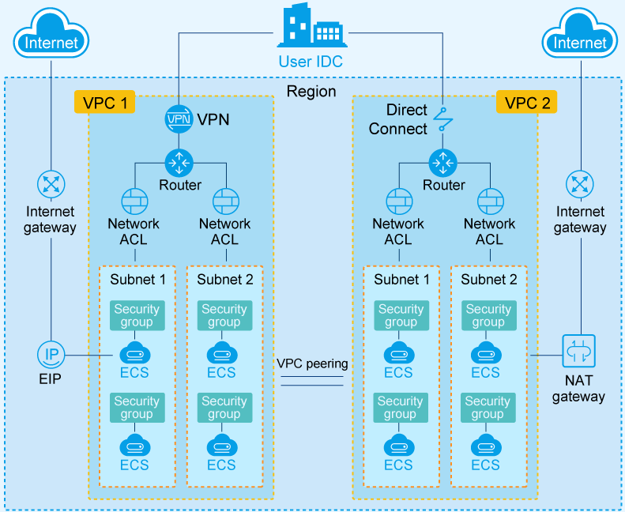
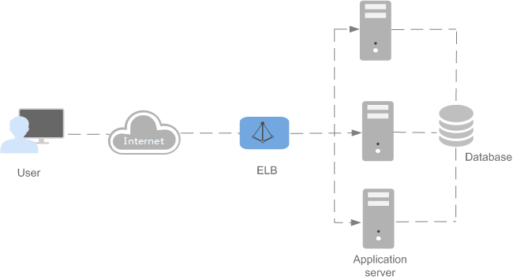

# Network Overview

CCE provides different workload access types to address diverse scenarios.

## Constraints

-   A maximum of 6,000 services can be created in each  namespace. The service mentioned here refers to the  Kubernetes service  resource which defines a logical set of pods and a policy by which to access them.
-   If containers running with hostPort or hostNetwork need to be accessed by external networks, the container ports corresponding to the nodes where the containers are located must be enabled.

## Network Capability

CCE works seamlessly with the Kubernetes network and VPC to provide a stable and high-performance container network. It provides the following workload access services:

-   **Intra-cluster access \(ClusterIP\)**

    A workload can be accessed from other workloads in the same cluster through a  cluster-internal domain name. A cluster-internal domain name is in the format of  _<User-defined service name\>_._<Namespace of the workload\>_**.svc.cluster.local**, for example,  **nginx.default.svc.cluster.local**. For details, see  [Intra-Cluster Access \(ClusterIP\)](intra-cluster-access-(clusterip).md).

-   **NodePort**

    A service is exposed on each node's IP address at a static port \(the NodePort\). A ClusterIP service, to which the NodePort service will route, is automatically created. By requesting the <NodeIP\>:<NodePort\>, you can access a NodePort service from the outside of the cluster. For details, see  [NodePort](nodeport.md).

    NodePort access is further classified into intra-Virtual Private Cloud \(VPC\) access or elastic IP address \(EIP\)-based access.

    -   Intra-VPC access: If the workload that the NodePort service targets runs inside a Kubernetes cluster and does not have an EIP, it can still be accessible to workloads in the same VPC by using a node IP address.
    -   EIP-based access: If the NodePort service needs to be exposed to public networks, the workload that the NodePort service targets can be accessed at an EIP from public networks. This can happen only after an EIP is bound to any node in the cluster and a service port is mapped to a node port in the 30000–32767 range. For example, the access address could be 10.117.117.117:30000.

-   **LoadBalancer**

    A workload can be accessed from public networks through a  load balancer. LoadBalancer provides higher reliability than EIP-based NodePort because an EIP is no longer bound to a single node. The LoadBalancer access type is applicable to the scenario in which a service exposed to public networks is required. The access address is in the format of <IP address of public network load balancer\>:<access port\>. For example, 10.117.117.117:80. For details, see  [LoadBalancer\)](loadbalancer.md).

-   **Destination Network Address Translation \(DNAT\)**

    A  **NAT gateway**  is situated between cluster nodes and public networks and assigned an EIP. After receiving inbound requests from public networks, the NAT gateway translates the EIP \(destination address in the inbound requests\) into a cluster-internal address. It appears to workload users as if all nodes running the workload share the same EIP. DNAT provides higher reliability than EIP-based NodePort in which the EIP is bound to a single node and once the node is down, all inbound requests to the workload will not be distributed. The access address is in the format of <EIP\>:<access port\>, for example, 10.117.117.117:80. For details, see  [DNAT](dnat.md).

-   **Layer-7 load balancing \(ingress\)**

    The difference between ingress and layer-4 load balancing is that ingress supports uniform resource identifier \(URI\) configuration and distributes access traffic to services based on the URI. In addition, the services implement different functions based on URIs.

    Ingress uses  enhanced load balancers. The access address is in the format of <public network load balancer service address\>:<access port\>/defined URI. For example, 10.117.117.117:80/helloworld. For details, see  [Layer-7 Load Balancing \(Ingress\)](layer-7-load-balancing-(ingress).md).

## Layer-7 Load Balancing \(Ingress\)

Generally, the IP addresses of services and pods are accessible to workloads in the same cluster. An external request needs to be forwarded by a load balancer to the NodePort exposed by the service on a node and then be forwarded by kube-proxy to corresponding pods through an edge router or be discarded by kube-proxy. Ingress is a set of rules that route external requests to the cluster.

Ingress provides the URL, load balancer, SSL offloading, and HTTP route for external access to the cluster. To configure these ingress rules, the cluster administrator needs to deploy an ingress controller to monitor changes of ingresses and services, configure load balancing based on the rules, and provide access entries.

An ingress object consists of:

-   Nginx: implements load balancing among pods.
-   Ingress controller: obtains the IP addresses of the pods corresponding to services from cluster APIs and adds the IP addresses to the Nginx configuration file.
-   Ingress: creates virtual hosts for Nginx.

For details on how to create and manage ingresses, see  [Layer 7 Load Balancing \(Ingress\)](layer-7-load-balancing-(ingress).md).

## Network Policy

Network policies define communication rules between pods and between a pod and other network endpoints.

The NetworkPolicy resource selects pods by labels and defines the communication rules allowed by the selected pods. For details, see  [Network Policy](network-policy.md).

## Network Infrastructure

-   **VPC**

    A Virtual Private Cloud \(VPC\) is a private network created based on the public cloud. Different private networks are logically isolated. VPC enables you to provision logically isolated, configurable, and manageable virtual networks for Elastic Cloud Servers \(ECSs\), cloud databases, and load balancers, improving cloud service security and simplifying network deployment.

    You can configure security groups, virtual private networks \(VPNs\), and IP address segments, and allocate bandwidth in a VPC. With a VPC, you can configure and manage the networks within the VPC, making changes to these networks as needed, quickly and securely. You can also customize the ECS access rules within a security group and between security groups to strengthen ECS security protection.

    **Figure  1**  VPC components  
    

-   **ELB**

    Elastic Load Balance \(ELB\) automatically distributes incoming traffic across multiple backend servers based on the rules you configure. This expands service capabilities of applications and improves their availability by eliminating single points of failure \(SPOFs\). For details, see  [Differences Between Classic and Enhanced Load Balancers](https://docs.otc.t-systems.com/en-us/usermanual/elb/en-us_topic_0015479966.html).

    **Figure  2**  ELB  
    

    ELB provides two types of load balancers:

    -   Classic load balancer: This type of load balancer can well handle web services with low access traffic and simple applications.
    -   Enhanced load balancer: This type of load balancer is suitable for web services with high access traffic. Requests are forwarded based on domain names or URLs, making request routing more flexible.

