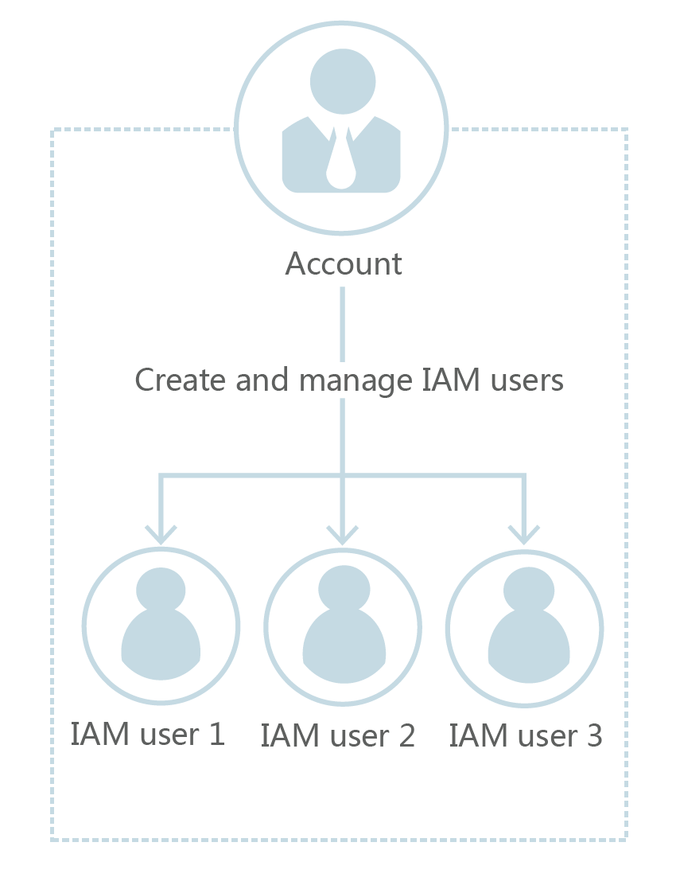
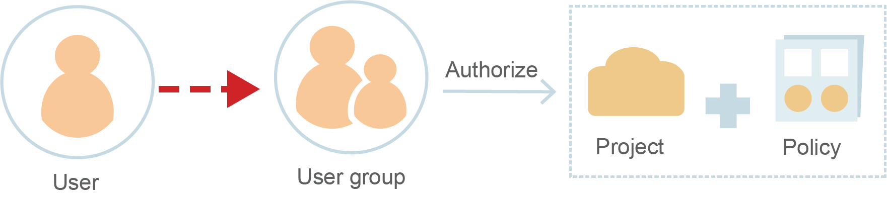
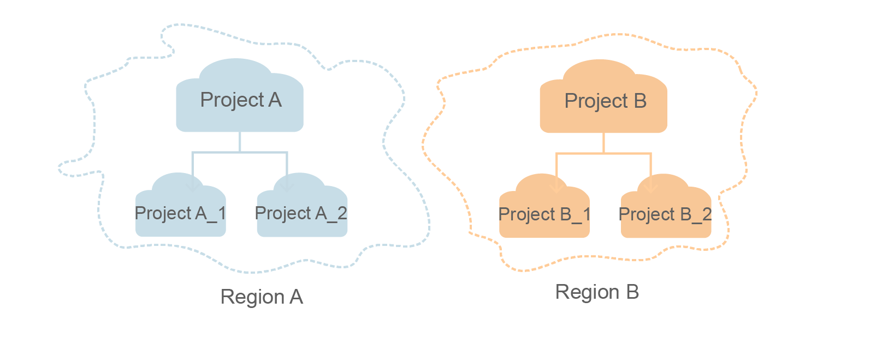

# Permissions Management by IAM

This chapter describes Identity and Access Management \(IAM\)'s fine-grained permissions management for your Cloud Container Engine \(CCE\) service. With IAM, you can:

-   Create IAM users for employees based on the organizational structure of your enterprise. Each IAM user has their own security credentials, providing access to CCE resources.
-   Grant only the permissions required for users to perform a task.
-   Entrust an account or cloud service to perform professional and efficient O&M on your CCE resources.

If your account does not need individual IAM users, then you may skip over this chapter.

The following sections describe the common IAM operations, including creating a user and user group, granting permissions to a user group, and creating a custom policy. For other IAM operations, see the  [IAM User Guide](https://docs.otc.t-systems.com/en-us/usermanual/iam/en-us_topic_0079496985.html).

## Account

To use cloud services, you need to register an account using your mobile number. The account owns your cloud resources and has full access permissions for the resources. You can use the account to reset user passwords and assign permissions. Your account receives and pays all bills generated by your IAM users' use of resources. To log in to the management console using an account, choose  **Account Login**.

## IAM User

IAM users are created by an account. Each IAM user has its own password and access keys to access the public cloud, and uses cloud resources based on assigned permissions. IAM users do not make payments. It is the account that pays the bills.

## Relationship Between an Account and Its IAM Users

An account and its IAM users are like a parent and children. The account owns the resources and makes payments for IAM users' resource usage. It has full access permissions for these resources. IAM users are created using the account, and only have the permissions granted by the account. The account can be used to modify or cancel the IAM users' permissions at any time. Fees generated by IAM users' use of resources are paid by the account.

## Credentials

Credentials confirm the identity of a user that accesses cloud services through the console or APIs. Credentials include a password and access keys, which are managed in IAM.

-   Password: A common credential for logging in to the management console or calling APIs.
-   Access key: An access key ID/secret access key \(AK/SK\) pair, which can only be used to call APIs. Each access key provides a signature for cryptographic authentication to ensure that access requests are secret, complete, and correct.

## User Group

User groups facilitate centralized user management and streamlined permissions management. Users in the same user group have the same permissions. IAM users must be added to a user group to obtain the permissions required for accessing specified resources or cloud services under the account. A user can be added to multiple groups, which allows them to inherit different permissions.

The default user group  **admin**  has all of the permissions required to use all of the cloud resources. Users in this group can perform operations on all the resources, including but not limited to creating user groups and users, assigning permissions, and managing resources.

## Authorization

Authorization is the process of granting required permissions for a user to perform a task. After a system or custom policy is assigned to a user group, users in the group inherit the permissions defined by the policy to manage resources. For example, managing ECSs.

## Project

Projects group and isolate resources \(including compute, storage, and network resources\) across physical regions. A default project is provided for each service region, and subprojects can be created under each default project. Users can be granted permissions to access all resources in a specific project. For more refined access control, create subprojects under a project and purchase resources in the subprojects. Users can then be assigned permissions to access only specific resources in the subprojects.

