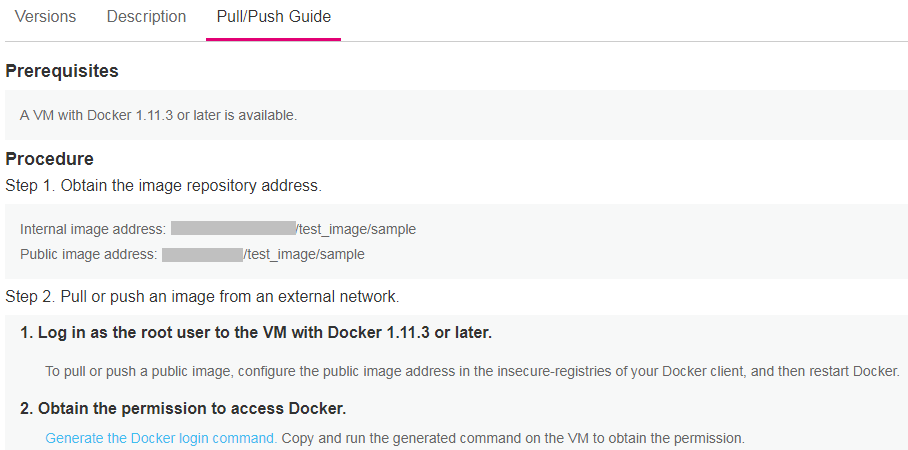

# Pushing a Private Image from an Intranet<a name="cce_01_0211"></a>

This section uses the nginx:1.10 image as an example to describe how to push a private image from an intranet to the CCE image repository. Images will be displayed in the image repository after being pushed.

## Prerequisites<a name="s6974aee92cff45cab8102170ab01700d"></a>

-   A VM is available, on which Docker 1.11.2, 1.12.0, 1.12.1, or 1.12.6 is installed. You are advised to use the VM created in CCE to upload images. The VM has Docker client 1.11.2 installed and can access the Intranet of CCE to obtain a faster upload speed.

    > **NOTE:**   
    >-   For more information on how to create a node on CCE, see  [Creating a Hybrid Cluster](creating-a-hybrid-cluster.md).  
    >-   For more information on how to log in to a VM, see  [Connecting to a Kubernetes Cluster Using kubectl](connecting-to-a-kubernetes-cluster-using-kubectl.md).  

-   The Docker client has been configured. For details, see section  [Connecting to Private Container Registry](connecting-to-private-container-registry.md).
-   An image has been created.

## Procedure<a name="section3220153311018"></a>

1.  Log in to the VM where the Docker client is installed as the  **root**  user.

    For more information on how to log in to a VM created in CCE, see  [Connecting to a Kubernetes Cluster Using kubectl](connecting-to-a-kubernetes-cluster-using-kubectl.md).

2.  Log in to the node, and run the following command to query the Docker version:

    **docker version**

    Information similar to the following is displayed.

    ```
    Client:
    Version: 1.11.2
    UnicornVersion:1.11.2.4
    ...
    ```

    In the preceding information,  **Version**  indicates the version number of the Docker.

3.  Connect to CCE.
    1.  Click the name of the image repository to be uploaded to go to the details page.
    2.  On the  **Pull/Push Guide**  tab page, click  **Generate the Docker login command**, as shown in  [Figure 1](#fig1931918174407).

        **Figure  1**  Generating a Docker login command<a name="fig1931918174407"></a>  
        

        1.  In the Docker login command that is displayed, click    to copy the command. For example, the Docker login command may be similar to the following:

            ```
            docker login -u eu-de@MMZES9KTH43ELTVYTGXA -p c4c8b79699abe427daf60b8035955230c146f744b990b03f7f30a5cb89fb382c 10.158.24.86
            ```

        2.  Replace the public network address of the image repository 10.158.24.86 in the Docker login command with the private network address  **_IP address:Port number_**. You can obtain the value of  **_IP address:Port number_**  in  **Step 1. Obtain the image repository address \> Internal image address**, for example, 10.125.7.25:20202. Then, the Docker login command is as follows:

            ```
            docker login -u eu-de@MMZES9KTH43ELTVYTGXA -p c4c8b79699abe427daf60b8035955230c146f744b990b03f7f30a5cb89fb382c 10.125.7.25:20202
            ```


4.  Log in to the server where Docker is installed. Then, run the Docker login command copied in the previous step.

    After you successfully log in to the Docker client, "login succeeded" is displayed.

5.  Run the following command to tag the nginx:1.10 image:

    **docker tag** _\[Original image name:Original version number\] \[Private network address of the repository that holds the image\]/\[Custom namespace\]\[Custom image repository name\]:\[Version number\]_

    Example command:

    **docker** **tag** _nginx:1.10 10.125.7.25:20202/test/nginx:1.10_

6.  Run the following command to push the image to the image repository:

    **docker push** _10.125.7.25:20202/test/nginx:1.10_

    If the image has been successfully pushed, the following information is displayed:

    ```
    6d6b9812c8ae: Pushed 
    695da0025de6: Pushed 
    fe4c16cbf7a4: Pushed 
    1.10: digest: sha256:eb7e3bbd8e3040efa71d9c2cacfa12a8e39c6b2ccd15eac12bdc49e0b66cee63 size: 948
    ```

    On the CCE console, refresh the  **Image** **Repository**  \>  _**imagename**_  page of the image repository. The pushed image is displayed in the list.


