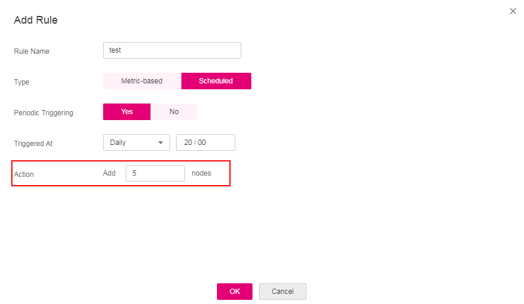

# Scaling a Node

This section describes how to scale in or out CCE cluster nodes.

## Prerequisites

Before using the node scaling function, you must install the  [autoscaler](autoscaler.md)  add-on of v1.13.8 or later.

## Procedure

1.  Log in to the CCE console. In the navigation pane on the left, choose  **Auto Scaling**. On the  **Node Scaling**  tab page, check whether the  [autoscaler](autoscaler.md)  add-on has been installed and is running properly.
2.  After installing the autoscaler add-on, click  **Create Node Scaling Policy**.
3.  On the  **Create Node Scaling Policy**  page, set policy parameters listed in  [Table 1](#table8638121213265).

    **Table  1**  Node scaling policy parameters

    
    <table><thead align="left"><tr id="row10638181262612"><th class="cellrowborder" valign="top" width="20.02%" id="mcps1.2.3.1.1">
Parameter

    </th>
    <th class="cellrowborder" valign="top" width="79.97999999999999%" id="mcps1.2.3.1.2">
Description

    </th>
    </tr>
    </thead>
    <tbody><tr id="row1922964644615"><td class="cellrowborder" valign="top" width="20.02%" headers="mcps1.2.3.1.1 ">
Policy Name

    </td>
    <td class="cellrowborder" valign="top" width="79.97999999999999%" headers="mcps1.2.3.1.2 ">
Name of the policy to be created. Set this parameter as required.

    </td>
    </tr>
    <tr id="row42961494311"><td class="cellrowborder" valign="top" width="20.02%" headers="mcps1.2.3.1.1 ">
Associated Node Pool

    </td>
    <td class="cellrowborder" valign="top" width="79.97999999999999%" headers="mcps1.2.3.1.2 ">
Add a node pool. You can associate multiple node pools to use the same scaling policy.

    </td>
    </tr>
    <tr id="row572593234714"><td class="cellrowborder" valign="top" width="20.02%" headers="mcps1.2.3.1.1 ">
Execution Rules

    </td>
    <td class="cellrowborder" valign="top" width="79.97999999999999%" headers="mcps1.2.3.1.2 ">
Click <b>Add Rule</b>. In the <b>Add Rule</b> dialog box displayed, set the following parameters:

    
<b>Rule Name</b>: Enter a custom rule name.

    
<b>Type</b>: You can select <b>Metric-based</b> or <b>Scheduled</b>. The differences between the two types are as follows:

    <ul id="ul56611653205511"><li><strong id="b1598011319536">Metric-based</strong>:<ul id="ul1350972245920"><li><b>Condition</b>: Select <b>CPU usage</b> or <b>Memory usage</b> and enter a value. The value must be greater than the scale-in percentage configured in the autoscaler add-on.</li><li><b>Action</b>: Set an action to be taken when the trigger condition is met. As shown in <a href="#fig1083019104112">Figure 1</a>, five pods will be added when the memory usage exceeds 40%.</li></ul>
    </li><li><strong id="b98364237211">Scheduled</strong>:<ul id="ul102271758646"><li><b>Periodic Triggering</b>: Select <b>Yes</b> or <b>No</b>.</li><li><b>Triggered At</b>: The value option is decided by <b>Periodic Triggering</b>. If <b>Periodic Triggering</b> is set to <b>Yes</b>, you can set <b>Triggered At</b> to a specific time point every day, every week, or every month. The configuration in <a href="#fig15641103912113">Figure 2</a> indicates that the rule will be triggered at 15:00 every day. If you select <b>No</b> for <b>Periodic Triggering</b>, you can set <b>Triggered At</b> to a specific time point on a certain day in a certain month. The configuration in <a href="#fig1426162312211">Figure 3</a>indicates that the task is triggered at 15:00 on March 6 every year.</li><li><b>Action</b>: Set an action to be taken when the <b>Triggered At</b> value is reached. As shown in <a href="#fig33041138310">Figure 4</a>, five pods will be added at 15:00 every day.</li></ul>
    </li></ul>
    
You can click <strong id="b39038611617">Add Rule</strong> again to add more node scaling policies. You can add a maximum of one CPU usage-based rule and one memory usage-based rule. The total number of rules cannot exceed 10.

    </td>
    </tr>
    </tbody>
    </table>

    **Figure  1**  Action to be taken when a metric-based condition is met  
    

    **Figure  2**  Periodic Triggering \(Yes\)  
    .png "periodic-triggering-(yes)")

    **Figure  3**  Periodic Triggering \(No\)  
    .png "periodic-triggering-(no)")

    **Figure  4**  Action to be taken when a scheduled condition is met  
    

4.  After the configuration is complete, click  **Create Now**. The  **Node Scaling**  page is displayed. You can view the created policy in the list.

## Deleting a Node Scaling Policy

1.  Log in to the CCE console. In the navigation pane, choose  **Auto Scaling**. On the  **Node Scaling**  tab page, click  **Delete**  in the  **Operation**  column of the policy to be deleted.
2.  In the  **Delete Node Policy**  dialog box displayed, confirm whether to delete the policy.
3.  Enter  **DELETE**  in the text box.
4.  Click  **OK**  to delete the policy.

## Editing a Node Scaling Policy

1.  Log in to the CCE console. In the navigation pane, choose  **Auto Scaling**. On the  **Node Scaling**  tab page, click  **Edit**  in the  **Operation**  column of the policy to be edited.
2.  On the  **Create Node Scaling Policy**  page displayed, modify policy parameters listed in  [Table 1](#table8638121213265).
3.  After the configuration is complete, click  **OK**.

## Cloning a Node Scaling Policy

1.  Log in to the CCE console. In the navigation pane, choose  **Auto Scaling**. On the  **Node Scaling**  tab page, click  **More**  \>  **Clone**  in the  **Operation**  column of the policy to be cloned.
2.  On the  **Create Node Scaling Policy**  page displayed, some parameters have been cloned. Add or modify other policy parameters based on service requirements.
3.  Click  **Create Now**  to clone the policy. The cloned policy is displayed in the policy list on the  **Node Scaling**  tab page.

## Enabling or Disabling a Node Scaling Policy

1.  Log in to the CCE console. In the navigation pane, choose  **Auto Scaling**. On the  **Node Scaling**  tab page, click  **More**  \>  **Disable**  or  **Enable**  in the  **Operation**  column of the policy.
2.  In the dialog box displayed, confirm whether to disable or enable the node policy.
3.  Click  **OK**. The policy status is displayed in the node scaling list.

## Viewing a Node Scaling Policy

You can view the associated node pool, rules, and scaling history of a node scaling policy and rectify faults according to the error information displayed.

1.  Log in to the CCE console. In the navigation pane, choose  **Auto Scaling**. On the  **Node Scaling**  tab page, click    in front of the policy to be viewed.
2.  In the expanded area, the  **Associated Node Pool**,  **Execution Rules**, and  **Scaling Records**  tab pages are displayed. If the policy is abnormal, locate and rectify the fault based on the error information.

    > **NOTE:** 
    >You can also enable or disable auto scaling in  **Node Pool Management**. Log in to the CCE console. In the navigation pane, choose  **Resource Management**  \>  **Node Pools**, and click  **Edit**  in the upper right corner of the node pool to be operated. In the  **Edit Node Pool**  dialog box displayed, you can enable  **Autoscaler**  and set the limits of the number of nodes and the cooling interval for auto scaling.

