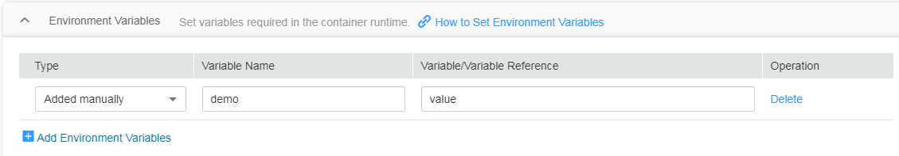

# Setting an Environment Variable

An  environment variable  is a variable set in the runtime environment of a container. Environment variables can be modified after the workload is deployed, providing flexibility for workloads.

The function of setting environment variables on CCE is the same as that of specifying  **ENV**  in a Dockerfile.

CCE provides three ways to add environment variables:  Manually add environment variables,  import environment variables from a secret, and  import environment variables from a configMap.

> **NOTICE:**   
>After a container is started, do not modify configurations in the container. If configurations in the container are modified \(for example, passwords, certificates, and environment variables of a containerized application are added to the container\), the configurations will be lost after the container restarts and container services will become abnormal. An example scenario of container restart is pod rescheduling due to node anomalies.  
>Configurations must be imported to a container as arguments. Otherwise, configurations will be lost after the container restarts.  

## Manually Adding Environment Variables

1.  When creating a workload, add a container image. Then, expand  **Environment Variables**  and click  **Add Environment Variables**.
2.  Configure the following parameters as required:

    -   **Type**: Set this to  **Added manually**.
    -   **Variable Name**: Enter a variable name, for example, demo.
    -   **Variable Value/Reference**: Enter a variable value, for example, value.

    **Figure  1**  Manually adding environment variables  
    

## Importing Environment Variables from a Secret

1.  You need to create a key first. For details, see  [Creating a Secret](creating-a-secret.md).
2.  When creating a workload, add a container image. Then, expand  **Environment Variables**  and click  **Add Environment Variables**.
3.  Configure the following parameters as required:

    -   **Type**: Set this to  **Added from Secret**.
    -   **Variable Name**: Enter a variable name.
    -   **Variable Value/Reference**: Select the corresponding secret name and key.

    **Figure  2**  Importing environment variables from a secret  
    

## Importing Environment Variables from a ConfigMap

1.  Create a ConfigMap first. For details, see  [Creating a ConfigMap](creating-a-configmap.md).
2.  When creating a workload, add a container image. Then, expand  **Environment Variables**  and click  **Add Environment Variables**.
3.  Configure the following parameters as required:

    -   **Type**: Set this to  **Added from ConfigMap**.
    -   **Variable Name**: Enter a variable name.
    -   **Variable Value/Reference**: Select the corresponding ConfigMap name and key.

    **Figure  3**  Importing environment variables from a ConfigMap  
    

