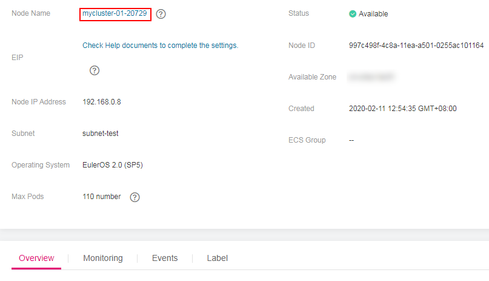
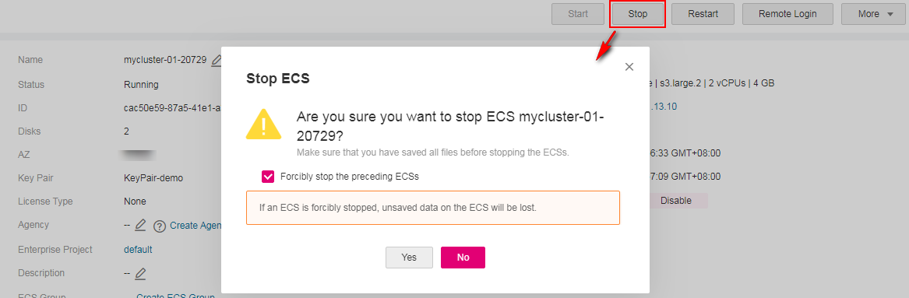

# Stopping a Node

After a node in the cluster is stopped, the services on the node are also stopped. Before stopping a node, ensure that discontinuity of the services on the node will not result in adverse impacts.

## Precautions

-   Deleting a node will lead to pod migration, which may affect services. Therefore, delete nodes during off-peak hours.
-   Unexpected risks may occur during node deletion. Back up related data in advance.
-   While the node is being deleted, the backend will set the node to the unschedulable state.
-   Only worker nodes can be stopped.

## Procedure

1.  Log in to the CCE console. In the navigation pane, choose  **Resource Management**  \>  **Nodes**.
2.  In the node list, click the name of the node to be stopped. The node details page is displayed.

    **Figure  1**  Node list  
    

3.  Click the node name in the  **Basic Information**  area to open the ECS details page on the Cloud Server Console.

    **Figure  2**  Nodes details page  
    

4.  In the upper right corner of the ECS details page, click  **Stop**. In the  **Stop ECS**  dialog box, click  **Yes**.

    **Figure  3**  ECS details page  
    

