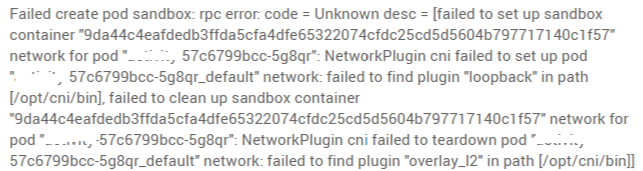

# What Should I Do If Sandbox-Related Errors Are Reported When the Pod Remains in the Creating State?

## Symptom

The pod remains in the creating state for a long time, and the sandbox-related errors are reported.

## Solution

Select a troubleshooting method for your cluster:

**Clusters of V1.13**

1.  Sandbox errors are generally caused by the abnormal startup of the container component on the node. You can run the  **systemctl status canal**  command to check the container component and run the  **systemctl restart canal**  command to restart the component.
2.  All container components on the node are normal, but the  **loopback**  file of the CNI is missing. The error is as follows:  **network: failed to find plugin "loopback" in path \[/opt/cni/bin\]**. You can copy a complete version of the  **loopback**  file from the current region or other regions which share the same cluster versions \(minor releases can be ignored\), and put the  **loopback**  file in the path  **/opt/cni/bin/**. Then, restart the canal component.

**Clusters earlier than V1.13**

1.  Sandbox errors are generally caused by the abnormal startup of the container components on the node. You can run the  **su paas -c '/var/paas/monit/bin/monit summary'**  command to check the container component and run the  **su paas -c '/var/paas/monit/bin/monit restart canal'**  command to restart the component.
2.  All container components on the node are normal, but the  **loopback**  file of the CNI is missing. The error is as follows:  **network: failed to find plugin "loopback" in path \[/opt/cni/bin\]**. You can copy a complete version of the  **loopback**  file from the current region or other regions which share the same cluster versions \(minor releases can be ignored\), and put the  **loopback**  file in the path  **/opt/cni/bin/**. Then, restart the canal component.

