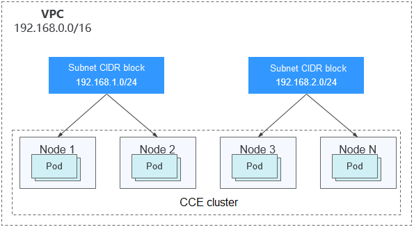
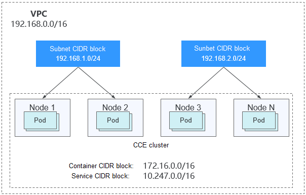
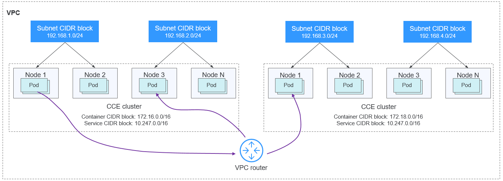
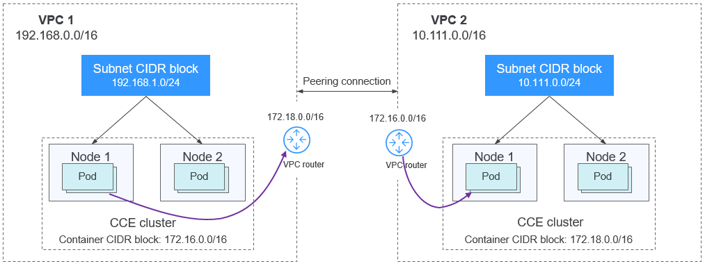
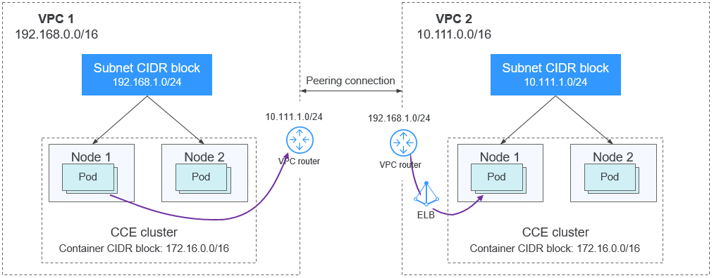

# Which CIDR Blocks Does CCE Support?

Before creating a cluster on CCE, determine the number of VPCs, number of subnets, container CIDR blocks, and Services for access based on service requirements.

This topic describes the functions of various addresses in the CCE cluster in the VPC environment and how to plan CIDR blocks.

## Basic Concepts

**VPC CIDR Block**

Virtual Private Cloud \(VPC\) enables you to provision logically isolated, configurable, and manageable virtual networks for cloud servers, cloud containers, and cloud databases. You have complete control over your virtual network, including selecting your own CIDR block, creating subnets, and configuring security groups. You can also assign EIPs and allocate bandwidth in your VPC for secure and easy access to your business system.

**Subnet CIDR Block**

A subnet is a network that manages ECS network planes. It supports IP address management and DNS. The IP addresses of all ECSs in a subnet belong to the subnet.

**Figure  1**  VPC CIDR block architecture  

By default, ECSs in all subnets of the same VPC can communicate with one another, while ECSs in different VPCs cannot communicate with each other.

You can create a VPC peering connection to enable ECSs in different VPCs to communicate with each other.

**Container \(Pod\) CIDR Block**

Pod is a Kubernetes concept. Each pod has an IP address.

When creating a cluster on CCE, you can specify the pod \(container\) CIDR block, which cannot overlap with the subnet CIDR block. For example, if the subnet CIDR block is 192.168.0.0/16, the container CIDR block cannot be 192.168.0.0/18 or 192.168.1.0/18, because these addresses are included in 192.168.0.0/16.

**Service CIDR Block**

Service is also a Kubernetes concept. Each Service has an address. When creating a cluster on CCE, you can specify the Service CIDR block. Similarly, the Service CIDR block cannot overlap with the subnet CIDR block or the container CIDR block. The Service CIDR block can be used only within a cluster.

For details about the relationship between these CIDR blocks, see  [Figure 2](#en-us_topic_0242566246_fig15791152874920).

## How Do I Select a CIDR Block?

**Single-VPC Single-Cluster Scenarios**

These are the simplest scenarios. The VPC CIDR block is determined when the VPC is created. When creating a CCE cluster, select a CIDR block different from that of the current VPC.

**Figure  2**  CIDR block in the single-VPC single-cluster scenario  

**Single-VPC Multi-Cluster Scenarios**

Multiple CCE clusters are created in a VPC.

In the  **VPC network**  mode, pod packets are forwarded through VPC routes. CCE automatically configures a routing table on the VPC routes to each container CIDR block.

Pay attention to the following:

-   The VPC address is determined during VPC creation. When creating a cluster, select a CIDR block for each cluster that does not overlap with the VPC CIDR block or other container CIDR blocks.
-   The container CIDR blocks of all clusters cannot overlap, but the Service CIDR blocks can. In this case, CCE clusters are partially interconnected. A pod of a cluster can directly access the pods of another cluster, but cannot access the Services of the cluster.
-   The network scale is limited by the VPC route table.

**Figure  3**  VPC network - multi-cluster scenario  

In the tunnel network model, the container network is an overlay network plane deployed over the VPC network. Though at some cost of performance, the tunnel encapsulation enables higher interoperability and compatibility with advanced features \(such as network policy-based isolation\), meeting the requirements of most applications.

**Figure  4**  Tunnel network - multi-cluster scenario  

Pay attention to the following:

-   The VPC address is determined during VPC creation. When creating a cluster, select a CIDR block for each cluster that does not overlap with the VPC CIDR block or other container CIDR blocks.
-   The container CIDR blocks of all clusters can overlap, so do the Service CIDR blocks.
-   It is recommended that ELB be used for the cross-cluster access between containers.

**VPC Interconnection Scenarios**

When two VPC networks are interconnected, you can configure the packets to be sent to the peer VPC in the route table.

In the VPC network model, after creating a peering connection, you need to add routes for the peering connection to enable communication between the two VPCs.

**Figure  5**  VPC Network - VPC interconnection scenario  

To interconnect cluster containers across VPCs, you need to create VPC peering connections.

Pay attention to the following:

-   The VPC address is determined during VPC creation. When creating a cluster, select a CIDR block for each cluster that does not overlap with the VPC CIDR block or other container CIDR blocks.
-   The container CIDR blocks of all clusters cannot overlap, but the Service CIDR blocks can.
-   Add the peer container CIDR block to the route table of the VPC peering connection.

In the tunnel network model, after creating a peering connection, you need to add routes for the peering connection to enable communication between the two VPCs.

**Figure  6**  Tunnel network - VPC interconnection scenario  

Pay attention to the following:

-   The VPC address is determined during VPC creation. When creating a cluster, select a CIDR block for each cluster that does not overlap with the VPC CIDR block or other container CIDR blocks.
-   The container CIDR blocks of all clusters cannot overlap, but the Service CIDR blocks can.
-   Add the peer subnet CIDR block to the route table of the VPC peering connection.

**VPC-IDC Scenarios**

Similar to the VPC interconnection scenario, some CIDR blocks in the VPC are routed to the IDC. The pod IP addresses of CCE clusters cannot overlap with the addresses within these CIDR blocks. To access the pod IP addresses in the cluster in the IDC, you need to configure the route table to the private line VBR on the IDC.

