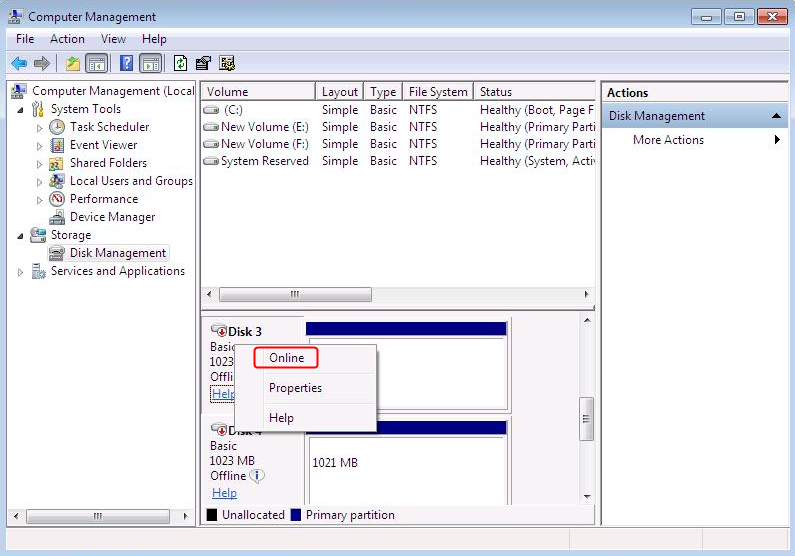
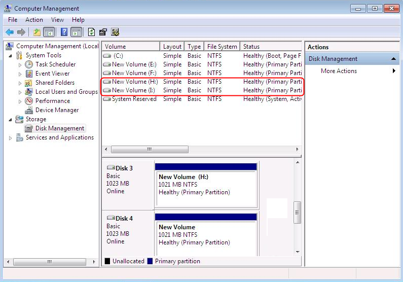

# Data Disks Are Not Displayed After a Windows ECS Is Restored

## Symptom

When a Windows ECS is restored, the data disks are not displayed.

## Possible Cause

Due to the limitations of Windows operating systems, data disks are in offline mode after an ECS is stored.

## Solution

1.  On the Windows desktop, right-click the  **My Computer**  icon.
2.  Choose  **Manage**  from the shortcut menu. The  **Computer Management**  page is displayed.
3.  In the navigation tree, choose  **Storage**  \>  **Disk Management**.

    Data disks are in the offline state, as shown in  [Figure 1](#fig413741135513).

    **Figure  1**  Data disks in the offline state  
    

4.  Right-click a data disk in the offline state and choose  **Online**, as shown in  [Figure 2](#fig179301858016).

    **Figure  2**  Setting a data disk to be online  
    

    After the data disk status changes to  **Online**, the data disk will be displayed in the disk list, as shown in  [Figure 3](#fig9869427131715).

    In addition, the data disk will be properly displayed on the ECS.

    **Figure  3**  Viewing online data disks  
    

