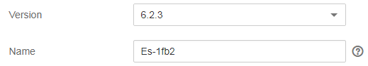
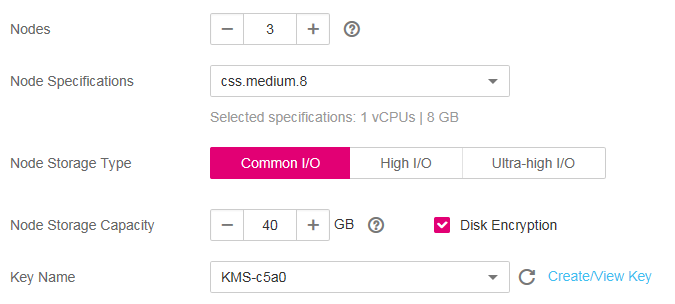

# Creating a Cluster

To use CSS, create a cluster first.

## Procedure

1.  Log in to the CSS management console.
2.  On the  **Dashboard**  or  **Clusters**  page, click  **Create Cluster**  to switch to the  **Create Cluster**  page.
3.  Specify  **Region**  and  **AZ**.

    **Region**: Select the region for the cluster from drop-down menu to the right of  **Region**. Currently, only region eu-de is supported.

    **AZ**: An AZ contains one or multiple physical data centers. Each AZ has independent cooling, fire extinguishing, moisture-proof, and electricity facilities. Within an AZ, computing, network, storage, and other resources are logically divided into multiple clusters. AZs within a region are interconnected using high-speed optical fibers to allow users to build cross-AZ high-availability systems. Select the AZ associated with the cluster's region.

4.  Set basic information about the cluster. Specifically, specify  **Version**  and  **Name**.

    -   **Version**: Version 6.2.3 is supported.
    -   **Name**: Enter a cluster name containing 4 to 32 characters. Only letters, digits, hyphens \(-\), and underscores \(\_\) are allowed. The value must start with a letter.

    **Figure  1**  Configuring basic information  
    

5.  Set host specifications of the cluster.

    **Table  1**  Parameter description

    
    <table><thead align="left"><tr id="row14509181918241"><th class="cellrowborder" valign="top" width="25%" id="mcps1.2.3.1.1">
Parameter

    </th>
    <th class="cellrowborder" valign="top" width="75%" id="mcps1.2.3.1.2">
Description

    </th>
    </tr>
    </thead>
    <tbody><tr id="row15509111982410"><td class="cellrowborder" valign="top" width="25%" headers="mcps1.2.3.1.1 ">
<b>Nodes</b>

    </td>
    <td class="cellrowborder" valign="top" width="75%" headers="mcps1.2.3.1.2 ">
Number of nodes in a cluster.

    </td>
    </tr>
    <tr id="row65090196243"><td class="cellrowborder" valign="top" width="25%" headers="mcps1.2.3.1.1 ">
<b>Node Specifications</b>

    </td>
    <td class="cellrowborder" valign="top" width="75%" headers="mcps1.2.3.1.2 ">
Flavor of nodes in a cluster. Currently, the following specifications are supported: <strong id="b185681557231">css.medium.8</strong>, <strong id="b109714214242">css.large.8</strong>, <strong id="b1318376152419">css.xlarge.8</strong>, <strong id="b1084719942417">css.2xlarge.8</strong>, and <strong id="b1984911128247">css.4xlarge.8</strong>.

    
After you select a node specification, the CPU and memory corresponding to the current specification are displayed below the parameter. For example, if you select <strong id="b685720320818">css.medium.8</strong>, then <strong id="b38701031782">1 vCPUs | 8 GB</strong> will be displayed in the lower part, indicating that your selected node specification contains one vCPU and 8 GB memory.

    </td>
    </tr>
    <tr id="row175091919122413"><td class="cellrowborder" valign="top" width="25%" headers="mcps1.2.3.1.1 ">
<b>Node Storage Type</b>

    </td>
    <td class="cellrowborder" valign="top" width="75%" headers="mcps1.2.3.1.2 ">
In the current version, the following options are available: <strong id="b28211641156">Common I/O</strong>, <strong id="b13880344954">High I/O</strong>, and <strong id="b68612481958">Ultra-high I/O</strong>.

    </td>
    </tr>
    <tr id="row250912197249"><td class="cellrowborder" valign="top" width="25%" headers="mcps1.2.3.1.1 ">
<b>Node Storage Capacity</b>

    </td>
    <td class="cellrowborder" valign="top" width="75%" headers="mcps1.2.3.1.2 ">
Storage space. Its value is related to node specifications and varies with node specifications.

    <ul id="ul189461316669"><li>Value range of flavor <strong id="b1848992610451">css.medium.8</strong>: 40 GB to 640 GB</li><li>Value range of flavor <strong id="b1851033122314">css.large.8</strong>: 40 GB to 1,280 GB</li><li>Value range of flavor <strong id="b91201547112313">css.xlarge.8</strong>: 40 GB to 2,560 GB</li><li>Value range of flavor <strong id="b279692713247">css.2xlarge.8</strong>: 80 GB to 5,120 GB</li><li>Value range of flavor <strong id="b142962316246">css.4xlarge.8</strong>: 160 GB to 10,240 GB</li></ul>
    </td>
    </tr>
    <tr id="row6127934194011"><td class="cellrowborder" valign="top" width="25%" headers="mcps1.2.3.1.1 ">
<b>Disk Encryption</b>

    </td>
    <td class="cellrowborder" valign="top" width="75%" headers="mcps1.2.3.1.2 ">
If you select this option, the nodes you selected for the created cluster use encrypted EVS disks to enhance data security in the cluster. By default, this option is not selected. After the cluster is created, you cannot modify the setting of this option. Therefore, exercise caution when performing the setting.

    
After you select this option, you need to select an available key from the <strong id="b11607121916479">Key Name</strong> drop-down list box. If no key is available, click <b>Create/View Key</b> to go to the KMS management console and create or modify a key. For details, see <a href="https://docs.otc.t-systems.com/en-us/usermanual/kms/en-us_topic_0034330265.html" target="_blank" rel="noopener noreferrer">Creating a CMK</a>.

    
Enabling disk encryption has no impact on your operations on a cluster (such as accessing the cluster, importing data to the cluster, and much more). However, after you enable disk encryption, operation performance deteriorates by about 10%.

    
 NOTE: 
<ul id="ul67444552406"><li>If the cluster is in the <b>Available</b> state and the key used for disk encryption is in the <b>Pending deletion</b> or <b>disable</b> state or has been deleted after a cluster is created, cluster capacity expansion is not allowed, while other operations on the cluster, such as restarting the cluster, creating snapshots, restoring the cluster, and importing data to the cluster are not affected. In addition, this key cannot be used for cluster creation in the future.</li><li>After a cluster is created, do not delete the key used by the cluster. Otherwise, the cluster will become unavailable.</li><li>The Default Master Keys cannot be used to create grants. Specifically, you cannot use Default Master Keys whose aliases end with <b>/default</b> in KMS to create clusters.</li></ul>
    

    </td>
    </tr>
    </tbody>
    </table>

    **Figure  2**  Configuring host specifications  
    

6.  Set network specifications of the cluster. Specifically, specify  **VPC**,  **Subnet**, and  **Security Group**.

    -   **VPC**: A VPC is a secure, isolated, logical network environment.

        Select the target VPC. Click  **View VPC**  to enter the VPC management console to view the created VPC names and IDs. If no VPC is available, create a VPC.

        > **NOTE:**   
        >The selected VPC must contain CIDRs. Otherwise, cluster creation will fail. By default, a created VPC contains CIDRs.  

    -   **Subnet**: A subnet provides dedicated network resources that are isolated from other networks for higher network security.

        Select the target subnet. You can access the VPC management console to view the names and IDs of the existing subnets in the target VPC.

    -   **Security Group**: A security group is a collection of access control rules for ECSs that have the same security protection requirements and are mutually trusted in a VPC. To view more details about the security group, click  **View Security Group**.

        > **NOTE:**   
        >Ensure that  **Port/Range**  is  **All**  or a port range including port  **9200**  for the selected security group.  

    -   **Communication Encryption**: If you enable the communication encryption function, you will access the cluster using HTTPS to secure your data. After the cluster is created, you cannot modify the setting of this option. Therefore, exercise caution when performing the setting. By default, the communication encryption function is enabled.

          indicates to enable the communication encryption function, and    indicates to disable the communication encryption function.

        If the communication encryption function is enabled, the CSS server processes the SSL requests from the client and the security certificate of the CSS server has been configured by default. Please be aware that the certificate is shared between all CSS instances.

        Enabling this function in a cluster will affect the procedure of accessing the cluster or importing data to the cluster. For details, see  [Accessing a Cluster](accessing-a-cluster.md),  [Using Logstash to Import Data to Elasticsearch](using-logstash-to-import-data-to-elasticsearch.md), and  [Using Kibana or APIs to Import Data to Elasticsearch](using-kibana-or-apis-to-import-data-to-elasticsearch.md).

    **Figure  3**  Configuring network specifications  
    

7.  Click  **Next**  to switch to the  **Confirm**  page.
8.  After the specifications are confirmed, click  **Submit**.
9.  Click  **Back to Cluster List**  to switch to the  **Clusters**  page. The cluster you created is listed on the displayed page and its status is  **Creating**. If the cluster is successfully created, its status will change to  **Available**.

    If the cluster fails to be created, create the cluster again as prompted.

