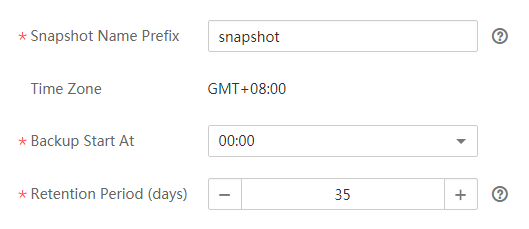
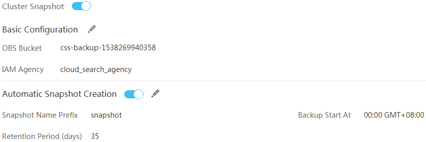
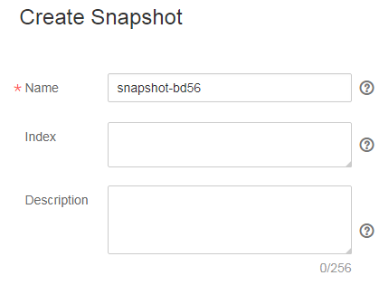
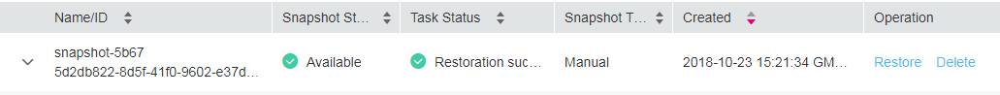

# Index Backup and Restoration

You can back up index data in clusters to avoid data loss. If data loss occurs or you want to retrieve data of a specified duration, you can restore the index data to obtain the data quickly. Index backup is implemented by creating cluster snapshots. When backing up for the first time, you are advised to back up data of all indices.

-   [Managing Automatic Snapshot Creation](#section18551039928): Snapshots are automatically created at a specified time each day according to the rules you create. You can enable or disable the automatic snapshot creation function and set the automatic snapshot creation policy.
-   [Manually creating a snapshot](#section43906502025): You can manually create a snapshot at any time to back up all data or data of specified indices.
-   [Restoring data](#section16538152014387): You can use existing snapshots to restore the backup index data to a specified cluster.
-   [Deleting a snapshot](#section3105193716428): You are advised to delete invalid snapshots to release storage resources.

> **NOTE:**   
>-   Before creating a snapshot, you need to perform basic configurations, including configuring the OBS bucket for storing snapshots and IAM agency used for security authentication.  
>-   If there are available snapshots in the snapshot list when you configure the OBS bucket for storing cluster snapshots for the first time, the bucket cannot be changed for all snapshots that are automatically or manually created later. Therefore, exercise caution when you configure the OBS bucket.  
>-   If you want to change the OBS bucket where there are snapshots, do as follows: Disable the snapshot function, enable it, and specify a new OBS bucket.  
>    Once the snapshot function is disabled, the previously created snapshots cannot be used to restore the cluster.  
>-   If a cluster is in the  **Unavailable**  state, you can only use the cluster snapshot function to restore clusters and view existing snapshot information without being able to edit.  
>-   During backup and restoration of a cluster, allowed operations on the cluster include capacity expansion, Kibana access, metric viewing, and deletion of other snapshots of clusters, but the following operations are not allowed: restart or deletion of the cluster, deletion of a snapshot that is in the  **Creating**  or  **Restoring**  state, and creating or restoring another snapshot. If a snapshot is being created or restored for a cluster, then the automatic snapshot creation task initiated for the cluster will be canceled.  

## Prerequisites

To use the function of creating or restoring snapshots, the account or IAM user used for logging in to the CSS management console must have both of the following permissions:

-   **Tenant Administrator**  for project  **OBS**  in region  **Global service**
-   **CSS Administrator**  in the current region

## Managing Automatic Snapshot Creation

1.  In the left navigation pane of the CSS management console, click  **Clusters**.
2.  On the  **Clusters**  page that is displayed, click the name of the target cluster. On the displayed page, click  **Cluster Snapshots**.

    Alternatively, on the  **Clusters**  page, locate the row where the target cluster resides and click  **More \> Back Up and Restore**  in the  **Operation**  column to switch to the  **Cluster Snapshots**  page.

3.  On the displayed  **Cluster Snapshots**  page, click the icon to the right of  **Cluster Snapshot**  to enable the cluster snapshot function.

      indicates that the cluster snapshot function is disabled.    indicates that the cluster snapshot function is enabled.

4.  \(Optional\) After the cluster snapshot function is enabled, CSS automatically creates the OBS bucket and IAM agency for you to store snapshots. The automatically created OBS bucket and IAM agency are displayed on the page. If you want to change the OBS bucket and IAM agency, click    to the right of  **Basic Configuration**. To ensure the security of snapshot data, you can select a key to encrypt the snapshot.

    In the displayed  **Edit Basic Configuration**  dialog box, you can either select an existing OBS bucket and an IAM agency or create an OBS bucket and an IAM agency. To create an OBS bucket, click  **Create Bucket**. To create an IAM agency, click  **Create IAM Agency**. For details, see  [Creating a Bucket](https://docs.otc.t-systems.com/en-us/usermanual/obs/en-us_topic_0045853662.html)  and  [Creating an Agency](https://docs.otc.t-systems.com/en-us/usermanual/iam/en-us_topic_0046613147.html). To encrypt the snapshot, select  **Snapshot Encryption**  and select a key.

    **Table  1**  Parameter description

    
    <table><thead align="left"><tr id="row595810278493"><th class="cellrowborder" valign="top" width="20%" id="mcps1.2.4.1.1">
Parameter

    </th>
    <th class="cellrowborder" valign="top" width="27.98%" id="mcps1.2.4.1.2">
Description

    </th>
    <th class="cellrowborder" valign="top" width="52.019999999999996%" id="mcps1.2.4.1.3">
Precautions

    </th>
    </tr>
    </thead>
    <tbody><tr id="row296002719498"><td class="cellrowborder" valign="top" width="20%" headers="mcps1.2.4.1.1 ">
<b>OBS Bucket</b>

    </td>
    <td class="cellrowborder" valign="top" width="27.98%" headers="mcps1.2.4.1.2 ">
Name of the OBS bucket used for storing snapshots.

    </td>
    <td class="cellrowborder" valign="top" width="52.019999999999996%" headers="mcps1.2.4.1.3 ">
The following conditions must be met for existing OBS buckets or those to be created:

    <ul id="ul196015276499"><li><b>Storage Class</b> is <b>Standard</b> or <strong id="b19327185411268">Warm</strong>.</li></ul>
    </td>
    </tr>
    <tr id="row1996112794910"><td class="cellrowborder" valign="top" width="20%" headers="mcps1.2.4.1.1 ">
<b>IAM Agency</b>

    </td>
    <td class="cellrowborder" valign="top" width="27.98%" headers="mcps1.2.4.1.2 ">
IAM agency authorized by the current account to CSS to access or maintain data stored in OBS.

    </td>
    <td class="cellrowborder" valign="top" width="52.019999999999996%" headers="mcps1.2.4.1.3 ">
The following conditions must be met for existing IAM agencies or those to be created:

    <ul id="ul29611827194917"><li><b>Agency Type</b> is <b>Cloud service</b>.</li><li><b>Cloud Service</b> is <strong id="b761841702716">CSS</strong>.</li><li>The agency has the <b>Tenant Administrator</b> permission for the <strong id="b115661322132818">OBS(S3)</strong> project in <strong id="b177731536202811">OBS(S3)</strong>.</li></ul>
    </td>
    </tr>
    <tr id="row3355132444"><td class="cellrowborder" valign="top" width="20%" headers="mcps1.2.4.1.1 ">
<b>Snapshot Encryption</b>

    </td>
    <td class="cellrowborder" valign="top" width="27.98%" headers="mcps1.2.4.1.2 ">
Whether to enable the snapshot encryption function. Enabling the snapshot encryption function ensures the security of your snapshot data.

    </td>
    <td class="cellrowborder" valign="top" width="52.019999999999996%" headers="mcps1.2.4.1.3 ">
After selecting <strong id="b12703185913513">Snapshot Encryption</strong>, select a key from the <strong id="b1872813196616">Key Name</strong> drop-down list. If no key is available, click <b>Create/View Key</b> to switch to the KMS management console to create a key or modify an existing key. For details, see <a href="https://docs.otc.t-systems.com/en-us/usermanual/kms/en-us_topic_0034330265.html" target="_blank" rel="noopener noreferrer">Creating a CMK</a>.

    <ul id="ul67444552406"><li>The Default Master Keys cannot be used to create grants. Specifically, you cannot use Default Master Keys whose aliases end with <b>/default</b> in KMS to encrypt snapshots.</li><li>If a snapshot has been stored in the OBS bucket, you cannot modify the parameters for encrypting the snapshot.</li><li>If the key used for encryption is in the <b>Pending deletion</b> or <b>disable</b> state, you cannot perform backup and restoration operations on the cluster. Specifically, new snapshots cannot be created for the cluster, and existing snapshots cannot be used for restoration. In this case, switch to the KMS management console and change the state of the target key to <strong id="b317617751116">enable</strong> so that backup and restore operations are allowed on the cluster.</li><li>If the key used for encryption is deleted, backup and restore operations are not allowed on the cluster. In addition, the deleted key cannot be restored. Therefore, exercise caution when deleting a key.</li><li>You are advised to disable the automatic snapshot creation function if the key is deleted or is in the <b>Pending deletion</b> or <b>disable</b> state. In this condition, automatic snapshot creation is allowed based on the configured snapshot policy. However, all automatic snapshot creation tasks will fail, and the failed tasks will be displayed in the <strong id="b89421150414">Failed Tasks</strong> dialog box.</li></ul>
    </td>
    </tr>
    </tbody>
    </table>

    **Figure  1**  Edit Basic configuration  
    

5.  Click the icon to the right of  **Automatic Snapshot Creation**  to enable the automatic snapshot creation function.

      indicates that the automatic snapshot creation function is enabled, and    indicates that the automatic snapshot creation function is disabled.

6.  In the displayed  **Edit Snapshot Policy**  dialog box, specify parameters as required.

    -   **Snapshot Name Prefix**: The snapshot name consists of the snapshot name prefix \(indicated by this parameter\) and time. For example,  **snapshot-2018022405925**, an automatically generated snapshot name. The snapshot name prefix contains 1 to 31 characters and must start with a lowercase letter. Only lowercase letters, digits, hyphens \(-\), and underscores \(\_\) are allowed.
    -   **Time Zone**: indicates the time zone for the backup time. Specify  **Backup Started**  based on the time zone.
    -   **Backup Started**: indicates the time when the backup starts automatically each day. You can only specify this parameter to an hour time, for example,  **00:00**  or  **01:00**. The value ranges from  **00:00**  to  **23:00**. Select the backup time from the drop-down list box.
    -   **Retention Period \(days\)**: indicates the duration during which snapshots are retained in the OBS bucket, in days. The value ranges from  **1**  to  **90**. You can specify this parameter as required. The system automatically deletes snapshots that are retained over the specified retention period on the half hour. For example, if you set the snapshot policy as shown in  [Figure 2](#fig134941224185010), the system will automatically delete in 35 days at 00:30 the automated snapshots that were created 35 days earlier at 00:00.

    **Figure  2**  Automatic snapshot creation  
    

7.  Click  **OK**.

    After the policy for automatic snapshot creation is created, the policy information will be displayed on the  **Cluster Snapshots**  page. If you need to change the policy due to business changes, click  .

    Snapshots that are automatically created according to the snapshot policy are displayed in the snapshot list. All automatically and manually created snapshots are displayed in the snapshot list. You can distinguish them by the  **Snapshot Type**  setting. In the upper right corner of the snapshot list, enter the keyword of the snapshot name or snapshot ID to search for the desired snapshots. You can also click    to sort the snapshots based on related parameter settings.

    **Figure  3**  Automatic snapshot creation policy  
    

8.  \(Optional\) Disable the automatic snapshot creation function.

    After you disable the automatic snapshot creation function, the system stops automatic creation of snapshots. If the system is creating a snapshot based on the automatic snapshot creation policy and the snapshot has not been displayed in the snapshot list, you cannot disable the automatic snapshot creation function. In this case, if you click the button next to  **Automatic Snapshot Creation**, a message is displayed, indicating that you cannot disable the function. You are advised to disable the function after the system completes automatic creation of the snapshot, specifically, the created snapshot is displayed in the snapshot list.

    When disabling the automatic snapshot creation function, you can choose whether to delete the snapshots that have been automatically created by configuring  **Delete automated snapshots**  in the displayed dialog box. By default, automatically created snapshots are not deleted.

    -   If you do not select  **Delete automated snapshots**, automatically created snapshots are not deleted when you disable the automatic snapshot creation function. In this case, you can manually delete them in the future. For details, see  [Deleting a Snapshot](#section3105193716428). If you do not manually delete the automatically created snapshots and enable the automatic snapshot creation function again, then all snapshots with  **Snapshot Type**  set to  **Automated**  in the snapshot list of the cluster can only be automatically deleted by the system. Specifically, the system automatically deletes snapshots based on the snapshot policy configured when you enable the automatic snapshot creation function again. For example, if you set  **Retention Period \(days\)**  to  **10**, the system will automatically delete the snapshots that have been retained for more than 10 days.
    -   If you select  **Delete automated snapshots**, all snapshots with  **Snapshot Type**  set to  **Automated**  in the snapshot list will be deleted when you disable the automatic snapshot creation function.

## Manually Creating a Snapshot

1.  In the left navigation pane of the CSS management console, click  **Clusters**.
2.  On the  **Clusters**  page that is displayed, click the name of the target cluster. On the displayed page, click  **Cluster Snapshots**.

    Alternatively, on the  **Clusters**  page, locate the row where the target cluster resides and click  **More**  \>  **Back Up and Restore**  in the  **Operation**  column to switch to the  **Cluster Snapshots**  page.

3.  On the displayed  **Cluster Snapshots**  page, click the icon to the right of  **Cluster Snapshot**  to enable the cluster snapshot function.

      indicates that the cluster snapshot function is disabled.    indicates that the cluster snapshot function is enabled.

4.  \(Optional\) After the cluster snapshot function is enabled, CSS automatically creates the OBS bucket and IAM agency for you to store snapshots. The automatically created OBS bucket and IAM agency are displayed on the page. If you want to change the OBS bucket and IAM agency, click    to the right of  **Basic Configuration**. For details about how to configure parameters involved in the basic configuration, see  [4](#li1597517249415).
5.  After basic configurations are complete, click  **Create Snapshot**.

    -   **Snapshot Name**: indicates the name of the manually created snapshot, which contains 4 to 64 characters and must start with a lowercase letter. Only lowercase letters, digits, hyphens \(-\), and underscores \(\_\) are allowed. Unlike the name of an automatically created snapshot, the name of a manually created snapshot is set as specified and time information is not automatically added to the name.
    -   **Index**: Enter the name of the index. The manually created snapshot can back up data of certain indices in the cluster. The value contains a maximum of 1,024 characters. Uppercase letters, spaces, and certain special characters \(including "\\<|\>/?\) are not allowed. Multiple index names are separated by commas \(,\). If this parameter is left unspecified, data of all indices in the cluster is backed up by default. You can use the asterisk \(**\***\) to back up data of certain indices. For example, if you enter  **2018-06\***, then data of indices with the name prefix of  **2018-06**  will be backed up.

        You can use the  **GET /\_cat/indices**  command in Kibana to query names of all indices in the cluster. You can then enter the names of the indices you want to back up.

    -   **Snapshot Description**: indicates the description of the created snapshot. The value contains 0 to 256 characters, and certain special characters \(**<\>**\) are not allowed.

    **Figure  4**  Creating a snapshot  
    

6.  Click  **OK**.

    After the snapshot is created, it will be displayed in the snapshot list. Status  **Available**  indicates that the snapshot is created successfully. All automatically and manually created snapshots are displayed in the snapshot list. You can distinguish them by the  **Snapshot Type**  setting. In the upper right corner of the snapshot list, enter the keyword of the snapshot name or snapshot ID to search for the desired snapshots. You can also click    to sort the snapshots based on related parameter settings.

## Restoring Data

You can use snapshots whose  **Snapshot Status**  is  **Available**  to restore cluster data. The stored snapshot data can be restored to other clusters.

Restoring data will overwrite current data in clusters. Therefore, exercise caution when restoring data.

1.  In the  **Snapshot Management**  area, locate the row where the snapshot you want to restore resides and click  **Restore**  in the  **Operation**  column.
2.  In the displayed dialog box, specify parameters as required.

    **Index**: Enter the name of the index you want to restore. By default, this option is left blank, indicating that data of all indices is restored. The value contains 0 to 1024 characters. Uppercase letters, spaces, and certain special characters \(including "\\<|\>/?\) are not allowed.

    **Rename Pattern**: Enter a regular expression. Indices that match the regular expression are restored. The default value  **index\_\(.+\)**  indicates restoring data of all indices. The value contains 0 to 1024 characters. Uppercase letters, spaces, and certain special characters \(including "\\<|\>/?,\) are not allowed.

    **Rename Replacement**: Enter the index renaming rule. The default value  **restored\_index\_$1**  indicates that  **restored\_**  is added in front of the names of all restored indices. The value contains 0 to 1024 characters. Uppercase letters, spaces, and certain special characters \(including "\\<|\>/?,\) are not allowed. The setting of  **Rename Replacement**  takes effect only when  **Rename Pattern**  is specified.

    **Cluster**: Select the cluster that you want to restore. You can select the current cluster or others. However, you can only restore the snapshot to clusters in the  **Available**  state. If the current cluster is in the  **Unavailable**  state, you cannot restore the snapshot to the current cluster. If you select another cluster and two or more indices in the cluster have the same name, data of all indices with the same name as the one you specify will be overwritten. Therefore, exercise caution when you set the parameters.

    **Figure  5**  Restoring a snapshot  
    

3.  Click  **OK**. If restoration succeeds,  **Task Status**  of the snapshot in the snapshot list will change to  **Restoration succeeded**, and the index data is generated again according to the snapshot information.

    In the snapshot list, the  **Task Status**  column indicates the latest status of a snapshot and displays  **Restoration succeeded**  only when the latest restoration of a snapshot succeeds.

    **Figure  6**  Successful restoration  
    

## Deleting a Snapshot

If you no longer need a snapshot, delete it to release storage resources. If the automatic snapshot creation function is enabled, snapshots that are automatically created cannot be deleted manually, and the system automatically deletes these snapshots on the half hour after the time specified by  **Retention Period \(days\)**. If you disable the automatic snapshot creation function while retaining the automated snapshots, then you can manually delete them later. If you do not manually delete the automatically created snapshots and enable the automatic snapshot creation function again, then all snapshots with  **Snapshot Type**  set to  **Automated**  in the snapshot list of the cluster can only be automatically deleted by the system.

> **NOTE:**   
>After a snapshot is deleted, its data cannot be restored. Therefore, exercise caution when deleting a snapshot.  

1.  In the  **Snapshot Management**  area, locate the row where the target snapshot resides and click  **Delete**  in the  **Operation**  column.
2.  In the  **Delete Snapshot**  dialog box that is displayed, click  **OK**.

