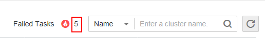
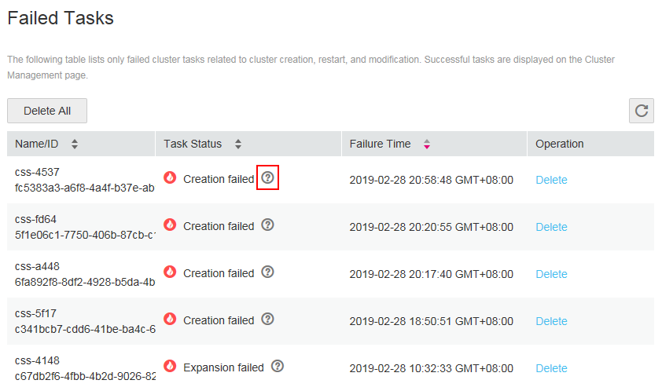
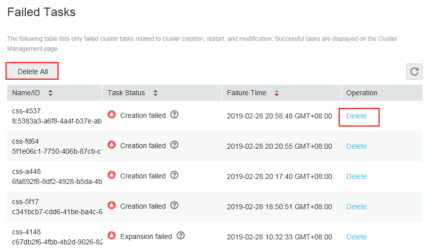

# Managing Failed Tasks

In the  **Failed Tasks**  dialog box, you can view the failed tasks related to a cluster, such as failing to create, restart, scale out, back up, or restore a cluster. In addition, you can view the failure cause of each task and choose to delete a single or all failed tasks.

## Viewing Failed Tasks

1.  Log in to the CSS management console.
2.  Click  **Clusters**  to switch to the  **Clusters**  page. Click the digit next to  **Failed Tasks**  to switch to the  **Failed Tasks**  dialog box.

    **Figure  1**  Clicking the digit next to Failed Tasks  
    

3.  The  **Failed Tasks**  dialog box presents all failed tasks of the current account. The following information about the failed tasks is displayed:  **Name/ID**,  **Task Status**, and  **Failure Time**.
4.  View the failure cause of a task. Specifically, click the question mark in the  **Task Status**  column to view the failure cause of a task. You are advised to troubleshoot faults based on failure causes. For details about failure causes, see  [Error Code](#section155001521193312).

    **Figure  2**  Viewing the failure cause of a task  
    

## Deleting a Failed Task

You can delete a single failed task or all failed tasks at a time.

-   To delete a failed task, perform the following operations: Locate the row where the target task resides and click  **Delete**  in the  **Operation**  column. In the displayed dialog box, confirm the task you want to delete and click  **Yes**.
-   To delete all failed tasks, perform the following operations: In the  **Failed Tasks**  dialog box, click  **Delete All**. In the displayed dialog box, confirm the information about all failed tasks and click  **Yes**.

**Figure  3**  Deleting a failed task  

## Error Code

**Table  1**  Failure causes

<table><thead align="left"><tr id="row376129113519"><th class="cellrowborder" valign="top" width="21.512151215121513%" id="mcps1.2.4.1.1">
Error Code

</th>
<th class="cellrowborder" valign="top" width="37.75377537753775%" id="mcps1.2.4.1.2">
Failure Cause

</th>
<th class="cellrowborder" valign="top" width="40.73407340734073%" id="mcps1.2.4.1.3">
Solution

</th>
</tr>
</thead>
<tbody><tr id="row6761895353"><td class="cellrowborder" valign="top" width="21.512151215121513%" headers="mcps1.2.4.1.1 ">
CSS.6000

</td>
<td class="cellrowborder" valign="top" width="37.75377537753775%" headers="mcps1.2.4.1.2 ">
Failed to create the cluster because of an internal error. Please contact customer service or try again later.

</td>
<td class="cellrowborder" rowspan="7" valign="top" width="40.73407340734073%" headers="mcps1.2.4.1.3 ">
Try again later or contact customer service.

</td>
</tr>
<tr id="row47649143514"><td class="cellrowborder" valign="top" headers="mcps1.2.4.1.1 ">
CSS.6001

</td>
<td class="cellrowborder" valign="top" headers="mcps1.2.4.1.2 ">
Failed to scale out the cluster because of an internal error. Please contact customer service or try again later.

</td>
</tr>
<tr id="row187619910350"><td class="cellrowborder" valign="top" headers="mcps1.2.4.1.1 ">
CSS.6002

</td>
<td class="cellrowborder" valign="top" headers="mcps1.2.4.1.2 ">
Failed to restart the cluster because of an internal error. Please contact customer service or try again later.

</td>
</tr>
<tr id="row14425154151017"><td class="cellrowborder" valign="top" headers="mcps1.2.4.1.1 ">
CSS.6003

</td>
<td class="cellrowborder" valign="top" headers="mcps1.2.4.1.2 ">
Failed to restore the cluster because of an internal error. Please contact customer service or try again later.

</td>
</tr>
<tr id="row24264471015"><td class="cellrowborder" valign="top" headers="mcps1.2.4.1.1 ">
CSS.6004

</td>
<td class="cellrowborder" valign="top" headers="mcps1.2.4.1.2 ">
Failed to create the node because of ECS exceptions (<em id="i62088384145">&lt;ECS error code&gt;</em>). Please contact customer service or try again later.

 NOTE: 

<em id="i1543285813142">&lt;ECS error code&gt;</em> indicates the error information reported by ECS. For details about the cause and solution, see <a href="https://docs.otc.t-systems.com/en-us/api/ecs/en-us_topic_0022067717.html" target="_blank" rel="noopener noreferrer">ECS Error Code Description</a>.

</td>
</tr>
<tr id="row144265410104"><td class="cellrowborder" valign="top" headers="mcps1.2.4.1.1 ">
CSS.6005

</td>
<td class="cellrowborder" valign="top" headers="mcps1.2.4.1.2 ">
Failed to initialize the service because of an internal error. Please contact customer service or try again later.

</td>
</tr>
<tr id="row10480192161116"><td class="cellrowborder" valign="top" headers="mcps1.2.4.1.1 ">
CSS.6007

</td>
<td class="cellrowborder" valign="top" headers="mcps1.2.4.1.2 ">
Failed to create the snapshot because of an internal error. Please contact customer service or try again later.

</td>
</tr>
<tr id="row1448012191118"><td class="cellrowborder" valign="top" width="21.512151215121513%" headers="mcps1.2.4.1.1 ">
CSS.6008

</td>
<td class="cellrowborder" valign="top" width="37.75377537753775%" headers="mcps1.2.4.1.2 ">
Failed to create the snapshot because the OBS bucket you select does not exist or has been deleted.

</td>
<td class="cellrowborder" rowspan="3" valign="top" width="40.73407340734073%" headers="mcps1.2.4.1.3 ">
Modify the OBS bucket.

</td>
</tr>
<tr id="row7481721141112"><td class="cellrowborder" valign="top" headers="mcps1.2.4.1.1 ">
CSS.6009

</td>
<td class="cellrowborder" valign="top" headers="mcps1.2.4.1.2 ">
Failed to restore the snapshot because the OBS bucket you select does not exist or has been deleted.

</td>
</tr>
<tr id="row1770913013172"><td class="cellrowborder" valign="top" headers="mcps1.2.4.1.1 ">
CSS.6010

</td>
<td class="cellrowborder" valign="top" headers="mcps1.2.4.1.2 ">
Failed to restore the snapshot because the OBS object does not exist or has been deleted.

</td>
</tr>
</tbody>
</table>

