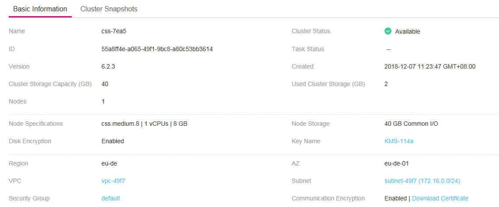
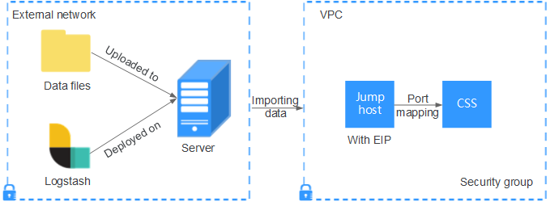
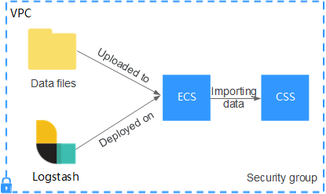

# Using Logstash to Import Data to Elasticsearch<a name="css_01_0048"></a>

You can use Logstash to collect data and migrate collected data to Elasticsearch in CSS. This method helps you effectively manage and obtain data through Elasticsearch. Data files can be in the JSON or CSV format.

Logstash is an open-source, server-side data processing pipeline that ingests data from a multitude of sources simultaneously, transforms it, and then sends it to Elasticsearch. For details about Logstash, visit the following website:  [https://www.elastic.co/guide/en/logstash/current/getting-started-with-logstash.html](https://www.elastic.co/guide/en/logstash/current/getting-started-with-logstash.html)

Data importing involves the following two scenarios depending on the Logstash deployment:

-   [Importing Data When Logstash Is Deployed on the External Network](#section072813417814)
-   [Importing Data When Logstash Is Deployed on an ECS](#section1098217174335)

## Prerequisites<a name="section371994174412"></a>

-   To facilitate operations, you are advised to deploy Logstash on a host that runs the Linux operating system \(OS\).
-   To download Logstash, visit the following website:  [https://www.elastic.co/downloads/logstash](https://www.elastic.co/downloads/logstash)
-   After installing Logstash, perform the following steps to import data. For details about how to install Logstash, visit the following website:  [https://www.elastic.co/guide/en/logstash/current/installing-logstash.html](https://www.elastic.co/guide/en/logstash/current/installing-logstash.html)
-   The JDK must be installed before the installation of Logstash. In the Linux OS, you can run the  **yum -y install java-1.8.0**  command to install the JDK \(version 1.8.0\). In the Windows OS, you can download the required JDK version from the  [official website of JDK](https://www.oracle.com/technetwork/java/javase/downloads/jdk8-downloads-2133151.html), and install it by following the installation guide.
-   In the scenario of  [Importing Data When Logstash Is Deployed on an ECS](#section1098217174335), ensure that the ECS and the Elasticsearch cluster to which data is imported reside in the same VPC.

## \(Optional\) Configuring a Security Certificate for a CSS Cluster Enabled with Communication Encryption<a name="section19303040194619"></a>

If you use Logstash to import data to a CSS cluster that has been enabled with communication encryption, you need to perform the following operations to complete security authentication:

1.  Download the security certificate and add it to the Java certificate library of the server where Logstash is located.

    > **NOTE:**   
    >-   If you use Logstash to import data, Logstash functions as the CSS client. In this case, you need to download and then configure the security certificate so that Logstash can access the corresponding CSS cluster.  
    >-   Ensure that the operator who performs this operation has operation permissions on the security certificate, certificate storage directory, and JDK. Therefore, it is recommended that the user who installs JDK upload the certificate and run the keytool command.  

    1.  In the cluster list on the CSS management console, click the target cluster name to switch to the  **Basic Information**  page. Click  **Download Certificate**  to the right of  **Communication Encryption**  to download the security certificate.

        **Figure  1**  Downloading the security certificate<a name="fig1151436101219"></a>  
        

    2.  Upload the security certificate to the server where Logstash is deployed.
    3.  Log in to the server where Logstash is deployed, enter  **<JDK installation directory\>/jre/lib/security/**, and run the following command to add the security certificate:

        **keytool -keystore cacerts -import -alias <Alias\> -file <Certificate path\>**

        **<Alias\>**  indicates the alias you set for the security certificate in the Java keystore.  **<Certificate path\>**  indicates the storage path of the uploaded security certificate on the server where Logstash is deployed.

2.  When using Logstash, add security authentication configurations to the Logstash configuration file.

    You need to add the following information to the  **logstash-simple.conf**  file. This section describes only the information to be added. For details, see  [Importing Data When Logstash Is Deployed on the External Network](#section072813417814)  and  [Importing Data When Logstash Is Deployed on an ECS](#section1098217174335).

    ```
    ssl => true
    ssl_certificate_verification => false
    ```

    > **NOTE:**   
    >The security certificate of the CSS server is not signed by a third-party certificate signing authority. Therefore, you need to set  **ssl\_certificate\_verification**  to  **false**  in the  **logstash-simple.conf**  file to indicate that the security certificate is not verified.  


## Importing Data When Logstash Is Deployed on the External Network<a name="section072813417814"></a>

[Figure 2](#fig471717481106)  illustrates how data is imported when Logstash is deployed on the external network.

**Figure  2**  Importing data when Logstash is deployed on the external network<a name="fig471717481106"></a>  


1.  <a name="li1648853125014"></a>Create a jump host and configure it as follows:
    -   The jump host is an ECS running the Linux OS and has been bound with an EIP.
    -   The jump host resides in the same VPC as the CSS cluster.
    -   SSH local port forwarding is configured for the jump host to forward requests from a chosen local port to port  **9200**  on one node of the CSS cluster.
    -   Refer to  [SSH documentation](https://man.openbsd.org/ssh.1#L)  for the local port forwarding configuration.

2.  Use PuTTY to log in to the created jump host with the EIP.
3.  Run the following command to perform port mapping to transfer the request sent to the port on the jump host to the target cluster:

    ```
    ssh -g -L <Local port of the jump host:Private network address and port number of a node> -N -f root@<Private IP address of the jump host>
    ```

    > **NOTE:**   
    >-   In the preceding command,  _<_Local port of the jump host_\>_  refers to the port obtained in  [1](#li1648853125014).  
    >-   In the preceding command,  _<Private network address and port number of a node\>_  refers to the private network address and port number of a node in the cluster. If the node fails to work, the command will fail to be executed. If the cluster contains multiple nodes, you can replace the value of  _<__private network address and port number of a node\>_  with the private network address and port number of any available node in the cluster. If the cluster contains only one node, restore the node and execute the command again.  
    >-   Replace <Private IP address of the  __jump host__\> in the preceding command with the IP address \(with  **Private IP**\) of the created jump host in the  **IP Address**  column in the ECS list on the ECS management console.  

    For example, port  **9200**  on the jump host is assigned external network access permissions, the private network address and port number of the node are 192.168.0.81 and 9200, respectively, and the private IP address of the jump host is 192.168.0.227. You need to run the following command to perform port mapping:

    ```
    ssh -g -L 9200:192.168.0.81:9200 -N -f root@192.168.0.227
    ```

4.  <a name="li5164153542312"></a>Log in to the server where Logstash is deployed and store the data files to be imported on the server.

    For example, data file  **access\_20181029\_log**  needs to be imported, the file storage path is  **/tmp/access\_log/**, and the data file includes the following data:

    ```
    |   All |               Heap used for segments |                        |     18.6403 |      MB |
    |   All |             Heap used for doc values |                        |    0.119289 |      MB |
    |   All |                  Heap used for terms |                        |     17.4095 |      MB |
    |   All |                  Heap used for norms |                        |   0.0767822 |      MB |
    |   All |                 Heap used for points |                        |    0.225246 |      MB |
    |   All |          Heap used for stored fields |                        |    0.809448 |      MB |
    |   All |                        Segment count |                        |         101 |         |
    |   All |                       Min Throughput |           index-append |     66232.6 |  docs/s |
    |   All |                    Median Throughput |           index-append |     66735.3 |  docs/s |
    |   All |                       Max Throughput |           index-append |     67745.6 |  docs/s |
    |   All |              50th percentile latency |           index-append |     510.261 |      ms |
    ```

5.  In the server where Logstash is deployed, run the following command to create configuration file  **logstash-simple.conf**  in the Logstash installation directory:

    ```
    cd /<Logstash installation directory>/
    vi logstash-simple.conf
    ```

6.  Input the following content in  **logstash-simple.conf**:

    ```
    input {
    Location of data
    }
    filter {
    Related data processing
    }
    output {
        elasticsearch {
            hosts => "<Public IP address of the jump host>:<Number of the port assigned external network access permissions on the jump host>"
            (Optional) If communication encryption has been enabled on the cluster, you need to add the following configuration:
            ssl => true
            ssl_certificate_verification => false
        }
    }
    ```

    -   The  **input**  parameter indicates the data source. Set this parameter based on the actual conditions. For details about the  **input**  parameter and parameter usage, visit the following website:  [https://www.elastic.co/guide/en/logstash/current/input-plugins.html](https://www.elastic.co/guide/en/logstash/current/input-plugins.html)
    -   The  **filter**  parameter specifies the mode in which data is processed. For example, extract and process logs to convert unstructured information into structured information. For details about the  **filter**  parameter and parameter usage, visit the following website:  [https://www.elastic.co/guide/en/logstash/current/filter-plugins.html](https://www.elastic.co/guide/en/logstash/current/filter-plugins.html)
    -   The  **output**  parameter indicates the destination address of the data. For details about the  **output**  parameter and parameter usage, visit  [https://www.elastic.co/guide/en/logstash/current/output-plugins.html](https://www.elastic.co/guide/en/logstash/current/output-plugins.html). Replace <_Public IP address of the  _jump host__\> with the IP address \(with  **EIP**\) of the created jump host in the  **IP Address**  column in the ECS list on the ECS management console.  _<Number of the port assigned external network access permissions on the jump host\>_  is the number of the port obtained in  [1](#li1648853125014), for example,  **9200**.

    Take the data files in the  **/tmp/access\_log/**  path mentioned in  [4](#li5164153542312)  as an example. Assume that data importing starts from data in the first row of the data file, the filtering condition is left unspecified \(indicating no data processing operations are performed\), the public IP address and port number of the jump host are  **192.168.0.227**  and  **9200**, respectively, and the name of the target index is  **myindex**. Edit the configuration file as follows, and enter  **:wq**  to save the configuration file and exit.

    ```
    input { 
        file{
          path => "/tmp/access_log/*"
          start_position => "beginning"
        }
    } 
    filter { 
    } 
    output { 
        elasticsearch { 
          hosts => "192.168.0.227:9200"
          index => myindex
          document_type => mytype
        } 
    }
    ```

    If communication encryption has been enabled on the cluster where you will import data, you need to set parameters  **ssl**  and  **ssl\_certificate\_verification**. The following provides an example of the configuration file.

    ```
    input { 
        file{
          path => "/tmp/access_log/*"
          start_position => "beginning"
        }
    } 
    filter { 
    } 
    output { 
        elasticsearch { 
          hosts => "192.168.0.227:9200"
          index => myindex
          document_type => mytype
          ssl => true
          ssl_certificate_verification => false
        } 
    }
    ```

7.  Run the following command to import the data collected by Logstash to the cluster:

    ```
    ./bin/logstash -f logstash-simple.conf
    ```

8.  Log in to the CSS management console.
9.  In the left navigation pane, click  **Clusters**  to switch to the  **Clusters**  page.
10. From the cluster list, locate the row where the cluster to which you want to import data resides and click  **Kibana**  in the  **Operation**  column.
11. In the left navigation pane of the displayed Kibana window, click  **Dev Tools**. Click  **Get to work**  to switch to the  **Console**  page.
12. On the  **Console**  page of Kibana, search for the imported data.

    On the  **Console**  page of Kibana, enter the following command to search for data. View the search results. If the searched data is consistent with the imported data, then the data has been imported successfully.

    ```
    GET myindex/_search
    ```


## Importing Data When Logstash Is Deployed on an ECS<a name="section1098217174335"></a>

[Figure 3](#fig124034434127)  illustrates how data is imported when Logstash is deployed on an ECS that resides in the same VPC as the cluster to which data is to be imported.

**Figure  3**  Importing data when Logstash is deployed on an ECS<a name="fig124034434127"></a>  


1.  Ensure that the ECS where Logstash is deployed and the cluster to which data is to be imported reside in the same VPC, port  **9200**  of the ECS security group has been assigned external network access permissions, and an EIP has been bound to the ECS.
2.  <a name="li1652411439236"></a>Use PuTTY to log in to the ECS.

    For example, data file  **access\_20181029\_log**  is stored in the  **/tmp/access\_log/**  path of the ECS, and the data file includes the following data:

    ```
    |   All |               Heap used for segments |                        |     18.6403 |      MB |
    |   All |             Heap used for doc values |                        |    0.119289 |      MB |
    |   All |                  Heap used for terms |                        |     17.4095 |      MB |
    |   All |                  Heap used for norms |                        |   0.0767822 |      MB |
    |   All |                 Heap used for points |                        |    0.225246 |      MB |
    |   All |          Heap used for stored fields |                        |    0.809448 |      MB |
    |   All |                        Segment count |                        |         101 |         |
    |   All |                       Min Throughput |           index-append |     66232.6 |  docs/s |
    |   All |                    Median Throughput |           index-append |     66735.3 |  docs/s |
    |   All |                       Max Throughput |           index-append |     67745.6 |  docs/s |
    |   All |              50th percentile latency |           index-append |     510.261 |      ms |
    ```

3.  Run the following command to create configuration file  **logstash-simple.conf**  in the Logstash installation directory:

    ```
    cd /<Logstash installation directory>/
    vi logstash-simple.conf
    ```

    Input the following content in  **logstash-simple.conf**:

    ```
    input {
    Location of data
    }
    filter {
    Related data processing
    }
    output {
        elasticsearch{
            hosts => "<Private network address and port number of the node>"} 
            (Optional) If communication encryption has been enabled on the cluster, you need to add the following configuration:
            ssl => true
            ssl_certificate_verification => false
    }
    ```

    -   The  **input**  parameter indicates the data source. Set this parameter based on the actual conditions. For details about the  **input**  parameter and parameter usage, visit the following website:  [https://www.elastic.co/guide/en/logstash/current/input-plugins.html](https://www.elastic.co/guide/en/logstash/current/input-plugins.html)
    -   The  **filter**  parameter indicates to extract and process logs to convert unstructured information into structured information. For details about the  **filter**  parameter and parameter usage, visit the following website:  [https://www.elastic.co/guide/en/logstash/current/filter-plugins.html](https://www.elastic.co/guide/en/logstash/current/filter-plugins.html)
    -   The  **output**  parameter indicates the destination address of the data. For details about the  **output**  parameter and parameter usage, visit  [https://www.elastic.co/guide/en/logstash/current/output-plugins.html](https://www.elastic.co/guide/en/logstash/current/output-plugins.html).  _<private network address and port number of a node\>_  refers to the private network address and port number of a node in the cluster.

        If the cluster contains multiple nodes, you are advised to replace the value of  _<Private network address and port number of a node\>_  with the private network addresses and port numbers of all nodes in the cluster to prevent node faults. Use commas \(,\) to separate the nodes' private network addresses and port numbers. The following is an example:

        ```
        hosts => ["192.168.0.81:9200","192.168.0.24:9200"]
        ```

        If the cluster contains only one node, the format is as follows:

        ```
        hosts => "192.168.0.81:9200"
        ```

    Take the data files in the  **/tmp/access\_log/**  path mentioned in  [2](#li1652411439236)  as an example. Assume that data importing starts from data in the first row of the data file, the filtering condition is left unspecified \(indicating no data processing operations are performed\), the private network address and port number of the node in the cluster where data is to be imported are  **192.168.0.81**  and  **9200**, respectively, and the name of the target index is  **myindex**. Edit the configuration file as follows, and enter  **:wq**  to save the configuration file and exit.

    ```
    input { 
        file{
          path => "/tmp/access_log/*"
          start_position => "beginning"
        }
    } 
    filter { 
    } 
    output { 
        elasticsearch { 
          hosts => "192.168.0.81:9200"
          index => myindex
          document_type => mytype
        } 
    }
    ```

    If communication encryption has been enabled on the cluster where you will import data, you need to set parameters  **ssl**  and  **ssl\_certificate\_verification**. The following provides an example of the configuration file.

    ```
    input { 
        file{
          path => "/tmp/access_log/*"
          start_position => "beginning"
        }
    } 
    filter { 
    } 
    output { 
        elasticsearch { 
          hosts => "192.168.0.81:9200"
          index => myindex
          document_type => mytype
          ssl => true
          ssl_certificate_verification => false
        } 
    }
    ```

4.  Run the following command to import the ECS data collected by Logstash to the cluster:

    ```
    ./bin/logstash -f logstash-simple.conf
    ```

5.  Log in to the CSS management console.
6.  In the left navigation pane, click  **Clusters**  to switch to the  **Clusters**  page.
7.  From the cluster list, locate the row where the cluster to which you want to import data resides and click  **Kibana**  in the  **Operation**  column.
8.  In the left navigation pane of the displayed Kibana window, click  **Dev Tools**. Click  **Get to work**  to switch to the  **Console**  page.
9.  On the  **Console**  page of Kibana, search for the imported data.

    On the  **Console**  page of Kibana, enter the following command to search for data. View the search results. If the searched data is consistent with the imported data, then the data has been imported successfully.

    ```
    GET myindex/_search
    ```


