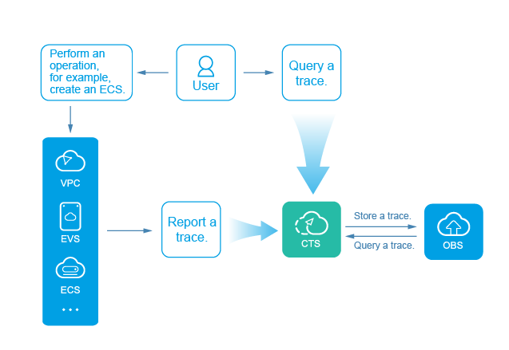

# What Is Cloud Trace Service?

log auditing is a core and necessary component for information security auditing and an important information system providing security risk management and control for enterprises and public institutions. As the information system is migrating to the cloud, information and data security management departments around the world have released multiple standards, such as ISO IEC27000, GB/T 20945-2013, COSO, COBIT, ITIL, and NISTSP800.

Cloud Trace Service \(CTS\) is a log audit service that is available for cloud security. It allows you to collect, store, and query resource operation records. You can use these records to perform security analysis, track resource changes, audit compliance, and locate faults.

**Figure  1**  CTS service diagram  

CTS provides the following functions:

-   Trace recording: CTS records operations performed on the management console or by calling APIs, as well as operations triggered by each interconnected service.
-   Trace query: Operation records of the last seven days can be queried on the management console from multiple dimensions, such as the trace source, trace name, operation type, resource name, resource ID, and time.
-   Trace dumping: Traces are delivered to Object Storage Service \(OBS\) buckets on a regular basis for long-term storage. In this process, traces are compressed into trace files by service.
-   Key event notification: CTS works with Simple Message Notification \(SMN\) to send emails or SMS messages to notify you of some key operations.

