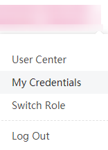

# Obtaining the Domain Name

1.  Log in to the management console.
2.  Click the username in the upper right corner. In the displayed drop-down list shown in  [Figure 1](#en-us_topic_0046655038_fig44439045174848), select  **My Credential**.

    **Figure  1**  My Credentials  
    

3.  In the  **My Credentials**  area shown in  [Figure 2](#en-us_topic_0046655038_fig19894662101419), obtain the domain name of the user.

    **Figure  2**  Domain Name  
    

