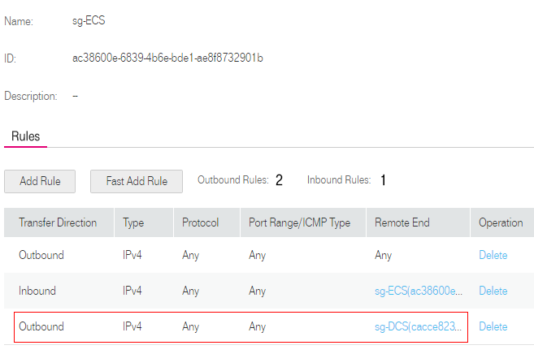
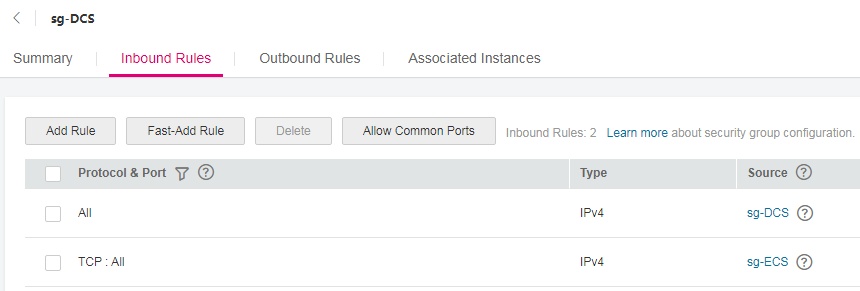

# How to Select and Configure a Security Group?

An ECS can communicate with a DCS instance if they belong to the same VPC and security group rules are configured correctly.

It is recommended that the ECS and DCS instance belong to the same security group. After a security group is created, the security group rules, by default, include a rule allowing members in the security group to access each other without any restrictions.

If the ECS and DCS instance belong to different security groups, add security group rules to ensure that the ECS and DCS instance can access each other.

> **NOTE:**   
>The example rules provided here are based on the assumption that:  
>-   The ECS on which the client runs belongs to security group  **sg-ECS**, and the DCS instance that the client will access belongs to security group  **sg-DCS**.  
>-   The port number of the DCS instance is 6379.  
>-   The remote end is a security group or an IP address.  

**Figure  1**  Security group rules allowing the ECS to access the DCS instance  

**Figure  2**  Security group rules making the DCS instance accessible to the ECS  

