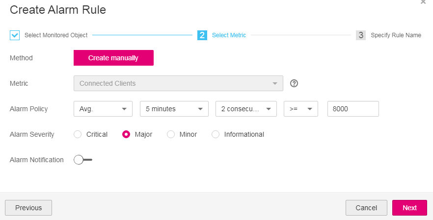

# Setting Alarm Rules for Critical Metrics

As listed in  [DCS Metrics](dcs-metrics.md), Cloud Eye monitors a wide variety of DCS metrics.

Among all the metrics, the ones listed in the following table are of particular importance. Configure alarm rules for these metrics to be notified immediately after the set thresholds are reached.

**Table  1**  Metrics to set alarm rules for

<table><thead align="left"><tr id="row74121453152110"><th class="cellrowborder" valign="top" width="15.17%" id="mcps1.2.5.1.1">
Metric ID

</th>
<th class="cellrowborder" valign="top" width="20.27%" id="mcps1.2.5.1.2">
Metric

</th>
<th class="cellrowborder" valign="top" width="12.120000000000001%" id="mcps1.2.5.1.3">
Recommended Threshold

</th>
<th class="cellrowborder" valign="top" width="52.44%" id="mcps1.2.5.1.4">
Description

</th>
</tr>
</thead>
<tbody><tr id="row541355317219"><td class="cellrowborder" valign="top" width="15.17%" headers="mcps1.2.5.1.1 ">
cpu_usage

</td>
<td class="cellrowborder" valign="top" width="20.27%" headers="mcps1.2.5.1.2 ">
CPU Usage

</td>
<td class="cellrowborder" valign="top" width="12.120000000000001%" headers="mcps1.2.5.1.3 ">
80

</td>
<td class="cellrowborder" valign="top" width="52.44%" headers="mcps1.2.5.1.4 ">
CPU consumed by the monitored object

The recommended threshold indicates that an alarm will be triggered when the CPU usage of the instance reaches 80% for the set number of consecutive periods during the monitoring period.

For example, an alarm may be triggered if the average CPU usage ≥ 80% for 3 consecutive periods of 1 minute.

</td>
</tr>
<tr id="row1941318532214"><td class="cellrowborder" valign="top" width="15.17%" headers="mcps1.2.5.1.1 ">
memory_usage

</td>
<td class="cellrowborder" valign="top" width="20.27%" headers="mcps1.2.5.1.2 ">
Memory Usage

</td>
<td class="cellrowborder" valign="top" width="12.120000000000001%" headers="mcps1.2.5.1.3 ">
80

</td>
<td class="cellrowborder" valign="top" width="52.44%" headers="mcps1.2.5.1.4 ">
Memory consumed by the monitored object

The recommended threshold indicates that an alarm will be triggered when the memory usage of the instance reaches 80% for the set number of consecutive periods during the monitoring period.

For example, an alarm may be triggered if the average memory usage ≥ 80% for 3 consecutive periods of 1 minute.

</td>
</tr>
<tr id="row74131853162115"><td class="cellrowborder" valign="top" width="15.17%" headers="mcps1.2.5.1.1 ">
connected_clients

</td>
<td class="cellrowborder" valign="top" width="20.27%" headers="mcps1.2.5.1.2 ">
Connected Clients

</td>
<td class="cellrowborder" valign="top" width="12.120000000000001%" headers="mcps1.2.5.1.3 ">
8,000

</td>
<td class="cellrowborder" valign="top" width="52.44%" headers="mcps1.2.5.1.4 ">
Number of connected clients (excluding those to standby nodes)

The minimum threshold is 8,000. Set the threshold to 80% of the maximum allowed connections indicated in the instance specifications.

For example, an alarm may be triggered if the average number of connected clients ≥ 8,000 for 3 consecutive periods of 1 minute.

</td>
</tr>
</tbody>
</table>

## Procedure

In the following example, an alarm rule is set for the  **Connected Clients \(connected\_clients\)**  metric.

1.  Log in to the DCS console.
2.  Click   in the upper left corner of the management console and select a region and a project.
3.  In the navigation pane, choose  **Cache Manager**.
4.  In the same row as the DCS instance whose metrics you want to view, click  **View Metric**.

    **Figure  1**  Viewing instance metrics  
    

5.  On the displayed page, locate the  **Connected Clients**  metric. Hover over the metric and click    to create an alarm rule for the metric.

    The  **Create Alarm Rule**  page is displayed.

6.  Specify the alarm details.
    1.  Specify the alarm policy and alarm severity.

        For example, the alarm policy shown in  [Figure 2](#fig112961424225)  indicates that an alarm will be triggered if the average number of clients connected to the instance exceeds the preset value for two consecutive periods and no actions are taken.

        **Figure  2**  Setting the alarm policy and alarm severity  
        

    2.  Set the alarm notification configurations. If you enable  **Alarm Notification**, set the validity period, notification object, and trigger condition.
    3.  Click  **Next**  to set the alarm name and description.
    4.  Click  **Finish**.

