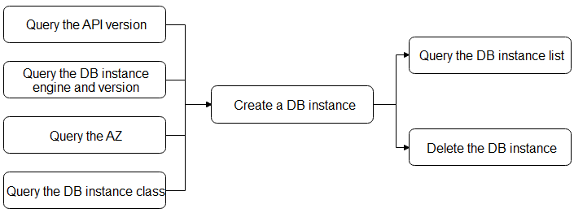

# Scenarios

DDS open APIs allow users to create, view, or delete DB instances, query API versions, DB engines, DB engine versions, and DB instance class supported by the system. The application scenarios are shown as follows.

**Figure  1**  Scenarios  

Before creating a DB instance, you need to obtain the DB engines and versions, DB instance class, and AZs supported by the system.

After obtaining the information, you can use the returned results as invoked parameters to create a DB instance.

After a DB instance is created, you can query the instance list and delete the instance.

