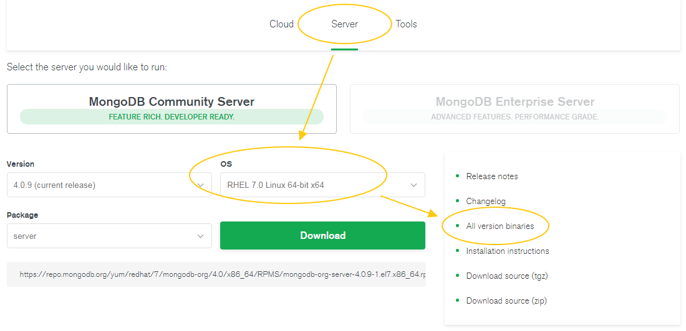
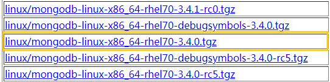

# How Can I Install a MongoDB Client?

MongoDB official website provides client installation packages for different OSs. Download the official binary installation package at  [https://www.mongodb.com/download-center\#community](https://www.mongodb.com/download-center#community).

The following uses Red Hat Linux 7 and MongoDB 3.4.0 as examples to describe how to obtain the required installation package and install the MongoDB client.

## Procedure

1.  Obtain the installation package.
    1.  Log in at  [https://www.mongodb.com/download-center\#community](https://www.mongodb.com/download-center#community).
    2.  Choose  **Server**, select  **RHEL 7.0 Linux 64-bit x64**  for  **OS**, and click  **All version binaries**.  [Figure 1](#fig129943125910)  shows an example.

        **Figure  1**  MongoDB official webpage  
        

    3.  Open the downloading page, click  **linux/mongodb-linux-x86\_64-rhel70-3.4.0.tgz**  to download the binary installation package of MongoDB 3.4.0.  [Figure 2](#fig12339163313218)  shows an example.

        **Figure  2**  Downloading page  
        

2.  Upload the installation package to the ECS. For details about how to log in to an ECS, see  [How Can I Create and Log In to an ECS?](how-can-i-create-and-log-in-to-an-ecs.md)
3.  Decompress the installation package on the ECS.

    **tar zxvf mongodb-linux-x86\_64-rhel70-3.4.0.tgz**

4.  Obtain the client tool from the  **bin**  directory of the installation package.

    **cd mongodb-linux-x86\_64-rhel70-3.4.0/bin**

    The common tools are as follows:

    -   MongoDB client mongo
    -   Data export tool mongoexport
    -   Data import tool mongoimport

5.  Before using a client tool, assign the execute permission to it.
    -   Run the  **chmod +x mongo**  command to grant a client permission to connect to a DB instance.
    -   Run the  **chmod +x mongoexport**  command to grant a client permission to export data.
    -   Run the  **chmod +x mongoimport**  command to grant a client permission to import data.

6.  Connect to a DB instance through the installed client.
    -   For details on how to connect to a cluster instance, see  [Connecting to a DB Instance Through a Client](connecting-to-a-db-instance-through-a-client(cluster).md).
    -   For details on how to connect to a replica set instance, see  [Connecting to a DB Instance Through a Client](connecting-to-a-db-instance-through-a-client(replica-set).md).

