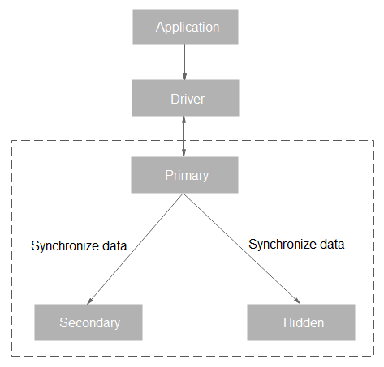

# Replica Set Architecture

A replica set consists of a set of mongod processes and provides a collection of data nodes to ensure data redundancy and reliability.

> **NOTE:**   
>For details about the mongod process, visit  [https://docs.mongodb.com/v3.2/tutorial/manage-mongodb-processes/index.html](https://docs.mongodb.com/v3.2/tutorial/manage-mongodb-processes/index.html).  

A replica set consists of three nodes: primary, secondary, and hidden. The three-node architecture is automatically set up, and the three nodes synchronize data with each other automatically to ensure data reliability.

-   The primary node is used to read and write requests.
-   The secondary node is used to read requests.
-   The hidden node is used to back up data.

You can directly perform operations on the primary and secondary nodes. If a primary node goes down or becomes faulty, a secondary node is automatically assigned to the primary role and continues normal operation. If a secondary node is unavailable, a hidden node will take the role of the secondary to ensure high availability. The following figure shows the replica set architecture.

**Figure  1**  Replica set architecture  

-   Supports multiple management and control tasks, such as creating instances, changing configurations, and backing up instances. The system flexibly controls and tracks tasks, and manages exceptions based on the operations delivered by users.
-   Collects performance monitoring information about DB instances, including basic metrics, storage space, access requests, and the number of operations.
-   Collects slow query logs and access control logs, recording DB instance running status.
-   Backs up DB instance data and uploads it to OBS buckets. Currently, DDS supports automated and manual backup. Automated backups are kept for seven days by default.

