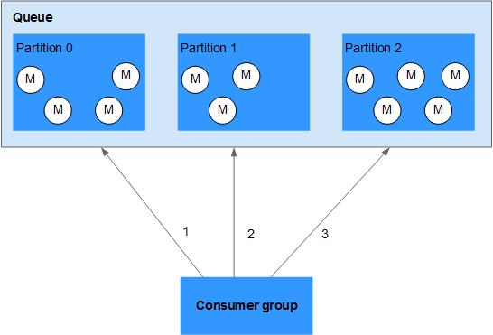

# Why Can't I Retrieve the Chosen Number of Messages from a Queue That Contains Only a Few Messages?

-   Messages in a standard FIFO queue are stored in a single partition. Upon each retrieval request, the chosen number of messages can be returned, unless the available number of messages in the queue is less than the chosen number of messages.
-   Messages in other types of queues are distributed to multiple partitions. This achieves high concurrency, allowing multiple requests from a consumer group to be processed concurrently. To avoid performance loss caused by cross-partition access and management, a single retrieval request from a consumer group returns messages in only one partition. Therefore, when a queue holds a small number of available messages, a single retrieval request may not return the chosen number of messages even if the number of available messages in the queue is greater than the chosen number of messages.

    For example, as shown in  [Figure 1](#en-us_topic_0144320894_fig1849525773613), 12 messages exist in the queue and are distributed in three partitions. If the chosen number of messages is  **10**, only four messages can be retrieved from  **Partition 0**. After retrieval from  **Partition 0**  is complete, messages are retrieved from  **Partition 1**  and then from  **Partition 2**.

    **Figure  1**  A single retrieval request returns messages from only one partition  
    

