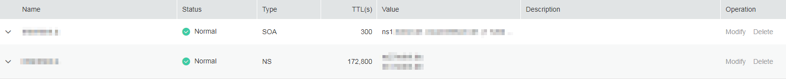

# Configuring a Public Zone

## **Scenarios**

To use the DNS service to manage domain names, you need to configure the service on the management console.

>  **NOTE:** 

> The ap-sg region does not support public zones.

## **Prerequisites**

You have registered a domain name with the domain name registrar.

For details about how to register a domain name, contact the domain name registrar.

## Configuration Process

**Figure 1** Process to configure a public zone

You need to perform operations in [Figure 1](#fe4910c96160749349abf31cb88cfe52b) in different places:

-   "Register a domain name" and "Update the NS addresses" are conducted by your domain name registrar.
-   "Create a public zone" and "Create record sets" are performed on the DNS console.

## **Procedure**

**Creating a public zone**

1.  Log in to the management console.
2.  In the **Network** category, click **Domain Name Service**.

    The DNS console is displayed.

3.  In the navigation pane, Choose **Public Zones**.

    The **Public Zones** page is displayed.

4.  Click **Create Public Zone**.

    **Figure 2** Create Public Zone
    

5.  Configure the parameters according to [Table 1](#en-us_topic_0035467699_table2052132816642).**Table 1** Parameters required for creating a public zone

    <table><thead align="left"><tr id="en-us_topic_0035467699_row5957484916642"><th class="cellrowborder" valign="top" width="18.11%" id="mcps1.2.4.1.1">
<strong id="b8423527069657">Parameter</strong>

    </th>
    <th class="cellrowborder" valign="top" width="50.629999999999995%" id="mcps1.2.4.1.2">
<strong id="b842352706971">Description</strong>

    </th>
    <th class="cellrowborder" valign="top" width="31.259999999999998%" id="mcps1.2.4.1.3">
<strong id="b842352706978">Example Value</strong>

    </th>
    </tr>
    </thead>
    <tbody><tr id="en-us_topic_0035467699_row2871871016642"><td class="cellrowborder" valign="top" width="18.11%" headers="mcps1.2.4.1.1 ">
Name

    </td>
    <td class="cellrowborder" valign="top" width="50.629999999999995%" headers="mcps1.2.4.1.2 ">
Domain name registered with the domain name registrar

    </td>
    <td class="cellrowborder" valign="top" width="31.259999999999998%" headers="mcps1.2.4.1.3 ">
example.com

    </td>
    </tr>
    <tr id="en-us_topic_0035467699_row3925088716642"><td class="cellrowborder" valign="top" width="18.11%" headers="mcps1.2.4.1.1 ">
Email

    </td>
    <td class="cellrowborder" valign="top" width="50.629999999999995%" headers="mcps1.2.4.1.2 ">
(Optional) Email address of the administrator managing the public zone. It is recommended that you set the email address to <strong id="b842352706182128">HOSTMASTER@<em id="i842352697182143">Domain name</em></strong>.

    
For more details about the email address, see <a href="why-is-the-email-address-format-changed-in-the-soa-record.html">Why Is the Email Address Format Changed in the SOA Record?</a>

    </td>
    <td class="cellrowborder" valign="top" width="31.259999999999998%" headers="mcps1.2.4.1.3 ">
HOSTMASTER@example.com

    </td>
    </tr>
    <tr id="row105410594141"><td class="cellrowborder" valign="top" width="18.11%" headers="mcps1.2.4.1.1 ">
Tag

    </td>
    <td class="cellrowborder" valign="top" width="50.629999999999995%" headers="mcps1.2.4.1.2 ">
(Optional) Identifier of a resource. Each tag contains a key and a value. You can add 10 tags at most to a zone.

    
For details about tag key and value requirements, see <a href="#en-us_topic_0035467699__table18290035121711">Table 2</a>.

    </td>
    <td class="cellrowborder" valign="top" width="31.259999999999998%" headers="mcps1.2.4.1.3 ">
example_key1

    
example_value1

    </td>
    </tr>
    <tr id="row197267115553"><td class="cellrowborder" valign="top" width="18.11%" headers="mcps1.2.4.1.1 ">
Description

    </td>
    <td class="cellrowborder" valign="top" width="50.629999999999995%" headers="mcps1.2.4.1.2 ">
(Optional) Description of the domain name, which cannot exceed 255 characters

    </td>
    <td class="cellrowborder" valign="top" width="31.259999999999998%" headers="mcps1.2.4.1.3 ">
This is a public zone.

    </td>
    </tr>
    </tbody>
    </table>

    **Table 2** Tag key and value requirements

    <table><thead align="left"><tr id="row72901535141713"><th class="cellrowborder" valign="top" width="18.181818181818183%" id="mcps1.2.4.1.1">
<strong id="b8423527069525">Parameter</strong>

    </th>
    <th class="cellrowborder" valign="top" width="50.505050505050505%" id="mcps1.2.4.1.2">
<strong id="b842352706171418">Requirement</strong>

    </th>
    <th class="cellrowborder" valign="top" width="31.313131313131315%" id="mcps1.2.4.1.3">
Example Value

    </th>
    </tr>
    </thead>
    <tbody><tr id="row52906354176"><td class="cellrowborder" valign="top" width="18.181818181818183%" headers="mcps1.2.4.1.1 ">
Key

    </td>
    <td class="cellrowborder" valign="top" width="50.505050505050505%" headers="mcps1.2.4.1.2 "><ul id="ul46253231183"><li id="li176251123141812">Cannot be left blank.</li><li id="li86261923201810">Must be unique for each resource.</li><li id="li162620231180">Consists of at most 36 characters.</li><li id="li5389246102911">Contains only letters, digits, hyphens (-), and underscores (_).</li></ul>
    </td>
    <td class="cellrowborder" valign="top" width="31.313131313131315%" headers="mcps1.2.4.1.3 ">
example_key1

    </td>
    </tr>
    <tr id="row132900355172"><td class="cellrowborder" valign="top" width="18.181818181818183%" headers="mcps1.2.4.1.1 ">
Value

    </td>
    <td class="cellrowborder" valign="top" width="50.505050505050505%" headers="mcps1.2.4.1.2 "><ul id="ul19648123161815"><li id="li15648193110182">Cannot be left blank.</li><li id="li3648143181813">Consists of at most 43 characters.</li><li id="li64561823123015">Contains only letters, digits, hyphens (-), and underscores (_).</li></ul>
    </td>
    <td class="cellrowborder" valign="top" width="31.313131313131315%" headers="mcps1.2.4.1.3 ">
example_value1

    </td>
    </tr>
    </tbody>
    </table>

6.  Click **OK**.

    You can query information about the zone you created on the **Public Zones** page.

    >  **NOTE:** 

    > Click the zone name to query detailed zone information. The system has created record sets of the SOA type and NS type in the zone.

    > -   The SOA record set determines the DNS server that is the authoritative information source for a particular domain name.
    > -   The NS record set defines authoritative DNS servers for a zone.

**Adding a record set of the A type**

1.  In the zone list on the **Public Zones** page, click the name of the public zone you created.

    The record set page is displayed.

2.  Click **Add Record Set**.

    The **Add Record Set** box is displayed.

    **Figure 3** Add Record Set
    

3.  Configure the parameters according to [Table 3](#en-us_topic_0035467699_table6239446395216).**Table 3** Parameters required for adding a record set of the A type

    <table><thead align="left"><tr id="en-us_topic_0035467699_row1754572995216"><th class="cellrowborder" valign="top" width="20.549999999999997%" id="mcps1.2.4.1.1">
<strong id="b8423527069657_1">Parameter</strong>

    </th>
    <th class="cellrowborder" valign="top" width="46.12%" id="mcps1.2.4.1.2">
<strong id="b842352706971_1">Description</strong>

    </th>
    <th class="cellrowborder" valign="top" width="33.33%" id="mcps1.2.4.1.3">
<strong id="b842352706978_1">Example Value</strong>

    </th>
    </tr>
    </thead>
    <tbody><tr id="en-us_topic_0035467699_row3698863095216"><td class="cellrowborder" valign="top" width="20.549999999999997%" headers="mcps1.2.4.1.1 ">
Name

    </td>
    <td class="cellrowborder" valign="top" width="46.12%" headers="mcps1.2.4.1.2 ">
Domain name (You do not need to manually add the suffix.)

    
The default value is the zone name.

    </td>
    <td class="cellrowborder" valign="top" width="33.33%" headers="mcps1.2.4.1.3 ">
www

    </td>
    </tr>
    <tr id="en-us_topic_0035467699_row933215795216"><td class="cellrowborder" valign="top" width="20.549999999999997%" headers="mcps1.2.4.1.1 ">
Type

    </td>
    <td class="cellrowborder" valign="top" width="46.12%" headers="mcps1.2.4.1.2 ">
Type of the record set

    </td>
    <td class="cellrowborder" valign="top" width="33.33%" headers="mcps1.2.4.1.3 ">

    
A – Map domains to IPv4 addresses

    </td>
    </tr>
    <tr id="en-us_topic_0035467699_row2395117795431"><td class="cellrowborder" valign="top" width="20.549999999999997%" headers="mcps1.2.4.1.1 ">
TTL (s)

    </td>
    <td class="cellrowborder" valign="top" width="46.12%" headers="mcps1.2.4.1.2 ">
Caching period of the record set (in seconds)

    </td>
    <td class="cellrowborder" valign="top" width="33.33%" headers="mcps1.2.4.1.3 ">
The default value is 300s, that is, <strong id="b8423527061593">5 min</strong>.

    </td>
    </tr>
    <tr id="en-us_topic_0035467699_row3388081495431"><td class="cellrowborder" valign="top" width="20.549999999999997%" headers="mcps1.2.4.1.1 ">
Value

    </td>
    <td class="cellrowborder" valign="top" width="46.12%" headers="mcps1.2.4.1.2 ">
IPv4 addresses mapped to the domain name

    
Every two IPv4 addresses are separated using a line break.

    </td>
    <td class="cellrowborder" valign="top" width="33.33%" headers="mcps1.2.4.1.3 ">
192.168.12.2

    
192.168.12.3

    </td>
    </tr>
    <tr id="row947495585616"><td class="cellrowborder" valign="top" width="20.549999999999997%" headers="mcps1.2.4.1.1 ">
Tag

    </td>
    <td class="cellrowborder" valign="top" width="46.12%" headers="mcps1.2.4.1.2 ">
(Optional) Identifier of a resource. Each tag contains a key and a value. You can add 10 tags at most to a record set.

    
For details about tag key and value requirements, see <a href="#en-us_topic_0035467699__table18290035121711">Table 2</a>.

    </td>
    <td class="cellrowborder" valign="top" width="33.33%" headers="mcps1.2.4.1.3 ">
example_key1

    
example_value1

    </td>
    </tr>
    <tr id="row21944507132325"><td class="cellrowborder" valign="top" width="20.549999999999997%" headers="mcps1.2.4.1.1 ">
Description

    </td>
    <td class="cellrowborder" valign="top" width="46.12%" headers="mcps1.2.4.1.2 ">
(Optional) Description of the domain name

    </td>
    <td class="cellrowborder" valign="top" width="33.33%" headers="mcps1.2.4.1.3 ">
-

    </td>
    </tr>
    </tbody>
    </table>

4.  Click **OK**.

**Updating the NS addresses**

To resolve the domain name on the Internet, you need to change your domain name registrar's NS record addresses. Specifically, you need to change the domain name resolution addresses in the NS record of the zone to the authoritative DNS server domain names provided by the DNS service.

After you create a zone, the system automatically creates an NS record set, which specifies the DNS servers used to resolve public network domain names.

>  **NOTE:** 

> Generally, the update takes effect within 48 hours, but the time may vary depending on domain name registrars.

You can perform the following operations to query the NS addresses provided for you:

1.  Log in to the management console.
2.  In the **Network** category, click **Domain Name Service**.

    The DNS console is displayed.

3.  In the navigation pane, Choose **Public Zones**.

    The **Public Zones** page is displayed.

4.  In the zone list, click the name of the public zone you created.

    Query the NS record set. The information under **Value** is the NS addresses provided by the DNS service.

    **Figure 4** NS record set
    

