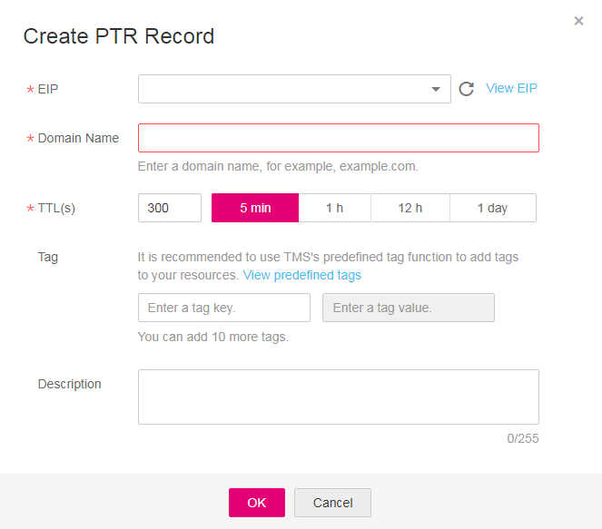

# Creating a PTR Record

## **Scenarios**

PTR records are used to prove the credibility of IP addresses and domain names of email servers. Most spam senders use email servers whose IP addresses are dynamically allocated or not mapped to registered domain names to avoid being tracked. If you do not want emails sent from your email server to be considered as spam, you need to add a PTR record to map the email server IP address to a domain name. In this way, the email recipient can obtain the domain name by IP address and will know that the email server is trustworthy.

By creating a PTR record, you can map an EIP of another cloud service, for example, ECS, to a domain name.

> **NOTE:**   
>After an ECS is successfully created and assigned with an EIP, a PTR record will be generated for the EIP by default in format of  **ecs-xx-xx-xx-xx.compute.xxx.com**, where  **xx-xx-xx-xx**  is the EIP and  **xxx**  the domain name provided by the cloud platform.  
>You can use one of the following methods to query the default PTR record of an EIP:  
>-   ping -a  _EIP_  
>-   nslookup \[-qt=ptr\]  _EIP_  
>-   dig -x  _EIP_  
>The default PTR record of the EIP may not be applicable in some scenarios. For example, it cannot be used as the domain name of an email server. In this case, you need to create a new PTR record for the EIP.  
>After you create a new PTR record, the default record will be overwritten.  

This section describes how to create a PTR record for reverse domain name resolution.

## Restrictions and Limitations

Currently, you can configure a PTR record only for IP addresses with a 32-bit subnet mask.

## **Procedure**

1.  Log in to the management console.
2.  In the  **Network**  category, click  **Domain Name Service**.

    The DNS console is displayed.

3.  In the navigation pane, choose  **PTR Records**.

    The  **PTR Records**  page is displayed.

4.  Click    on the upper left and select the desired region and project.
5.  Click  **Create PTR Record**.

    **Figure  1**  Create PTR Record  
    

6.  Configure the parameters according to  [Table 1](#en-us_topic_0035467699_table2052132816642).

    **Table  1**  Parameters required for creating a PTR record

    
    <table><thead align="left"><tr id="en-us_topic_0035467699_row5957484916642"><th class="cellrowborder" valign="top" width="19.99%" id="mcps1.2.4.1.1">
<strong id="b84235270695255">Parameter</strong>

    </th>
    <th class="cellrowborder" valign="top" width="48.75%" id="mcps1.2.4.1.2">
<strong id="en-us_topic_0035268497_b8423527061433">Description</strong>

    </th>
    <th class="cellrowborder" valign="top" width="31.259999999999998%" id="mcps1.2.4.1.3">
<strong id="b84235270617114">Example Value</strong>

    </th>
    </tr>
    </thead>
    <tbody><tr id="en-us_topic_0035467699_row2871871016642"><td class="cellrowborder" valign="top" width="19.99%" headers="mcps1.2.4.1.1 ">
EIP

    </td>
    <td class="cellrowborder" valign="top" width="48.75%" headers="mcps1.2.4.1.2 ">
EIP obtained from another cloud service (for example, ECS)

    
You can select an EIP from the drop-down list.

    </td>
    <td class="cellrowborder" valign="top" width="31.259999999999998%" headers="mcps1.2.4.1.3 ">
XX.XX.XX.XX

    </td>
    </tr>
    <tr id="en-us_topic_0035467699_row6656618516642"><td class="cellrowborder" valign="top" width="19.99%" headers="mcps1.2.4.1.1 ">
Domain Name

    </td>
    <td class="cellrowborder" valign="top" width="48.75%" headers="mcps1.2.4.1.2 ">
Domain name mapped to the EIP

    </td>
    <td class="cellrowborder" valign="top" width="31.259999999999998%" headers="mcps1.2.4.1.3 ">
www.example.com

    </td>
    </tr>
    <tr id="en-us_topic_0035467699_row2168553016642"><td class="cellrowborder" valign="top" width="19.99%" headers="mcps1.2.4.1.1 ">
TTL (s)

    </td>
    <td class="cellrowborder" valign="top" width="48.75%" headers="mcps1.2.4.1.2 ">
Caching period of the PTR record (in seconds)

    
The default value is 300s, that is, <strong id="b842352706183837">5 min</strong>.

    </td>
    <td class="cellrowborder" valign="top" width="31.259999999999998%" headers="mcps1.2.4.1.3 ">
300

    </td>
    </tr>
    <tr id="row273617193297"><td class="cellrowborder" valign="top" width="19.99%" headers="mcps1.2.4.1.1 ">
Tag

    </td>
    <td class="cellrowborder" valign="top" width="48.75%" headers="mcps1.2.4.1.2 ">
(Optional) Identifier of a resource. Each tag contains a key and a value. You can add 10 tags at most to a PTR record.

    
For details about tag key and value requirements, see <a href="#table1393932617253">Table 2</a>.

    </td>
    <td class="cellrowborder" valign="top" width="31.259999999999998%" headers="mcps1.2.4.1.3 ">
example_key1

    
example_value1

    </td>
    </tr>
    <tr id="en-us_topic_0035467699_row3925088716642"><td class="cellrowborder" valign="top" width="19.99%" headers="mcps1.2.4.1.1 ">
Description

    </td>
    <td class="cellrowborder" valign="top" width="48.75%" headers="mcps1.2.4.1.2 ">
(Optional) Description of the PTR record

    </td>
    <td class="cellrowborder" valign="top" width="31.259999999999998%" headers="mcps1.2.4.1.3 ">
The PTR record is for reverse resolution.

    </td>
    </tr>
    </tbody>
    </table>

    **Table  2**  Tag key and value requirements

    
    <table><thead align="left"><tr id="en-us_topic_0035467699_row72901535141713"><th class="cellrowborder" valign="top" width="18.18%" id="mcps1.2.4.1.1">
<strong id="en-us_topic_0035467699_b8423527069525">Parameter</strong>

    </th>
    <th class="cellrowborder" valign="top" width="50.51%" id="mcps1.2.4.1.2">
<strong id="en-us_topic_0035467699_b842352706171418">Requirement</strong>

    </th>
    <th class="cellrowborder" valign="top" width="31.31%" id="mcps1.2.4.1.3">
Example Value

    </th>
    </tr>
    </thead>
    <tbody><tr id="en-us_topic_0035467699_row52906354176"><td class="cellrowborder" valign="top" width="18.18%" headers="mcps1.2.4.1.1 ">
Key

    </td>
    <td class="cellrowborder" valign="top" width="50.51%" headers="mcps1.2.4.1.2 "><ul id="en-us_topic_0035467699_ul46253231183"><li>Cannot be left blank.</li><li>Must be unique for each resource.</li><li>Consists of at most 36 characters.</li><li>Contains only letters, digits, hyphens (-), and underscores (_).</li></ul>
    </td>
    <td class="cellrowborder" valign="top" width="31.31%" headers="mcps1.2.4.1.3 ">
example_key1

    </td>
    </tr>
    <tr id="en-us_topic_0035467699_row132900355172"><td class="cellrowborder" valign="top" width="18.18%" headers="mcps1.2.4.1.1 ">
Value

    </td>
    <td class="cellrowborder" valign="top" width="50.51%" headers="mcps1.2.4.1.2 "><ul id="en-us_topic_0035467699_ul19648123161815"><li>Cannot be left blank.</li><li>Consists of at most 43 characters.</li><li>Contains only letters, digits, hyphens (-), and underscores (_).</li></ul>
    </td>
    <td class="cellrowborder" valign="top" width="31.31%" headers="mcps1.2.4.1.3 ">
example_value1

    </td>
    </tr>
    </tbody>
    </table>

7.  Click  **OK**.

    You can query information about the PTR record you created on the  **PTR Records**  page.

    **Figure  2**  PTR Records  
    

    > **NOTE:**   
    >If the domain name, for example, example.com, is mapped to multiple EIPs, you need to create a PTR record for each EIP.  

