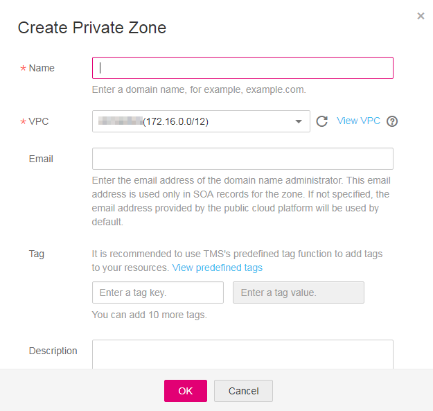
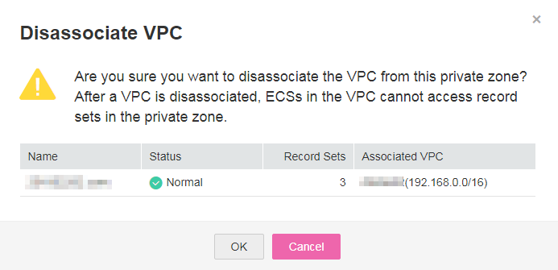

# Managing Private Zones

## Viewing Details About a Private Zone

1.  Log in to the management console.
2.  In the **Network** category, click **Domain Name Service**.

    The DNS console is displayed.

3.  On the **Dashboard** page, click **Private Zones** under **My Resources**.
4.  Click on the upper left and select the desired region and project.
5.  View the private zone details.

## Creating a Private Zone

Create a private zone if a new domain name is to be managed using the DNS service.

1.  Log in to the management console.
2.  In the **Network** category, click **Domain Name Service**.

    The DNS console is displayed.

3.  In the navigation pane, Choose **Private Zones**.

    The **Private Zones** page is displayed.

4.  Click on the upper left and select the desired region and project.
5.  Click **Create Private Zone**.

    **Figure 1** Create Private Zone
    

6.  Configure the parameters according to [Table 1](#en-us_topic_0057777026_en-us_topic_0035467699_table2052132816642).**Table 1** Parameters required for creating a private zone

    <table><thead align="left"><tr id="en-us_topic_0057777026_en-us_topic_0035467699_row5957484916642"><th class="cellrowborder" valign="top" width="18.11%" id="mcps1.2.4.1.1">
<strong id="en-us_topic_0057777026_b84235270695255">Parameter</strong>

    </th>
    <th class="cellrowborder" valign="top" width="50.629999999999995%" id="mcps1.2.4.1.2">
<strong id="en-us_topic_0057777026_en-us_topic_0035268497_b8423527061433">Description</strong>

    </th>
    <th class="cellrowborder" valign="top" width="31.259999999999998%" id="mcps1.2.4.1.3">
<strong id="en-us_topic_0057777026_b84235270617114">Example Value</strong>

    </th>
    </tr>
    </thead>
    <tbody><tr id="en-us_topic_0057777026_en-us_topic_0035467699_row2871871016642"><td class="cellrowborder" valign="top" width="18.11%" headers="mcps1.2.4.1.1 ">
Name

    </td>
    <td class="cellrowborder" valign="top" width="50.629999999999995%" headers="mcps1.2.4.1.2 ">
Private network domain name

    
You can customize any correctly formatted top-level domain names.

    </td>
    <td class="cellrowborder" valign="top" width="31.259999999999998%" headers="mcps1.2.4.1.3 ">
example.com

    </td>
    </tr>
    <tr id="en-us_topic_0057777026_row16069279235858"><td class="cellrowborder" valign="top" width="18.11%" headers="mcps1.2.4.1.1 ">
VPC

    </td>
    <td class="cellrowborder" valign="top" width="50.629999999999995%" headers="mcps1.2.4.1.2 ">
VPC to be associated with the private zone

    </td>
    <td class="cellrowborder" valign="top" width="31.259999999999998%" headers="mcps1.2.4.1.3 ">
-

    </td>
    </tr>
    <tr id="en-us_topic_0057777026_en-us_topic_0035467699_row3925088716642"><td class="cellrowborder" valign="top" width="18.11%" headers="mcps1.2.4.1.1 ">
Email

    </td>
    <td class="cellrowborder" valign="top" width="50.629999999999995%" headers="mcps1.2.4.1.2 ">
(Optional) Email address of the administrator managing the private zone

    
It is recommended that you set the email address to <strong id="en-us_topic_0057777026_b842352706182128">HOSTMASTER@<em id="en-us_topic_0057777026_i842352697182143">Domain name</em></strong>.

    
For more details about the email address, see <a href="why-is-the-email-address-format-changed-in-the-soa-record.html">Why Is the Email Address Format Changed in the SOA Record?</a>

    </td>
    <td class="cellrowborder" valign="top" width="31.259999999999998%" headers="mcps1.2.4.1.3 ">
HOSTMASTER@example.com

    </td>
    </tr>
    <tr id="en-us_topic_0057777026_row648142632420"><td class="cellrowborder" valign="top" width="18.11%" headers="mcps1.2.4.1.1 ">
Tag

    </td>
    <td class="cellrowborder" valign="top" width="50.629999999999995%" headers="mcps1.2.4.1.2 ">
(Optional) Identifier of a resource. Each tag contains a key and a value. You can add 10 tags at most to a zone.

    
For details about tag key and value requirements, see <a href="#en-us_topic_0057773658__en-us_topic_0057777026_table1393932617253">Table 2</a>.

    </td>
    <td class="cellrowborder" valign="top" width="31.259999999999998%" headers="mcps1.2.4.1.3 ">
example_key1

    
example_value1

    </td>
    </tr>
    <tr id="en-us_topic_0057777026_row197267115553"><td class="cellrowborder" valign="top" width="18.11%" headers="mcps1.2.4.1.1 ">
Description

    </td>
    <td class="cellrowborder" valign="top" width="50.629999999999995%" headers="mcps1.2.4.1.2 ">
(Optional) Description of the domain name, which cannot exceed 255 characters

    </td>
    <td class="cellrowborder" valign="top" width="31.259999999999998%" headers="mcps1.2.4.1.3 ">
This is a private zone.

    </td>
    </tr>
    </tbody>
    </table>

    **Table 2** Tag key and value requirements

    <table><thead align="left"><tr id="en-us_topic_0057777026_en-us_topic_0035467699_row72901535141713"><th class="cellrowborder" valign="top" width="18.181818181818183%" id="mcps1.2.4.1.1">
<strong id="en-us_topic_0057777026_en-us_topic_0035467699_b8423527069525">Parameter</strong>

    </th>
    <th class="cellrowborder" valign="top" width="50.505050505050505%" id="mcps1.2.4.1.2">
<strong id="en-us_topic_0057777026_en-us_topic_0035467699_b842352706171418">Requirement</strong>

    </th>
    <th class="cellrowborder" valign="top" width="31.313131313131315%" id="mcps1.2.4.1.3">
Example Value

    </th>
    </tr>
    </thead>
    <tbody><tr id="en-us_topic_0057777026_en-us_topic_0035467699_row52906354176"><td class="cellrowborder" valign="top" width="18.181818181818183%" headers="mcps1.2.4.1.1 ">
Key

    </td>
    <td class="cellrowborder" valign="top" width="50.505050505050505%" headers="mcps1.2.4.1.2 "><ul id="en-us_topic_0057777026_en-us_topic_0035467699_ul46253231183"><li id="en-us_topic_0057777026_en-us_topic_0035467699_li176251123141812">Cannot be left blank.</li><li id="en-us_topic_0057777026_en-us_topic_0035467699_li86261923201810">Must be unique for each resource.</li><li id="en-us_topic_0057777026_en-us_topic_0035467699_li162620231180">Consists of at most 36 characters.</li><li id="en-us_topic_0057777026_en-us_topic_0035467699_li5389246102911">Contains only letters, digits, hyphens (-), and underscores (_).</li></ul>
    </td>
    <td class="cellrowborder" valign="top" width="31.313131313131315%" headers="mcps1.2.4.1.3 ">
example_key1

    </td>
    </tr>
    <tr id="en-us_topic_0057777026_en-us_topic_0035467699_row132900355172"><td class="cellrowborder" valign="top" width="18.181818181818183%" headers="mcps1.2.4.1.1 ">
Value

    </td>
    <td class="cellrowborder" valign="top" width="50.505050505050505%" headers="mcps1.2.4.1.2 "><ul id="en-us_topic_0057777026_en-us_topic_0035467699_ul19648123161815"><li id="en-us_topic_0057777026_en-us_topic_0035467699_li15648193110182">Cannot be left blank.</li><li id="en-us_topic_0057777026_en-us_topic_0035467699_li3648143181813">Consists of at most 43 characters.</li><li id="en-us_topic_0057777026_en-us_topic_0035467699_li64561823123015">Contains only letters, digits, hyphens (-), and underscores (_).</li></ul>
    </td>
    <td class="cellrowborder" valign="top" width="31.313131313131315%" headers="mcps1.2.4.1.3 ">
example_value1

    </td>
    </tr>
    </tbody>
    </table>

7.  Click **OK**.

    You can query information about the private zone you created on the **Private Zones** page.

    >  **NOTE:** 

    > Click the zone name to query detailed zone information. The system has created record sets of the SOA type and NS type in the zone.

    > -   The SOA record set determines the DNS server that is the authoritative information source for a particular domain name.
    > -   The NS record set defines authoritative DNS servers for a zone.

## Modifying a Private zone

If the information of your private zone has changed, you can modify its email address or description.

1.  Log in to the management console.
2.  In the **Network** category, click **Domain Name Service**.

    The DNS console is displayed.

3.  In the navigation pane, Choose **Private Zones**.

    The **Private Zones** page is displayed.

4.  Click on the upper left and select the desired region and project.
5.  Locate the zone to be modified and click **Modify** under **Operation**.

    The **Modify Private Zone** box is displayed.

6.  Change the email address or description of the zone.
7.  Click **OK**.

## Associating a VPC

You can associate a new VPC with the private zone on the DNS console.

1.  Log in to the management console.
2.  In the **Network** category, click **Domain Name Service**.

    The DNS console is displayed.

3.  In the navigation pane, Choose **Private Zones**.

    The **Private Zones** page is displayed.

4.  Click on the upper left and select the desired region and project.
5.  Locate the private zone to be associated with the VPC and click **Associate VPC** in the **Operation** column.

    **Figure 2** Associate VPC
    

6.  Configure the parameters according to [Table 3](#table2843771002454).**Table 3** Associating a VPC

    <table><thead align="left"><tr id="row3835768902454"><th class="cellrowborder" valign="top" width="19.61%" id="mcps1.2.4.1.1">
<strong id="b84235270695255">Parameter</strong>

    </th>
    <th class="cellrowborder" valign="top" width="47.06%" id="mcps1.2.4.1.2">
<strong id="en-us_topic_0035268497_b8423527061433">Description</strong>

    </th>
    <th class="cellrowborder" valign="top" width="33.33%" id="mcps1.2.4.1.3">
<strong id="b84235270617114">Example Value</strong>

    </th>
    </tr>
    </thead>
    <tbody><tr id="row4962413602454"><td class="cellrowborder" valign="top" width="19.61%" headers="mcps1.2.4.1.1 ">
Name

    </td>
    <td class="cellrowborder" valign="top" width="47.06%" headers="mcps1.2.4.1.2 ">
Private zone name

    </td>
    <td class="cellrowborder" valign="top" width="33.33%" headers="mcps1.2.4.1.3 ">
example.com

    </td>
    </tr>
    <tr id="row878042502454"><td class="cellrowborder" valign="top" width="19.61%" headers="mcps1.2.4.1.1 ">
VPC

    </td>
    <td class="cellrowborder" valign="top" width="47.06%" headers="mcps1.2.4.1.2 ">
VPC to be associated with the private zone

    </td>
    <td class="cellrowborder" valign="top" width="33.33%" headers="mcps1.2.4.1.3 ">
-

    </td>
    </tr>
    </tbody>
    </table>

7.  Click **OK**.

## Disassociating a VPC

If multiple VPCs are associated with a private zone, you can disassociate one of them on the console.

>  **NOTE:** 

> If only one VPC is associated, you cannot disassociate it from the private zone. You can choose to delete the private zone.

1.  Log in to the management console.
2.  In the **Network** category, click **Domain Name Service**.

    The DNS console is displayed.

3.  In the navigation pane, Choose **Private Zones**.

    The **Private Zones** page is displayed.

4.  Click on the upper left and select the desired region and project.
5.  Locate the private zone to be disassociated with the VPC and click in the **Associated VPCs** column to disassociate a VPC.

    **Figure 3** Private Zone
    

6.  Click **OK**.

    **Figure 4** Disassociate VPC
    

## Deleting a Private Zone

A private zone can be deleted if you do not need to manage it using the DNS service. After the deletion, domain names included in this zone cannot be resolved.

>  **NOTICE:** 

> Before deleting a private zone, ensure that all record sets in this zone have been backed up.

1.  Log in to the management console.
2.  In the **Network** category, click **Domain Name Service**.

    The DNS console is displayed.

3.  In the navigation pane, Choose **Private Zones**.

    The **Private Zones** page is displayed.

4.  Click on the upper left and select the desired region and project.
5.  Locate the private zone to be deleted and click **Delete** under **Operation**.
6.  Click **OK** to confirm the deletion.

