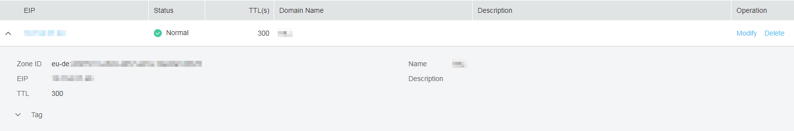

# Managing PTR Records

>  **NOTE:** 

> The ap-sg region does not support PTR records.

## Viewing Details About a PTR Record

You can query information about the PTR record you created on the **PTR Records** page.

1.  Log in to the management console.
2.  In the **Network** category, click **Domain Name Service**.

    The DNS console is displayed.

3.  Choose **Dashboard** and click **PTR Records** under **My Resources**.
4.  In the PTR record list, check the record details.

## Creating a PTR Record

If you have assigned a new EIP in your public cloud services \(for example, ECS\), you can create a PTR record for the EIP.

1.  Log in to the management console.
2.  In the **Network** category, click **Domain Name Service**.

    The DNS console is displayed.

3.  In the navigation pane, choose **PTR Records**.

    The **PTR Records** page is displayed.

4.  Click **Create PTR Record**.

    **Figure 1** Create PTR Record
    

5.  Configure the parameters according to [Table 1](#en-us_topic_0040322596_en-us_topic_0035467699_table2052132816642).**Table 1** Parameters required for creating a PTR record

    <table><thead align="left"><tr id="en-us_topic_0040322596_en-us_topic_0035467699_row5957484916642"><th class="cellrowborder" valign="top" width="19.99%" id="mcps1.2.4.1.1">
<strong id="en-us_topic_0040322596_b84235270695255">Parameter</strong>

    </th>
    <th class="cellrowborder" valign="top" width="48.75%" id="mcps1.2.4.1.2">
<strong id="en-us_topic_0040322596_en-us_topic_0035268497_b8423527061433">Description</strong>

    </th>
    <th class="cellrowborder" valign="top" width="31.259999999999998%" id="mcps1.2.4.1.3">
<strong id="en-us_topic_0040322596_b84235270617114">Example Value</strong>

    </th>
    </tr>
    </thead>
    <tbody><tr id="en-us_topic_0040322596_en-us_topic_0035467699_row2871871016642"><td class="cellrowborder" valign="top" width="19.99%" headers="mcps1.2.4.1.1 ">
EIP

    </td>
    <td class="cellrowborder" valign="top" width="48.75%" headers="mcps1.2.4.1.2 ">
EIP obtained from another cloud service (for example, ECS)

    </td>
    <td class="cellrowborder" valign="top" width="31.259999999999998%" headers="mcps1.2.4.1.3 ">
XX.XX.XX.XX

    </td>
    </tr>
    <tr id="en-us_topic_0040322596_en-us_topic_0035467699_row6656618516642"><td class="cellrowborder" valign="top" width="19.99%" headers="mcps1.2.4.1.1 ">
Domain Name

    </td>
    <td class="cellrowborder" valign="top" width="48.75%" headers="mcps1.2.4.1.2 ">
Domain name mapped to the EIP

    </td>
    <td class="cellrowborder" valign="top" width="31.259999999999998%" headers="mcps1.2.4.1.3 ">
www.example.com

    </td>
    </tr>
    <tr id="en-us_topic_0040322596_en-us_topic_0035467699_row2168553016642"><td class="cellrowborder" valign="top" width="19.99%" headers="mcps1.2.4.1.1 ">
TTL (s)

    </td>
    <td class="cellrowborder" valign="top" width="48.75%" headers="mcps1.2.4.1.2 ">
Caching period of the PTR record (in seconds)

    
The default value is 300s, that is, <strong id="en-us_topic_0040322596_b842352706183837">5 min</strong>.

    </td>
    <td class="cellrowborder" valign="top" width="31.259999999999998%" headers="mcps1.2.4.1.3 ">
300

    </td>
    </tr>
    <tr id="en-us_topic_0040322596_row273617193297"><td class="cellrowborder" valign="top" width="19.99%" headers="mcps1.2.4.1.1 ">
Tag

    </td>
    <td class="cellrowborder" valign="top" width="48.75%" headers="mcps1.2.4.1.2 ">
(Optional) Identifier of a resource. Each tag contains a key and a value. You can add 10 tags at most to a PTR record.

    
For details about tag key and value requirements, see <a href="#en-us_topic_0077500015__en-us_topic_0040322596_table1393932617253">Table 2</a>.

    </td>
    <td class="cellrowborder" valign="top" width="31.259999999999998%" headers="mcps1.2.4.1.3 ">
example_key1

    
example_value1

    </td>
    </tr>
    <tr id="en-us_topic_0040322596_en-us_topic_0035467699_row3925088716642"><td class="cellrowborder" valign="top" width="19.99%" headers="mcps1.2.4.1.1 ">
Description

    </td>
    <td class="cellrowborder" valign="top" width="48.75%" headers="mcps1.2.4.1.2 ">
(Optional) Description of the PTR record

    </td>
    <td class="cellrowborder" valign="top" width="31.259999999999998%" headers="mcps1.2.4.1.3 ">
The PTR record is for reverse resolution.

    </td>
    </tr>
    </tbody>
    </table>

    **Table 2** Tag key and value requirements

    <table><thead align="left"><tr id="en-us_topic_0040322596_en-us_topic_0035467699_row72901535141713"><th class="cellrowborder" valign="top" width="18.181818181818183%" id="mcps1.2.4.1.1">
<strong id="en-us_topic_0040322596_en-us_topic_0035467699_b8423527069525">Parameter</strong>

    </th>
    <th class="cellrowborder" valign="top" width="50.505050505050505%" id="mcps1.2.4.1.2">
<strong id="en-us_topic_0040322596_en-us_topic_0035467699_b842352706171418">Requirement</strong>

    </th>
    <th class="cellrowborder" valign="top" width="31.313131313131315%" id="mcps1.2.4.1.3">
Example Value

    </th>
    </tr>
    </thead>
    <tbody><tr id="en-us_topic_0040322596_en-us_topic_0035467699_row52906354176"><td class="cellrowborder" valign="top" width="18.181818181818183%" headers="mcps1.2.4.1.1 ">
Key

    </td>
    <td class="cellrowborder" valign="top" width="50.505050505050505%" headers="mcps1.2.4.1.2 "><ul id="en-us_topic_0040322596_en-us_topic_0035467699_ul46253231183"><li id="en-us_topic_0040322596_en-us_topic_0035467699_li176251123141812">Cannot be left blank.</li><li id="en-us_topic_0040322596_en-us_topic_0035467699_li86261923201810">Must be unique for each resource.</li><li id="en-us_topic_0040322596_en-us_topic_0035467699_li162620231180">Consists of at most 36 characters.</li><li id="en-us_topic_0040322596_en-us_topic_0035467699_li5389246102911">Contains only letters, digits, hyphens (-), and underscores (_).</li></ul>
    </td>
    <td class="cellrowborder" valign="top" width="31.313131313131315%" headers="mcps1.2.4.1.3 ">
example_key1

    </td>
    </tr>
    <tr id="en-us_topic_0040322596_en-us_topic_0035467699_row132900355172"><td class="cellrowborder" valign="top" width="18.181818181818183%" headers="mcps1.2.4.1.1 ">
Value

    </td>
    <td class="cellrowborder" valign="top" width="50.505050505050505%" headers="mcps1.2.4.1.2 "><ul id="en-us_topic_0040322596_en-us_topic_0035467699_ul19648123161815"><li id="en-us_topic_0040322596_en-us_topic_0035467699_li15648193110182">Cannot be left blank.</li><li id="en-us_topic_0040322596_en-us_topic_0035467699_li3648143181813">Consists of at most 43 characters.</li><li id="en-us_topic_0040322596_en-us_topic_0035467699_li64561823123015">Contains only letters, digits, hyphens (-), and underscores (_).</li></ul>
    </td>
    <td class="cellrowborder" valign="top" width="31.313131313131315%" headers="mcps1.2.4.1.3 ">
example_value1

    </td>
    </tr>
    </tbody>
    </table>

6.  Click **OK**.

    You can query information about the PTR record you created on the **PTR Records** page.

    **Figure 2** PTR record
    

    >  **NOTE:** 

    > If the domain name, for example, example.com, is mapped to multiple EIPs, you need to create a PTR record for each EIP.

## Modifying a PTR Record

If the domain name mapped to the EIP has changed or you want to change the TTL and description of a PTR record, you can modify the required PTR record.

1.  Log in to the management console.
2.  In the **Network** category, click **Domain Name Service**.

    The DNS console is displayed.

3.  In the navigation pane, choose **PTR Records**.

    The **PTR Records** page is displayed.

4.  Locate the PTR record to be modified and click **Modify** under **Operation**.

    The **Modify PTR Record** box is displayed.

5.  Change the domain name, TTL, or description as needed.
6.  Click **OK** to save the change.

## Deleting a PTR Record

You can delete a PTR record if it is needed any more. After the deletion, the domain name mapped to your EIP will change to the default.

1.  Log in to the management console.
2.  In the **Network** category, click **Domain Name Service**.

    The DNS console is displayed.

3.  In the navigation pane, choose **PTR Records**.

    The **PTR Records** page is displayed.

4.  Locate the PTR record to be deleted and click **Delete** under **Operation**.
5.  Click **OK**.

