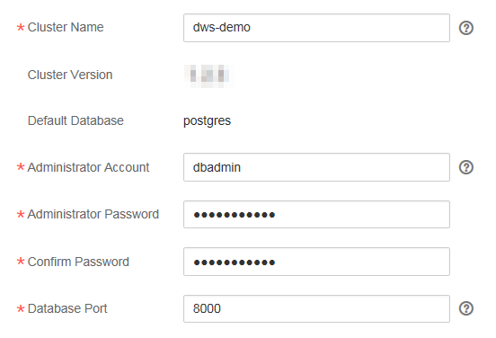

# Creating a Cluster

To use DWS in the public cloud environment, you need to create a data warehouse cluster by specifying only the node flavor and scale. 

This section describes how to create a data warehouse cluster on the DWS management console.

## Preparations Before Creating a Cluster

-   The flavor of nodes in the cluster has been evaluated.

    Choose as many nodes as possible to ensure high-performance storage and computing capabilities for service applications based on service requirements. A node in a data warehouse cluster contains two DataNodes. The DataNode instance stores service data \(support for row-based, column-based, and hybrid storage\), executes the data query tasks, and returns the execution results.

-   A network access topology has been designed.

    Plan an appropriate AZ and configure the network to isolate the data warehouse cluster from other public cloud services based on the service application requirements.

-   Ensure that the number of available nodes meets the following conditions. Otherwise, the cluster cannot be created. In this case, click  **Increase quota**  to submit a work order and apply for higher node quota.
    -   The number of available nodes must be greater than or equal to three, because at least three nodes are required for creating a cluster. You can view the number of available nodes on the  **Cluster Management**  page.
    -   The number of nodes in the cluster to be created must be less than or equal to the number of available nodes.

## Creating a Cluster

1.  Log in to the management console at  [https://console.otc.t-systems.com/dws/](https://console.otc.t-systems.com/dws/).
2.  On the  **Cluster Management**  page, click  **Create DWS Cluster**.
3.  Select the  **Region**.

    **Table  1**  Region parameters

    
    <table><thead align="left"><tr id="row11089193597"><th class="cellrowborder" valign="top" width="21.78%" id="mcps1.2.4.1.1">
<strong id="b29551244112357">Parameter</strong>

    </th>
    <th class="cellrowborder" valign="top" width="53.47%" id="mcps1.2.4.1.2">
<strong id="b5196504143335">Description</strong>

    </th>
    <th class="cellrowborder" valign="top" width="24.75%" id="mcps1.2.4.1.3">
<strong id="b60793810112357">Example Value</strong>

    </th>
    </tr>
    </thead>
    <tbody><tr id="row8143819165910"><td class="cellrowborder" valign="top" width="21.78%" headers="mcps1.2.4.1.1 ">
Region

    </td>
    <td class="cellrowborder" valign="top" width="53.47%" headers="mcps1.2.4.1.2 ">
Select the actual region where the cluster nodes run. 

    
For more information about AZs, see <a href="https://docs.otc.t-systems.com/en-us/endpoint/index.html" target="_blank" rel="noopener noreferrer">Regions and Endpoints</a>.

    </td>
    <td class="cellrowborder" valign="top" width="24.75%" headers="mcps1.2.4.1.3 ">
eu-de

    </td>
    </tr>
    <tr id="row521517197596"><td class="cellrowborder" valign="top" width="21.78%" headers="mcps1.2.4.1.1 ">
AZ

    </td>
    <td class="cellrowborder" valign="top" width="53.47%" headers="mcps1.2.4.1.2 ">
Select an AZ associated with the cluster region.

    
An AZ contains one or more physical DCs. It has independent cooling, fire extinguishing, moisture-proof, and electricity facilities. Within an AZ, computing, network, storage, and other resources are logically divided into multiple clusters. AZs within a region are interconnected using high-speed optical fibers to realize cross-AZ high availability for the system.

    
    </td>
    <td class="cellrowborder" valign="top" width="24.75%" headers="mcps1.2.4.1.3 ">
eu-de-01

    </td>
    </tr>
    </tbody>
    </table>

4.  Configure the node-related parameters.

    > **NOTE:**   
    >The number of nodes in a new cluster cannot exceed the quota that can be used by a user or 32. If the node quota is insufficient, click  **Increase quota**  to submit a work order and apply for higher node quota.  

    **Figure  1**  View of configuring node-related parameters  
    

    **Table  2**  Node configuration parameters

    
    <table><thead align="left"><tr id="row1858451161414"><th class="cellrowborder" valign="top" width="21.62%" id="mcps1.2.4.1.1">
<strong id="b18455557143338">Parameter</strong>

    </th>
    <th class="cellrowborder" valign="top" width="53.76%" id="mcps1.2.4.1.2">
<strong id="b2031400697">Description</strong>

    </th>
    <th class="cellrowborder" valign="top" width="24.62%" id="mcps1.2.4.1.3">
<strong id="b171032388">Example Value</strong>

    </th>
    </tr>
    </thead>
    <tbody><tr id="row361421141419"><td class="cellrowborder" valign="top" width="21.62%" headers="mcps1.2.4.1.1 ">
Node Flavor

    </td>
    <td class="cellrowborder" valign="top" width="53.76%" headers="mcps1.2.4.1.2 ">
Select vCPU and memory resources for the nodes in the cluster. <a href="#table111901234141316">Table 3</a> lists the node flavors supported by DWS.

    </td>
    <td class="cellrowborder" valign="top" width="24.62%" headers="mcps1.2.4.1.3 ">
dws.m3.xlarge

    </td>
    </tr>
    <tr id="row4633711181419"><td class="cellrowborder" valign="top" width="21.62%" headers="mcps1.2.4.1.1 ">
Nodes

    </td>
    <td class="cellrowborder" valign="top" width="53.76%" headers="mcps1.2.4.1.2 ">
Specify the number of nodes in the cluster.

    
The number of nodes ranges from 3 to 32.

    </td>
    <td class="cellrowborder" valign="top" width="24.62%" headers="mcps1.2.4.1.3 ">
3

    </td>
    </tr>
    </tbody>
    </table>

    **Table  3**  Flavor description

    
    <table><thead align="left"><tr id="row1222193461316"><th class="cellrowborder" valign="top" width="29.630000000000003%" id="mcps1.2.6.1.1">
<strong id="b571358716">Type</strong>

    </th>
    <th class="cellrowborder" valign="top" width="13.94%" id="mcps1.2.6.1.2">
<strong id="b142834586">vCPU Cores</strong>

    </th>
    <th class="cellrowborder" valign="top" width="12.45%" id="mcps1.2.6.1.3">
<strong id="b1053883782">Memory</strong>

    </th>
    <th class="cellrowborder" valign="top" width="15.97%" id="mcps1.2.6.1.4">
<strong id="b1824025355">Disk Size</strong>

    </th>
    <th class="cellrowborder" valign="top" width="28.01%" id="mcps1.2.6.1.5">
<strong id="b1092947105">Disk Type</strong>

    </th>
    </tr>
    </thead>
    <tbody><tr id="row3331203413136"><td class="cellrowborder" valign="top" width="29.630000000000003%" headers="mcps1.2.6.1.1 ">
dws.m1.xlarge.ultrahigh

    </td>
    <td class="cellrowborder" valign="top" width="13.94%" headers="mcps1.2.6.1.2 ">
4

    </td>
    <td class="cellrowborder" valign="top" width="12.45%" headers="mcps1.2.6.1.3 ">
32 GB

    </td>
    <td class="cellrowborder" valign="top" width="15.97%" headers="mcps1.2.6.1.4 ">
256 GB

    </td>
    <td class="cellrowborder" valign="top" width="28.01%" headers="mcps1.2.6.1.5 ">
General-purpose generation I, SSD

    </td>
    </tr>
    <tr id="row9424123491313"><td class="cellrowborder" valign="top" width="29.630000000000003%" headers="mcps1.2.6.1.1 ">
dws.d1.xlarge

    </td>
    <td class="cellrowborder" valign="top" width="13.94%" headers="mcps1.2.6.1.2 ">
4

    </td>
    <td class="cellrowborder" valign="top" width="12.45%" headers="mcps1.2.6.1.3 ">
32 GB

    </td>
    <td class="cellrowborder" valign="top" width="15.97%" headers="mcps1.2.6.1.4 ">
1.68 TB

    </td>
    <td class="cellrowborder" valign="top" width="28.01%" headers="mcps1.2.6.1.5 ">
Local disk (HDD)

    </td>
    </tr>
    <tr id="row0471103412137"><td class="cellrowborder" valign="top" width="29.630000000000003%" headers="mcps1.2.6.1.1 ">
dws.d2.15xlarge

    </td>
    <td class="cellrowborder" valign="top" width="13.94%" headers="mcps1.2.6.1.2 ">
60

    </td>
    <td class="cellrowborder" valign="top" width="12.45%" headers="mcps1.2.6.1.3 ">
540 GB

    </td>
    <td class="cellrowborder" valign="top" width="15.97%" headers="mcps1.2.6.1.4 ">
13.41 TB

    </td>
    <td class="cellrowborder" valign="top" width="28.01%" headers="mcps1.2.6.1.5 ">
Disk-intensive generation II (KVM), local disk (HDD)

    </td>
    </tr>
    <tr id="row20518834101316"><td class="cellrowborder" valign="top" width="29.630000000000003%" headers="mcps1.2.6.1.1 ">
dws.d2.xlarge

    </td>
    <td class="cellrowborder" valign="top" width="13.94%" headers="mcps1.2.6.1.2 ">
4

    </td>
    <td class="cellrowborder" valign="top" width="12.45%" headers="mcps1.2.6.1.3 ">
32 GB

    </td>
    <td class="cellrowborder" valign="top" width="15.97%" headers="mcps1.2.6.1.4 ">
1.68 TB

    </td>
    <td class="cellrowborder" valign="top" width="28.01%" headers="mcps1.2.6.1.5 ">
Disk-intensive generation II (KVM), local disk (HDD)

    </td>
    </tr>
    <tr id="row18660183401313"><td class="cellrowborder" valign="top" width="29.630000000000003%" headers="mcps1.2.6.1.1 ">
dws.m3.xlarge

    </td>
    <td class="cellrowborder" valign="top" width="13.94%" headers="mcps1.2.6.1.2 ">
4

    </td>
    <td class="cellrowborder" valign="top" width="12.45%" headers="mcps1.2.6.1.3 ">
32 GB

    </td>
    <td class="cellrowborder" valign="top" width="15.97%" headers="mcps1.2.6.1.4 ">
160 GB

    </td>
    <td class="cellrowborder" valign="top" width="28.01%" headers="mcps1.2.6.1.5 ">
General-purpose generation III (KVM), SSD

    </td>
    </tr>
    </tbody>
    </table>

      

5.  Configure cluster-related parameters.

    **Figure  2**  View of configuring the cluster  
    

    **Table  4**  Parameter description

    
    <table><thead align="left"><tr id="row9384101317142"><th class="cellrowborder" valign="top" width="21.62%" id="mcps1.2.4.1.1">
<strong id="b5863685143335">Parameter</strong>

    </th>
    <th class="cellrowborder" valign="top" width="53.76%" id="mcps1.2.4.1.2">
<strong id="b684577358">Description</strong>

    </th>
    <th class="cellrowborder" valign="top" width="24.62%" id="mcps1.2.4.1.3">
<strong id="b18263659143335">Example Value</strong>

    </th>
    </tr>
    </thead>
    <tbody><tr id="row13844134148"><td class="cellrowborder" valign="top" width="21.62%" headers="mcps1.2.4.1.1 ">
Cluster Name

    </td>
    <td class="cellrowborder" valign="top" width="53.76%" headers="mcps1.2.4.1.2 ">
Set the name of the data warehouse cluster. 

    
Enter 4 to 64 characters. Only case-insensitive letters, digits, hyphens (-), and underscores (_) are allowed. The value must start with a letter. 

    </td>
    <td class="cellrowborder" valign="top" width="24.62%" headers="mcps1.2.4.1.3 ">
dws-demo

    </td>
    </tr>
    <tr id="row13861713161413"><td class="cellrowborder" valign="top" width="21.62%" headers="mcps1.2.4.1.1 ">
Cluster Version

    </td>
    <td class="cellrowborder" valign="top" width="53.76%" headers="mcps1.2.4.1.2 ">
Display the version of the database instance installed in the cluster.

    
 NOTE: 

The version number is the default one and, as of publication, cannot be changed.

    

    </td>
    <td class="cellrowborder" valign="top" width="24.62%" headers="mcps1.2.4.1.3 ">
1.2.1

    </td>
    </tr>
    <tr id="row14386171315141"><td class="cellrowborder" valign="top" width="21.62%" headers="mcps1.2.4.1.1 ">
Default Database

    </td>
    <td class="cellrowborder" valign="top" width="53.76%" headers="mcps1.2.4.1.2 ">
The default database name of the cluster is <b>postgres</b>. 

    
 NOTE: 

This name cannot be changed.

    

    </td>
    <td class="cellrowborder" valign="top" width="24.62%" headers="mcps1.2.4.1.3 ">
-

    </td>
    </tr>
    <tr id="row73871513111412"><td class="cellrowborder" valign="top" width="21.62%" headers="mcps1.2.4.1.1 ">
Administrator Account

    </td>
    <td class="cellrowborder" valign="top" width="53.76%" headers="mcps1.2.4.1.2 ">
Set the administrator name of the database.

    
The administrator username must:

    <ul id="ul1838791391412"><li>Consist of lowercase letters, digits, or underscores.</li><li>Start with a lowercase letter or an underscore.</li><li>Contain 1 to 63 characters.</li><li>Cannot be a keyword of the DWS database. For details about the keywords of the DWS database, see section <b>Keyword</b> in the <em id="i2084564732611">Data Warehouse Service Database Developer Guide</em>.</li></ul>
    </td>
    <td class="cellrowborder" valign="top" width="24.62%" headers="mcps1.2.4.1.3 ">
dbadmin

    </td>
    </tr>
    <tr id="row10387113111411"><td class="cellrowborder" valign="top" width="21.62%" headers="mcps1.2.4.1.1 ">
Administrator Password

    </td>
    <td class="cellrowborder" valign="top" width="53.76%" headers="mcps1.2.4.1.2 ">
Set the password of the database administrator account.

    
The password complexity requirements are as follows:<ul id="ul13418111318144"><li>Consists of 8 to 32 characters.</li><li>Cannot be the same as the username or the username written in reverse order.</li><li>Must contain at least 3 of the following character types: uppercase letters, lowercase letters, digits, and special characters ~!@#%^&amp;*()-_=+|[{}];:,&lt;.&gt;/?</li><li>Passes the weak password check.</li></ul>
    

    
 NOTE: 

Change the password regularly and keep it secure.

    

    </td>
    <td class="cellrowborder" valign="top" width="24.62%" headers="mcps1.2.4.1.3 ">
Dws2018demo!

    </td>
    </tr>
    <tr id="row14387141315145"><td class="cellrowborder" valign="top" width="21.62%" headers="mcps1.2.4.1.1 ">
Confirm Password

    </td>
    <td class="cellrowborder" valign="top" width="53.76%" headers="mcps1.2.4.1.2 ">
Enter the database administrator password again.

    </td>
    <td class="cellrowborder" valign="top" width="24.62%" headers="mcps1.2.4.1.3 ">
Dws2018demo!

    </td>
    </tr>
    <tr id="row938781319144"><td class="cellrowborder" valign="top" width="21.62%" headers="mcps1.2.4.1.1 ">
Database Port

    </td>
    <td class="cellrowborder" valign="top" width="53.76%" headers="mcps1.2.4.1.2 ">
Set the port used when the client or application connects to the database in the cluster.

    
The port ranges from 8000 to 10000.

    </td>
    <td class="cellrowborder" valign="top" width="24.62%" headers="mcps1.2.4.1.3 ">
8000

    </td>
    </tr>
    </tbody>
    </table>

6.  Configure network parameters.

    **Figure  3**  View of configuring the network  
    

    **Table  5**  Network parameters

    
    <table><thead align="left"><tr id="row3540181381411"><th class="cellrowborder" valign="top" width="21.62%" id="mcps1.2.4.1.1">
<strong id="b40793968144420">Parameter</strong>

    </th>
    <th class="cellrowborder" valign="top" width="53.76%" id="mcps1.2.4.1.2">
<strong id="b729327017213">Description</strong>

    </th>
    <th class="cellrowborder" valign="top" width="24.62%" id="mcps1.2.4.1.3">
<strong id="b19079452144420">Example Value</strong>

    </th>
    </tr>
    </thead>
    <tbody><tr id="row1540171331413"><td class="cellrowborder" valign="top" width="21.62%" headers="mcps1.2.4.1.1 ">
VPC

    </td>
    <td class="cellrowborder" valign="top" width="53.76%" headers="mcps1.2.4.1.2 ">
Specify a virtual private network for nodes in a cluster to isolate networks of different services.

    
If you create a data warehouse cluster for the first time and have not configured the VPC, click <b>View VPC</b>. On the VPC management console that is displayed, create a new VPC that satisfies your needs.

    
For details about how to create a VPC, see section <b>Creating a VPC</b> in the <i><cite id="cite92ace8dc725e4eb6b9051e53943f28d3134156">Virtual Private Cloud User Guide</cite></i>.

    
After selecting a VPC from the drop-down list, click <b>View VPC</b> to enter the VPC management console and view the detailed information about the VPC.

    
You can click  to refresh the options in the <b>VPC</b> drop-down list.

    </td>
    <td class="cellrowborder" valign="top" width="24.62%" headers="mcps1.2.4.1.3 ">
vpc-dws

    </td>
    </tr>
    <tr id="row1054151312147"><td class="cellrowborder" valign="top" width="21.62%" headers="mcps1.2.4.1.1 ">
Subnet

    </td>
    <td class="cellrowborder" valign="top" width="53.76%" headers="mcps1.2.4.1.2 ">
Specify a subnet for the VPC.

    
A subnet provides dedicated network resources that are isolated from other networks, improving network security.

    </td>
    <td class="cellrowborder" valign="top" width="24.62%" headers="mcps1.2.4.1.3 ">
subnet-dws

    </td>
    </tr>
    <tr id="row85411713171419"><td class="cellrowborder" valign="top" width="21.62%" headers="mcps1.2.4.1.1 ">
Security Group

    </td>
    <td class="cellrowborder" valign="top" width="53.76%" headers="mcps1.2.4.1.2 ">
Specify a security group for the VPC.

    
A security group restricts access rules to enhance security when DWS and other services access each other.

    <ul id="ul244311341000"><li>Automatically create a security group.
If <b>Automatic creation</b> is selected, the system automatically creates a default security group. This option is selected by default.

    
The rule of the default security group is as follows: The outbound allows all access requests, while the inbound is only open to the database port that you set to connect to the data warehouse cluster.

    
The format of the default security group's name is dws-&lt;<em id="i151231534105623">cluster name</em>&gt;-&lt;<em id="i783314206105623">database port of the data warehouse cluster</em>&gt;, for example, <strong id="b842352706105715">dws-dws-demo-8000</strong>.

    
 NOTE: 

If the quotas of the security group and the security group rule are insufficient, an error message will be displayed after you submit the cluster creation application. Select an existing group and retry.

    

    </li><li>Manually create and configure a security group.
You can also log in to the VPC management console to manually create a security group. Then, go back to the page for creating data warehouse clusters, click the  button next to the <b>Security Group</b> drop-down list to refresh the page, and select the new security group.

    
To enable the DWS client to connect to the cluster, you need to add an inbound rule to the new security group to grant the access permission to the database port of the data warehouse cluster. An example of the inbound rule is as follows:

    <ul id="ul834751052511"><li><strong id="b842352706111211">Protocol</strong>: <strong id="b842352706111216">TCP</strong></li><li><strong id="b2418462181044">Port</strong>: <strong id="b40326830181048">8000</strong> Use the database port set when creating the data warehouse cluster. This port is used for receiving client connections to DWS.</li><li><strong id="b842352706111337">Source</strong>: Select <strong id="b842352706111342">IP address</strong> and use the host IP address of the client, for example, <strong id="b842352706111428">192.168.0.10/32</strong>.</li></ul>
    </li></ul>
    </td>
    <td class="cellrowborder" valign="top" width="24.62%" headers="mcps1.2.4.1.3 ">
Automatic creation

    </td>
    </tr>
    <tr id="row138021539133519"><td class="cellrowborder" valign="top" width="21.62%" headers="mcps1.2.4.1.1 ">
EIP

    </td>
    <td class="cellrowborder" valign="top" width="53.76%" headers="mcps1.2.4.1.2 ">
Specify whether users can use a client to connect to a cluster's database over the Internet. The following methods are supported:

    <ul id="ul43786513356"><li><b>Do not use</b>: The EIP is not required.</li><li><b>Automatically assign</b>: Users specify the bandwidth of the EIP and the system automatically assigns an EIP that exclusively uses bandwidth to each cluster so that users can use the EIP to access the cluster over the Internet.</li><li><b>Specify</b>: A specified EIP is bound to the cluster. If no available EIPs are displayed in the drop-down list, click <b>Create EIP</b> to go to the <strong id="b84235270611450">Elastic IP</strong> page and create an EIP that satisfies your needs. You can set the bandwidth as needed.</li></ul>
    </td>
    <td class="cellrowborder" valign="top" width="24.62%" headers="mcps1.2.4.1.3 ">
Automatically assign

    </td>
    </tr>
    <tr id="row68992056153010"><td class="cellrowborder" valign="top" width="21.62%" headers="mcps1.2.4.1.1 ">
Bandwidth

    </td>
    <td class="cellrowborder" valign="top" width="53.76%" headers="mcps1.2.4.1.2 ">
When <b>EIP</b> is set to <b>Automatically assign</b>, you specify the bandwidth of the used EIP, which ranges from 1 Mbit/s to 100 Mbit/s.

    </td>
    <td class="cellrowborder" valign="top" width="24.62%" headers="mcps1.2.4.1.3 ">
50 Mbit/s

    </td>
    </tr>
    </tbody>
    </table>

7.  Select either of the following options for  **Advanced Settings**:
    -   **Default**: Indicates that the following advanced settings use the default configurations.
        -   **Parameter Group**: The default database parameter group  **Default-Parameter-Group-DWS**  is associated with the cluster.
        -   **Tag**: By default, no tag is added to the cluster.
        -   **Automated Snapshot**: By default, the policy for automatically generating cluster snapshots is disabled.

    -   **Custom**: If you select this option, set the following advanced settings:

        **Figure  4**  Custom advanced settings  
        

        -   **Parameter Group**

            A parameter group is a set of database parameters. You need to select a parameter group from the drop-down list and associate it with the cluster during cluster creation. You can select the default parameter group  **Default-Parameter-Group-DWS**  or a customized parameter group.

            For details about parameter groups, see section  [Managing Parameter Groups](managing-parameter-groups.md).

        -   **Tag**

            A tag is a key-value pair used to identify a cluster. For details about the keys and values, see  [Table 6](#table59181441134820).

            For more information about tags, see section  [Tagging Overview](tagging-overview.md).

            **Table  6**  Tag parameters

            
            <table><thead align="left"><tr id="dws_01_0105_row17486121763113"><th class="cellrowborder" valign="top" width="15%" id="mcps1.2.4.1.1">
<strong id="dws_01_0105_b84235270617387">Parameter</strong>

            </th>
            <th class="cellrowborder" valign="top" width="71%" id="mcps1.2.4.1.2">
<strong id="dws_01_0105_b842352706101627">Description</strong>

            </th>
            <th class="cellrowborder" valign="top" width="14.000000000000002%" id="mcps1.2.4.1.3">
<strong id="dws_01_0105_b60793810112357">Example Value</strong>

            </th>
            </tr>
            </thead>
            <tbody><tr id="dws_01_0105_row11486131733111"><td class="cellrowborder" valign="top" width="15%" headers="mcps1.2.4.1.1 ">
Tag key

            </td>
            <td class="cellrowborder" valign="top" width="71%" headers="mcps1.2.4.1.2 ">
You can:

            <ul id="dws_01_0105_ul149381653121514"><li>Select a predefined tag key or an existing resource tag key from the drop-down list of the text box.
 NOTE: 

To add a predefined tag, you need to create one on TMS and select it from the drop-down list of <b>Tag key</b>. You can click <b>View predefined tags</b> to enter the <b>Predefined Tag</b> page of TMS. Then, click <b>Create Tag</b> to create a predefined tag. For details, see section <b>Creating Predefined Tags</b> in the <em id="dws_01_0105_i842352697104314">Tag Management Service User Guide</em>.

            

            </li></ul>
            <ul id="dws_01_0105_ul154819568159"><li>Enter a tag key in the text box. A tag key can contain a maximum of 36 Unicode characters, which cannot be null. The first and last characters cannot be spaces.
Contain only uppercase letters (A to Z), lowercase letters (a to z), digits (0-9), hyphens (-), and underscores (_).

            

 NOTE: 

The key name must be unique in the same cluster.

            

            

            </li></ul>
            </td>
            <td class="cellrowborder" valign="top" width="14.000000000000002%" headers="mcps1.2.4.1.3 ">
tagkey01

            </td>
            </tr>
            <tr id="dws_01_0105_row19486151715318"><td class="cellrowborder" valign="top" width="15%" headers="mcps1.2.4.1.1 ">
Tag value

            </td>
            <td class="cellrowborder" valign="top" width="71%" headers="mcps1.2.4.1.2 ">
You can:

            <ul id="dws_01_0105_ul12885203215142"><li>Select a predefined tag value or resource tag value from the drop-down list of the text box.</li><li>Enter a tag value in the text box. A tag key can contain a maximum of 43 Unicode characters, which can be null. The first and last characters cannot be spaces.
Contain only uppercase letters (A to Z), lowercase letters (a to z), digits (0-9), hyphens (-), and underscores (_).

            </li></ul>
            </td>
            <td class="cellrowborder" valign="top" width="14.000000000000002%" headers="mcps1.2.4.1.3 ">
value01

            </td>
            </tr>
            </tbody>
            </table>

        -   **Automated Snapshot**

            Click  **Automated Snapshot**  to enable or disable the automatic snapshot policy for the cluster. After the automated snapshot policy is enabled, the system automatically creates snapshots based on the preset time and period.

              indicates that the policy is enabled.

              indicates that the policy is disabled \(default\).

            When it is enabled, configure the following parameters:

            **Table  7**  Parameter description

            
            <table><thead align="left"><tr id="dws_01_0089_row555312181040"><th class="cellrowborder" valign="top" width="28.000000000000004%" id="mcps1.2.3.1.1">
<strong id="dws_01_0089_b84235270692541">Parameter</strong>

            </th>
            <th class="cellrowborder" valign="top" width="72%" id="mcps1.2.3.1.2">
<strong id="dws_01_0089_b842352706181449">Description</strong>

            </th>
            </tr>
            </thead>
            <tbody><tr id="dws_01_0089_row155542181842"><td class="cellrowborder" valign="top" width="28.000000000000004%" headers="mcps1.2.3.1.1 ">
Retention Days

            </td>
            <td class="cellrowborder" valign="top" width="72%" headers="mcps1.2.3.1.2 ">
It is used to set the retention days of the snapshots that are automatically created. The value ranges from 1 to 10 days.

            
 NOTE: 

You cannot delete the snapshots that are automatically created. The system automatically deletes these snapshots when their retention duration expires.

            

            </td>
            </tr>
            <tr id="dws_01_0089_row7556518248"><td class="cellrowborder" valign="top" width="28.000000000000004%" headers="mcps1.2.3.1.1 ">
Start Time

            </td>
            <td class="cellrowborder" valign="top" width="72%" headers="mcps1.2.3.1.2 ">
It is used to set the time when the automatic snapshot creation begins. The time must be set to an integer. The automatic creation task is triggered within one hour after the creation start time you set. 

            </td>
            </tr>
            <tr id="dws_01_0089_row35566181148"><td class="cellrowborder" valign="top" width="28.000000000000004%" headers="mcps1.2.3.1.1 ">
Execution Period

            </td>
            <td class="cellrowborder" valign="top" width="72%" headers="mcps1.2.3.1.2 ">
It is used to set the automatic snapshot creation cycle.

            </td>
            </tr>
            </tbody>
            </table>

8.  Click  **Create Now**. The  **Details**  page is displayed.

    > **NOTE:**   
    >If the number of applied nodes, vCPU \(cores\), or memory \(GB\) exceed the user's remaining quota, a warning dialog box is displayed indicating insufficient quota and displaying the detailed remaining quota and the current quota application information. In this case, you can click  **Increase quota**  in the warning dialog box to submit a work order and apply for higher node quota.  
    >For details about quota, see  [What Is User Quota?](what-is-user-quota.md).  

9.  Click  **Submit**.

    After the submission,  **Cluster Status**  of the newly created cluster is  **Creating**. Wait several minutes. Clusters in the  **Available**  state are ready for use.

