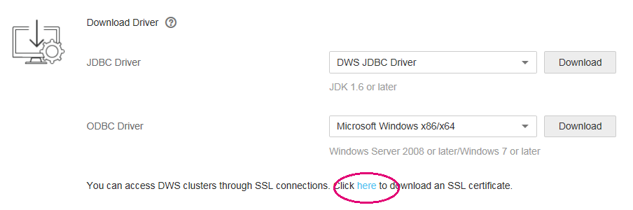

# Downloading the SSL Certificate File

DWS supports the standard SSL \(TLS 1.2\). As a highly secure protocol, SSL authenticates bidirectional identification between the server and client using digital signatures and digital certificates to ensure secure data transmission. To support SSL connection, DWS has obtained the formal certificates and keys for the server and client from the CA certification center. It is assumed that the key and certificate for the server are  **server.key**  and  **server.crt**  respectively; the key and certificate for the client are  **client.key**  and  **client.crt**  respectively, and the name of the CA root certificate is  **cacert.pem**. 

By default, the SSL function is enabled for a data warehouse cluster \(the server\) to allow SSL and non-SSL connections from the client. In addition, the certificate, private key, and root certificate of the server have been configured by default.

If the client or JDBC/ODBC driver needs to use SSL connection, you must configure related SSL connection parameters in the client or application code. The DWS management console provides the SSL certificate required by the client. The SSL certificate contains the default certificate, private key, root certificate, and private key password encryption file required by the client. Download the SSL certificate to the host where the client resides and specify the path of the certificate on the client.

> **NOTE:**   
>Using the default certificate may pose security risks. To improve system security, you are advised to periodically change the certificate to prevent password cracking. If you need to replace the certificate, contact the customer service personnel.  

This section describes how to download an SSL certificate.

## Downloading the SSL Certificate File

1.  Log in to the DWS management console.
2.  In the navigation tree on the left, click  **Connection Management**.
3.  In the  **Download Driver**  area, click  **here**  to download the SSL certificate file.

    **Figure  1**  Downloading the SSL certificate file  
    

