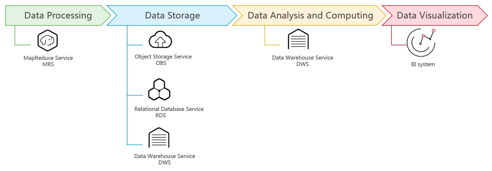

# DWS Access and Use

The following figure shows the process of using DWS.

**Figure  1**  Process of using DWS  

## Accessing a Cluster

DWS provides a web-based management console and HTTPS-compliant APIs for you to management data warehouse clusters.

## Accessing the Database in a Cluster

DWS supports database access using the following methods:

-   DWS client

    Use the DWS client to access the database in a cluster. For details, see  [Connecting to a Cluster](connecting_to_a_cluster).

-   Open-source PostgreSQL client

    The following lists compatible open-source clients:

    -   PostgreSQL psql 9.2.4 or later

        For more information, see  [https://www.postgresql.org/](https://www.postgresql.org/).

    -   pgAdmin

        For more information, see  [https://www.pgadmin.org/](https://www.pgadmin.org/).

    -   dbeaver

        For more information, see  [https://dbeaver.jkiss.org/download/](https://dbeaver.jkiss.org/download/).

    -   PostgreSQL psql 9.2.4 or later

        For more information, see  [https://www.postgresql.org/](https://www.postgresql.org/).

    -   pgAdmin

        For more information, see  [https://www.pgadmin.org/](https://www.pgadmin.org/).

    -   DBeaver

        For more information, see  [https://dbeaver.jkiss.org/download/](https://dbeaver.jkiss.org/download/).

-   Calling methods of interfaces such as JDBC and ODBC

    You can call standard interfaces, such as Java Database Connectivity \(JDBC\), Open Database Connectivity \(ODBC\), Python, and third-party psycopg2 to access databases in clusters.

    For details, see sections  [Using the JDBC and ODBC Drivers to Connect to the Cluster](using_the_jdbc_and_odbc_drivers_to_connect_to_the_cluster)  and  [Using the Third-Party Function Library psycopg2 of Python to Connect to a Cluster](using-the-third-party-function-library-psycopg2-of-python-to-connect-to-a-cluster.md).

## End-to-End Data Analysis Process

DWS has been seamlessly integrated with other services on the public cloud, helping you rapidly deploy end-to-end data analysis solutions.

[Figure 2](#fig85581940163219)  shows the end-to-end data analysis process. Services in use during each process are also displayed.

**Figure  2**  End-to-end data analysis process  

