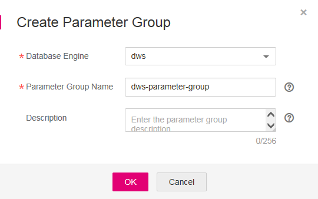

# Managing Parameter Groups

You can perform operations  [Creating a Parameter Group](#section14261524455),  [Modifying a Parameter Group](#section1957519408206),  [Deleting a Parameter Group](#section988984052114), and  [Changing the Parameter Group](#section2615131874812)  on the DWS management console.

## Parameter Group Overview

A parameter group is a collection of database parameters. You can set the parameters for a database to better adapt to the actual situation and run services. When creating or restoring a data warehouse cluster, you must specify a parameter group for the cluster. Parameters in the specified parameter group are applied to all databases in the cluster. After a cluster is created, you can change its parameter group to another one. However, you may need to restart the cluster to make the new parameter group take effect.

DWS has a default parameter group named  **Default-Parameter-Group-DWS**. The default parameter group cannot be deleted, and its parameters cannot be modified. If you want to modify a parameter value, create a customized parameter group. The parameters in the customized group can be modified.

After clusters created before version 1.2.3 are automatically upgraded to version 1.2.3 or later, parameter values in their parameter groups are set to values in the default parameter group. You can change the parameter group for each cluster.

## Parameter Group Parameters

**Table  1**  Parameter group parameters

<table><thead align="left"><tr id="row92716201567"><th class="cellrowborder" valign="top" width="23.762376237623762%" id="mcps1.2.4.1.1">
<strong id="b1993131717811">Parameter</strong>

</th>
<th class="cellrowborder" valign="top" width="47.524752475247524%" id="mcps1.2.4.1.2">
<strong id="b142745501728">Description</strong>

</th>
<th class="cellrowborder" valign="top" width="28.71287128712871%" id="mcps1.2.4.1.3">
<strong id="b42357640184919_1">Default Value</strong>

</th>
</tr>
</thead>
<tbody><tr id="row7273201611"><td class="cellrowborder" valign="top" width="23.762376237623762%" headers="mcps1.2.4.1.1 ">
session_timeout

</td>
<td class="cellrowborder" valign="top" width="47.524752475247524%" headers="mcps1.2.4.1.2 ">
Indicates the timeout interval for idle sessions. The unit is second. Value <strong id="b12915181220515">0</strong> indicates that the timeout limit is disabled.

</td>
<td class="cellrowborder" valign="top" width="28.71287128712871%" headers="mcps1.2.4.1.3 ">
600

</td>
</tr>
<tr id="row9271201464"><td class="cellrowborder" valign="top" width="23.762376237623762%" headers="mcps1.2.4.1.1 ">
query_dop

</td>
<td class="cellrowborder" valign="top" width="47.524752475247524%" headers="mcps1.2.4.1.2 ">
Indicates the user-defined query concurrency.

<ul id="ul89106417554"><li>Value <strong id="b858406141813">0</strong> indicates that the query concurrency is adaptive.</li><li>Value <strong id="b39331226152116">1</strong> indicates that query concurrency is disabled.</li><li>Value <strong id="b1816765410218">2</strong> indicates that the query concurrency degree is 2.</li></ul>
</td>
<td class="cellrowborder" valign="top" width="28.71287128712871%" headers="mcps1.2.4.1.3 ">
0

</td>
</tr>
<tr id="row10271220063"><td class="cellrowborder" valign="top" width="23.762376237623762%" headers="mcps1.2.4.1.1 ">
datestyle

</td>
<td class="cellrowborder" valign="top" width="47.524752475247524%" headers="mcps1.2.4.1.2 ">
Sets the format with which date and time values will be displayed.

</td>
<td class="cellrowborder" valign="top" width="28.71287128712871%" headers="mcps1.2.4.1.3 ">
ISO,MDY

</td>
</tr>
<tr id="row6271820468"><td class="cellrowborder" valign="top" width="23.762376237623762%" headers="mcps1.2.4.1.1 ">
failed_login_attempts

</td>
<td class="cellrowborder" valign="top" width="47.524752475247524%" headers="mcps1.2.4.1.2 ">
If the number of incorrect password attempts reaches the value of this parameter, the account is automatically locked. If this parameter is set to <strong id="b1473010218420">0</strong>, the number of consecutive incorrect password attempts is unlimited.

</td>
<td class="cellrowborder" valign="top" width="28.71287128712871%" headers="mcps1.2.4.1.3 ">
10

</td>
</tr>
<tr id="row5271202614"><td class="cellrowborder" valign="top" width="23.762376237623762%" headers="mcps1.2.4.1.1 ">
timezone

</td>
<td class="cellrowborder" valign="top" width="47.524752475247524%" headers="mcps1.2.4.1.2 ">
Indicates the time zone for displaying and interpreting time stamps.

</td>
<td class="cellrowborder" valign="top" width="28.71287128712871%" headers="mcps1.2.4.1.3 ">
UTC

</td>
</tr>
<tr id="row42710205610"><td class="cellrowborder" valign="top" width="23.762376237623762%" headers="mcps1.2.4.1.1 ">
log_timezone

</td>
<td class="cellrowborder" valign="top" width="47.524752475247524%" headers="mcps1.2.4.1.2 ">
Sets the time zone used for time stamps written in the server log.

</td>
<td class="cellrowborder" valign="top" width="28.71287128712871%" headers="mcps1.2.4.1.3 ">
UTC

</td>
</tr>
</tbody>
</table>

## Creating a Parameter Group

If parameters in the default parameter group cannot meet service requirements, you can customize a parameter group and modify the parameter values to better adapt to services.

To create a parameter group, perform the following steps:

1.  Log in to the management console at  [https://console.otc.t-systems.com/dws/](https://console.otc.t-systems.com/dws/).
2.  In the navigation tree on the left, click  **Parameter Group Management**.
3.  Click  **Create Parameter Group**  and set the following parameters:

    -   **Database Engine**: Select a database engine.
    -   **Parameter Group Name**: Enter the name of the new parameter group.

        Enter 4 to 64 characters. Only letters, digits, hyphens \(-\), underscores \(\_\), and periods \(.\) are allowed. The value must start with a letter. Letters are case-insensitive.

    -   **Description**: Enter the description of the new parameter group. This parameter is optional.

        The parameter group description contains 0 to 256 characters and does not support special characters !<\>'=&".

    **Figure  1**  Creating a parameter group  
    

4.  Click  **OK**  to start creating the parameter group.

## Modifying a Parameter Group

You can modify the parameter values in a user-defined parameter group but cannot modify the parameter values in the default parameter group.

1.  Log in to the management console at  [https://console.otc.t-systems.com/dws/](https://console.otc.t-systems.com/dws/).
2.  In the navigation tree on the left, click  **Parameter Group Management**.
3.  In the  **Name**  column, click the name of the target parameter group. The parameter list is displayed.
4.  Enter a new value in the  **Value**  column of the parameter to be modified. After the modification, click  **Save**.

    If you modify a parameter whose  **Restart Required**  column shows  **Yes**, you need to restart the cluster after saving the modification for the new parameter values to take effect.

5.  \(Optional\) If the modified parameters take effect only after the clusters are restarted, select  **Restart all clusters associated with the parameter group.**  in the displayed  **Modification Preview**  dialog box.

    If you do not select this option, the system saves only the parameter values. Then, you need to manually restart the clusters for the new parameter values to take effect.

    **Figure  2**  Modification Preview  
    

6.  In the  **Modification Preview**  dialog box, confirm the settings and click  **Save**.

## Deleting a Parameter Group

You can delete an unnecessary parameter group or a parameter group that is not used for a long time. The default parameter group cannot be deleted. Deleted parameter groups cannot be recovered. Exercise caution when performing this operation.

Before deleting a parameter group, ensure that it is not used by any cluster. Otherwise, it cannot be deleted. If the parameter group is used by a cluster, you need to change the parameter group to another one \(the default parameter group is recommended\) by performing steps in  [Changing the Parameter Group](#section2615131874812)  and delete the original parameter group.

1.  Log in to the management console at  [https://console.otc.t-systems.com/dws/](https://console.otc.t-systems.com/dws/).
2.  In the navigation tree on the left, click  **Parameter Group Management**.
3.  In the  **Operation**  column of the parameter group to be deleted, click  **Delete**.
4.  In the displayed dialog box, click  **OK**.

## Changing the Parameter Group

After a cluster is created, you can change its parameter group. After the change, you may need to restart the cluster to make the new parameter group take effect.

To change a parameter group, perform the following steps:

1.  Log in to the management console at  [https://console.otc.t-systems.com/dws/](https://console.otc.t-systems.com/dws/).
2.  In the navigation tree on the left, click  **Cluster Management**.
3.  In the  **Operation**  column of the target cluster, choose  **More \> Change Parameter Group**.
4.  In the  **Change Parameter Group**  dialog box, click the drop-down list on the right of  **New Parameter Group**  and select a new parameter group.
5.  Click  **OK**.

