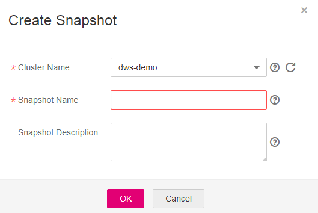

# Manually Creating a Snapshot

## Scenario

A snapshot is a complete backup that records point-in-time configuration data and service data of a data warehouse cluster. This section describes how to create a snapshot on the  **Snapshot Management**  page to back up cluster data.

## Impact on the System

-   The cluster cannot provide services correctly during snapshot creation. When the snapshot is being created, the cluster is in the  **Unavailable**  state for a short time. During snapshot creation, the cluster changes to the  **Read-only**  state. After snapshot is created, the cluster changes to the  **Available**  state.
-   A cluster for which a snapshot is being created cannot be restarted. To ensure integrity of the snapshot data, stop writing data to the cluster when you are creating a snapshot.

## Prerequisites

The cluster for which a snapshot is to be created must be in the  **Available**,  **Read-only**, or  **Low performance**  status.

## Procedure

1.  Log in to the DWS management console.
2.  In the navigation tree on the left, click  **Snapshot Management**.
3.  Click  **Create Snapshot**.

    -   **Cluster Name**: Select a data warehouse cluster from the drop-down list. The drop-down list only displays clusters that are in the  **Available**  state.
    -   **Snapshot Name**: Enter a snapshot name.

        The snapshot name must be 4 to 64 characters in length and start with a letter. It is case-insensitive and contains only letters, digits, hyphens \(-\), and underscores \(\_\).

    -   **Snapshot Description**: Enter the snapshot information.

        This parameter is optional. The snapshot description contains 0 to 256 characters and does not support special characters !<\>'=&".

    **Figure  1**  Creating a snapshot  
    

4.  Click  **OK**.

    Task status of the cluster for which you are creating a snapshot is  **Creating snapshot**. The status of the snapshot that is being created is  **Creating**. After the snapshot is created, its status becomes  **Available**.

    > **NOTE:**   
    >If the snapshot size is much greater than that of the data stored in the cluster, it is possible that data is labeled with a deletion tag, but is not cleared and reclaimed. Clear the data and create a snapshot again. For details, see section  [How Can I Clear and Reclaim the Storage Space?](how-can-i-clear-and-reclaim-the-storage-space.md).  

