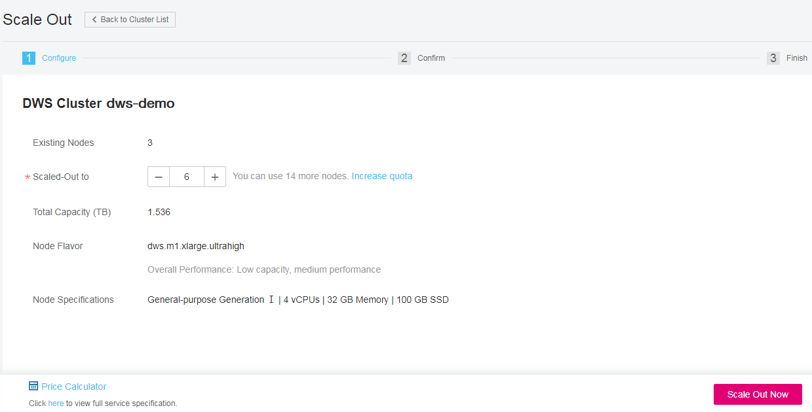

# Scaling Out a Cluster

When you need more computing and storage resources to meet service needs, add more nodes to the cluster on the management console.

## Impact on the System

-   Before the scale-out, exit the client connections that have created temporary tables because temporary tables created before or during the scale-out will become invalid and operations performed on these temporary tables will fail. Temporary tables created after the scale-out are not affected.
-   During the scale-out, functions such as cluster restart, scale-out, snapshot creation, administrator password resetting, and cluster deletion are disabled.
-   During the scale-out, the cluster automatically restarts. Therefore, the cluster stays  **Unavailable**  for a period of time. After the cluster is restarted, the cluster becomes  **Available**. During the last stage of the scale-out, the system dynamically distributes user data in the cluster to all nodes. During the distribution, the cluster is in the  **Read-only**  status and data cannot be written to it.

    During the redistribution, do not perform queries that take more than 20 minutes \(The default time for applying for the write lock during redistribution is 20 minutes\). Otherwise, data redistribution may fail due to timeout when waiting for locking. 

-   If a new snapshot is created for the cluster after the scale-out, the new snapshot contains data on the newly added nodes.
-   If the cluster scale-out fails, the database automatically performs the rollback operation in the background so that the number of nodes in the cluster can be restored to that before the scale-out.
    -   If the rollback is successful and the cluster can be normally used, you can perform  **Scale Out**  again. If the scale-out still fails, contact the technical support. 
    -   If the database fails to be rolled back due to some exceptions, the cluster may become  **Unavailable**. In this case, you cannot perform  **Scale Out**  or restart the cluster. Contact the technical support.

## Prerequisites

-   The cluster to be scaled out is in the  **Available**,  **Read-only**, or  **Low performance**  state.
-   The number of existing nodes in the cluster for which you want to scale out must be less than or equal to  **29**. If the number is greater than  **29**, you can click  the  **My Quota**  button  in the upper right corner of the management console and click  **Increase Quota**  in the upper right corner of  **Service Quota**  to increase the node quota. A cluster can house a maximum of 128 nodes.
-   The number of nodes to be added must be less than or equal to the available nodes. Otherwise, the system will prompt a message indicating that scale-out is not allowed. You can view the number of available nodes on the  **Cluster Management**  page.

## Scaling Out a Cluster

1.  Log in to the management console at  [https://console.otc.t-systems.com/dws/](https://console.otc.t-systems.com/dws/).
2.  Click  **Cluster Management**.

    All clusters are displayed by default.

3.  In the  **Operation**  column of the cluster for which you want to scale out, choose  **More**  \>  **Scale Out**.

    The scale-out page is displayed.

    **Figure  1**  Cluster scale-out  
    

4.  In the  **Scaled-Out to**  spin box, specify the number of nodes in the cluster.
    -   After the scale-out, the cluster's node quantity must be at least three nodes more than the original quantity. The maximum number of nodes that can be added depends on the available quota. In addition, the number of nodes after the scale-out cannot exceed 32.

        If the node quota is insufficient, click  **Increase quota**  to submit a work order and apply for higher node quota.

    -   Flavor of the new nodes must be the same as that of existing nodes in the cluster.
    -   The VPC, subnet, and security group of the cluster with new nodes added are the same as those of the original cluster.

5.  Click  **Scale Out Now**.

    > **NOTE:**   
    >If the number of applied nodes, vCPU \(cores\), or memory \(GB\) exceed the user's remaining quota, a warning dialog box is displayed indicating insufficient quota and displaying the detailed remaining quota and the current quota application information. In this case, you can click  **Increase quota**  in the warning dialog box to submit a work order and apply for higher node quota.  
    >For details about quota, see  [What Is User Quota?](what-is-user-quota.md).  

6.  Click  **Submit**.
    -   After the scale-out application is submitted,  **Task Status**  of the cluster changes to  **Scaling out**. The scale-out will take several minutes. During the scale-out, the cluster automatically restarts. Therefore,  **Cluster Status**  stays  **Unavailable**  for a period of time. After the cluster is restarted, the status becomes  **Available**. During the last stage of the scale-out, the system dynamically distributes user data in the cluster. During the distribution, the cluster is in the  **Read-only**  status.
    -   Nodes can be successfully added to the cluster only when  **Cluster Status**  is  **Available**  and  **Scaling out**  is not displayed in  **Task Information**  any more. Then the cluster begins providing services.
    -   If  **Task Information**  of the cluster is  **Scale-out failed**, the cluster scale-out fails. 

