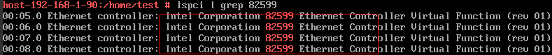
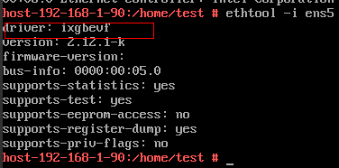

# Changing a General-Purpose ECS to an H1 ECS

## Scenarios

This section describes how to change a general-purpose \(S1, C1, C2, or M1\) ECS to an H1 \(high-computing first-generation\) ECS. H1 ECSs use SR-IOV for enhanced networking. Therefore, before changing the ECS type, manually configure the source ECS, install the required SR-IOV driver on it, and modify the specifications for network availability.

[Step 1: Configure the ECS and Enable SR-IOV for Enhanced Networking](#section72921455121017)

[Step 2: Modify Specifications](#section74848165402)

[Step 3: Verify the Specifications Modification](#section1294115365271)

## Notes

-   A general-purpose ECS supports up to 12 NICs, while an H1 ECS supports up to 4 NICs. Therefore, before changing the ECS type, ensure that the number of NICs of the general-purpose ECS is less than or equal to four.
-   After changing the ECS type, do not uninstall the driver. Otherwise, the H1 ECS may fail to access the network.
-   After the OS of an ECS is reinstalled or switched, the SR-IOV driver becomes invalid. If SR-IOV is required, reinstall the SR-IOV driver.
-   A general-purpose ECS running one of the following OSs can be changed to an H1 ECS:
    -   Windows Server 2016 DataCenter 64bit
    -   Windows Server 2016 Standard 64bit
    -   Windows Server 2012 Standard 64bit
    -   Windows Server 2012 DataCenter 64bit
    -   Windows Server 2012 R2 DataCenter 64bit
    -   Windows Server 2012 R2 Standard 64bit
    -   Windows Server 2012 R2 Essentials 64bit
    -   Windows Server 2008 R2 DataCenter 64bit
    -   Windows Server 2008 R2 DataCenter SP1 64bit
    -   Windows Server 2008 R2 Enterprise 64bit
    -   Windows Server 2008 R2 Enterprise SP1 64bit
    -   Windows Server 2008 R2 WEB 64bit
    -   Windows Server 2008 R2 Standard 64bit
    -   Windows Server 2008 R2 Standard SP1 64bit
    -   CentOS 6.3/6.4/6.5/6.6/6.7/6.8/6.9 64bit
    -   CentOS 7.0/7.1/7.2/7.3/7.4 64bit
    -   Debian 8.0/8.4/8.5/8.6 32bit
    -   Debian 8.0/8.4/8.5/8.6/8.8 64bit
    -   Debian 9.0 64bit
    -   OpenSUSE 42.3 64bit
    -   OpenSUSE 42.2 64bit
    -   Ubuntu Server 16.10 32bit
    -   Ubuntu Server 16.10/16.04.2/16.04 64bit
    -   SUSE Linux Enterprise Server 11 SP2/SP3/SP4 64bit
    -   SUSE Linux Enterprise Server 12 64bit
    -   SUSE Linux Enterprise Server 12 SP1/SP2/SP3 64bit
    -   Red Hat Linux Enterprise 6.8/6.9/7.0/7.2/7.3/7.4 64bit
    -   Fedora 25 64bit
    -   Fedora 26 64bit
    -   Oracle Enterprise Linux 6.8/6.9 64bit
    -   Oracle Enterprise Linux 7.3/7.4 64bit
    -   CoreOS 1185.5.0 64bit
    -   CoreOS 1298.5.0 64bit
    -   CoreOS 1298.6.0 64bit
    -   CoreOS 1298.7.0 64bit
    -   CoreOS 1353.8.0 64bit
    -   EulerOS 2.2 64bit

## Prerequisites

-   The available space in drive C of a Windows ECS is greater than 300 MB, and data can be written to it.

    The available space in root directory of a Linux ECS is greater than 300 MB, and data can be written to it.

-   DHCP is enabled in the VPC to which the ECS belongs.
-   The ECS network connectivity is normal.
-   The ECS security group rule in the outbound direction meets the following requirements:

    -   **Protocol**:  **TCP**
    -   **Port Range**:  **80**
    -   **Remote End**:  **169.254.0.0/16**

    If you use the default security group rule in the outbound direction, the preceding requirements are met, and the ECS can be initialized. The default security group rule in the outbound direction is as follows:

    -   **Protocol**:  **ANY**
    -   **Port Range**:  **ANY**
    -   **Remote End**:  **0.0.0.0/16**

## Step 1: Configure the ECS and Enable SR-IOV for Enhanced Networking

**Windows ECSs**

1.  Log in to the ECS as user  **Administrator**.
2.  Download an Intel NIC driver required by the OS running on the ECS.  [Table 1](#table183001557103)  lists the URLs for downloading the Intel NIC drivers required by the ECSs without an EIP bound.

    **Table  1**  URLs for downloading the Intel NIC drivers required by the ECSs without an EIP bound

    
    <table><thead align="left"><tr id="row83015553106"><th class="cellrowborder" valign="top" width="30.23%" id="mcps1.2.3.1.1">
OS

    </th>
    <th class="cellrowborder" valign="top" width="69.77%" id="mcps1.2.3.1.2">
How to Obtain

    </th>
    </tr>
    </thead>
    <tbody><tr id="row5303055151016"><td class="cellrowborder" valign="top" width="30.23%" headers="mcps1.2.3.1.1 ">
Linux

    </td>
    <td class="cellrowborder" valign="top" width="69.77%" headers="mcps1.2.3.1.2 ">
<a href="https://eu-de-sriov.obs.eu-de.otc.t-systems.com/osdriver/sriov/linux/sriov.zip" target="_blank" rel="noopener noreferrer">https://eu-de-sriov.obs.eu-de.otc.t-systems.com/osdriver/sriov/linux/sriov.zip</a>

    </td>
    </tr>
    <tr id="row23048553103"><td class="cellrowborder" valign="top" width="30.23%" headers="mcps1.2.3.1.1 ">
Windows Server 2008 R2

    </td>
    <td class="cellrowborder" valign="top" width="69.77%" headers="mcps1.2.3.1.2 ">
<a href="https://downloadcenter.intel.com/download/18725" target="_blank" rel="noopener noreferrer">https://downloadcenter.intel.com/download/18725</a>

    </td>
    </tr>
    <tr id="row13305155514106"><td class="cellrowborder" valign="top" width="30.23%" headers="mcps1.2.3.1.1 ">
Windows Server 2012

    </td>
    <td class="cellrowborder" valign="top" width="69.77%" headers="mcps1.2.3.1.2 ">
<a href="https://downloadcenter.intel.com/download/21694/Network-Adapter-Driver-for-Windows-Server-2012-" target="_blank" rel="noopener noreferrer">https://downloadcenter.intel.com/download/21694/Network-Adapter-Driver-for-Windows-Server-2012-</a>

    </td>
    </tr>
    <tr id="row530625514106"><td class="cellrowborder" valign="top" width="30.23%" headers="mcps1.2.3.1.1 ">
Windows Server 2012 R2

    </td>
    <td class="cellrowborder" valign="top" width="69.77%" headers="mcps1.2.3.1.2 ">
<a href="https://downloadcenter.intel.com/download/23073/Network-Adapter-Driver-for-Windows-Server-2012-R2-" target="_blank" rel="noopener noreferrer">https://downloadcenter.intel.com/download/23073/Network-Adapter-Driver-for-Windows-Server-2012-R2-</a>

    </td>
    </tr>
    <tr id="row73064554101"><td class="cellrowborder" valign="top" width="30.23%" headers="mcps1.2.3.1.1 ">
Windows Server 2016

    </td>
    <td class="cellrowborder" valign="top" width="69.77%" headers="mcps1.2.3.1.2 ">
<a href="https://downloadcenter.intel.com/download/26092/Ethernet-Intel-Network-Adapter-Driver-for-Windows-Server-2016-" target="_blank" rel="noopener noreferrer">https://downloadcenter.intel.com/download/26092/Ethernet-Intel-Network-Adapter-Driver-for-Windows-Server-2016-</a>

    </td>
    </tr>
    </tbody>
    </table>

    > **NOTE:**   
    >-   Intel driver 1.0.15.3 has been delivered with Windows Server 2012 R2. You are advised to use  **Pnputil.exe**  provided by the OS to upgrade the driver to the latest version.  
    >-   There are many restrictions on using a browser to download software for a Windows ECS. To improve the download efficiency, download the software to a Linux ECS and use a file server to share the software with the target Windows ECS.  

3.  Find the downloaded driver file in the  **Download**  folder and decompress it.
4.  Press  **Win+R**  and enter  **cmd**  to switch to CLI.
5.  Open the folder that contains the driver and run the following command to add and install the INF file in the driver store using Pnputil:
    -   Windows Server 2016

        **pnputil -i -a PROXGB\\Winx64\\NDIS65\\vxn65x64.inf**

    -   Windows Server 2012 R2

        **pnputil -i -a PROXGB\\Winx64\\NDIS64\\vxn64x64.inf**

    -   Windows Server 2012

        **pnputil -i -a PROXGB\\Winx64\\NDIS63\\vxn63x64.inf**

    -   Windows Server 2008 R2

        **pnputil -a PROXGB\\Winx64\\NDIS62\\vxn62x64.inf**

**Linux ECSs**

1.  Log in to the ECS.
2.  Run the following command to switch to user  **root**:

    **sudo su**

3.  Download the driver  **sriov.zip**  according to  [Table 1](#table183001557103).
4.  Switch to the directory in which the driver is downloaded and decompress  **sriov.zip**.
5.  Run the following command to configure the system so that it supports SR-IOV devices \(the  **/tmp**  directory is used as an example\):

    **bash /tmp/enable\_sriov.sh**

## Step 2: Modify the Specifications for Changing a General-Purpose ECS to an H1 ECS

1.  Log in to the management console.
2.  Click    in the upper left corner and select the desired region and project.
3.  Under  **Computing**, click  **Elastic Cloud Server**.
4.  On the  **Elastic Cloud Server**  page, view the status of the target ECS.

    If the ECS is not in  **Stopped**  state, click  **More**  in the  **Operation**  column and select  **Stop**.

5.  Click  **More**  in the  **Operation**  column and select  **Modify Specifications**.

    The  **Modify ECS Specifications**  page is displayed.

6.  Select the new ECS type, vCPUs, and memory as prompted.
7.  \(Optional\) Set  **DeH**.

    If the ECS is created on a DeH, the system allows you to change the DeH.

    To do so, select the target DeH from the drop-down list. If no DeH is available in the drop-down list, remaining DeH resources are insufficient and cannot be used to create the ECS with specifications modified.

8.  Select the check box to confirm the ECS configuration.
9.  Click  **OK**.
10. On the  **Modify ECS Specifications**  page, confirm the modified vCPU and memory specifications and click  **Submit**.

## Step 3: Verify the Specifications Modification

After the specifications are modified, check whether all NICs can be identified to verify the modification.

**Windows ECSs**

1.  Right-click  **My Computer**.
2.  Choose  **Properties**  \>  **Device Manager**.
3.  Check whether all NIC drivers in  **Network adapters**  are of the 82599 type.
    -   If yes, the enhanced SR-IOV network has taken effect, and the specifications have been modified.

        **Figure  1**  Enhanced network  
        

    -   If no, the NICs are unavailable. In such an event, right-click the NIC with a question mark \(?\) and choose  **update driver**  \>  **search automatically**  from the shortcut menu.

**Linux ECSs**

The methods of verifying specifications modification for CentOS and Ubuntu OSs are the same. If NIC drivers are ixgbevf and of the 82599 type, the SR-IOV enhanced network has been enabled and the specifications have been modified. To do so, perform the following operations:

1.  Run the following command to check whether the NIC drivers are of the 82599 type:

    **lspci | grep 82599**

    If the information marked in the red box of  [Figure 2](#fig1494810210216)  is displayed, the NIC drivers are of the 82599 type.

    **Figure  2**  82599 NIC drivers  
    

2.  Run the following command to check whether the drivers are ixgbevf:

    **ethtool -i  _$nic_**

    An example is provided as follows:

    If the NIC name is  **ens5**, run the following command:

    **ethtool -i ens5**

    

