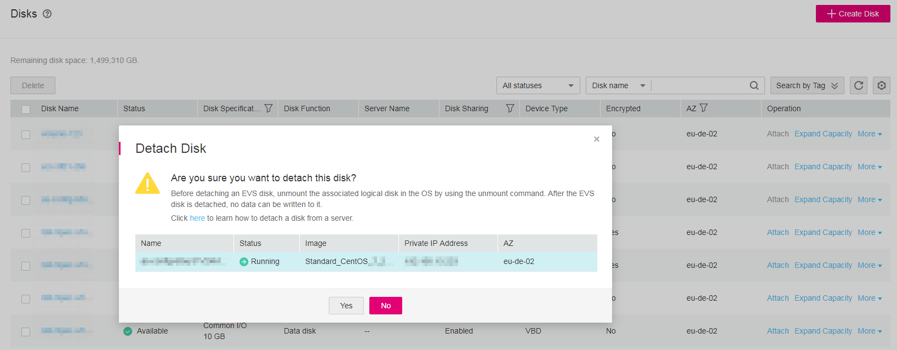
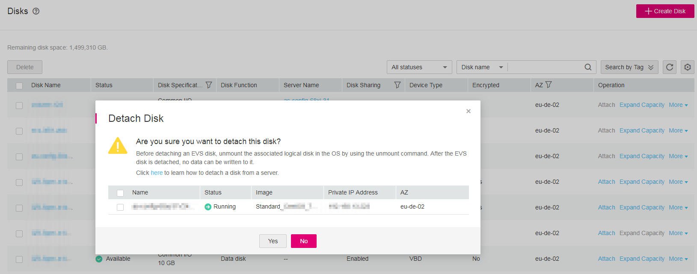

# Detaching a Data Disk

## Scenarios

Data disks can be detached online or offline, which means that the server containing the to-be-detached data disk can either be in the  **Running**  or  **Stopped**  state.

-   ECS

    Detach an EVS disk online. For details, see  **Storage**  \>  **Detaching an EVS Disk from a Running ECS**  in the  _Elastic Cloud Server User Guide_.

-   BMS

    Currently, SCSI disks can be attached to BMSs and used as data disks. You can detach a data disk either from a running or stopped BMS.

For a data disk attached to a server, the disk function is displayed as  **Data disk**, and the disk status is displayed as  **In-use**  in the disk list. After the data disk has been detached from the server, the disk function remains unchanged, the disk status changes to  **Available**  for a non-shared data disk, and the disk status changes to  **Available**  for a shared data disk after it is detached from all it servers.

## Prerequisites

-   Before detaching an EVS disk from a running Windows ECS, make sure that OTC tools have been installed on the ECS and that the tools are running properly.

-   Before detaching an EVS disk from a running Windows ECS, ensure that no program is reading data from or writing data to the disk. Otherwise, data will be lost.

-   Before detaching an EVS disk from a running Linux ECS, you must log in to the ECS and run the  **umount**  command to cancel the association between the disk and the file system. In addition, ensure that no program is reading data from or writing data to the disk. Otherwise, detaching the disk will fail.

## Detaching a Non-shared EVS Disk

1.  Log in to the management console.
2.  Click    in the upper left corner and select the desired region and project.
3.  Under  **Storage**, click  **Elastic Volume Service**.

    The disk list page is displayed.

4.  Determine whether to view the server information before detaching the disk.

    -   If you need to view the server information, perform the following procedure:
        1.  In the disk list, click the name of the to-be-detached disk.

            The disk details page is displayed.

        2.  Click the  **Attachments**  tab to view the server where the target disk has been attached.
        3.  Click    to select the server and click  **Detach Disk**.

            The  **Detach Disk**  dialog box is displayed, as shown in  [Figure 1](#fig146481428813).

            **Figure  1**  Detach Disk  
            

        4.  Click  **Yes**  to detach the disk.

    -   If you do not need to view the server information, perform the following procedure:
        1.  In the disk list, locate the row that contains the target disk and choose  **More**  \>  **Detach**  in the  **Operation**  column.

            The  **Detach Disk**  dialog box is displayed, as shown in  [Figure 2](#fig715496815241).

            **Figure  2**  Detach Disk dialog box  
            

        2.  Click  **Yes**  to detach the disk.

    The disk list is displayed. The disk status is  **Detaching**, indicating that the disk is being detached from the server.

    When the status changes to  **Available**, the EVS disk is successfully detached.

## Detaching a Shared EVS Disk

1.  Log in to the management console.
2.  Click    in the upper left corner and select the desired region and project.
3.  Under  **Storage**, click  **Elastic Volume Service**.

    The disk list page is displayed.

4.  Determine whether to view the server information before detaching the disk.

    -   If you need to view the server information, perform the following procedure:
        1.  In the disk list, click the name of the to-be-detached disk.

            The disk details page is displayed.

        2.  Click the  **Attachments**  tab to view the servers where the target disk has been attached.
        3.  Click    to select the server and click  **Detach Disk**.

            Shared EVS disks support batch detachment so that you can select multiple servers at a time.

            The  **Detach Disk**  dialog box is displayed, as shown in  [Figure 3](#fig10503132745).

            **Figure  3**  Detaching a shared disk  
            

        4.  Click  **Yes**  to detach the disk.

    -   If you do not need to view the server information, perform the following procedure:
        1.  In the disk list, locate the row that contains the target disk and choose  **More**  \>  **Detach**  in the  **Operation**  column.

            The  **Detach Disk**  dialog box is displayed, as shown in  [Figure 4](#fig36494313113211).

            **Figure  4**  Detaching a shared disk dialog box  
            

        2.  Click    to select the server.

            Shared EVS disks support batch detachment so that you can select multiple servers at a time.

        3.  Click  **Yes**  to detach the disk.

    The disk list is displayed. The disk status is  **Detaching**, indicating that the disk is being detached from the server.

    If the shared EVS disk has been attached to multiple servers and needs to be detached from only some of its servers, the disk status will go back to  **In-use**  after the disk has been detached from the target servers. The disk status changes to  **Available**  only when it has been detached from all the servers.

