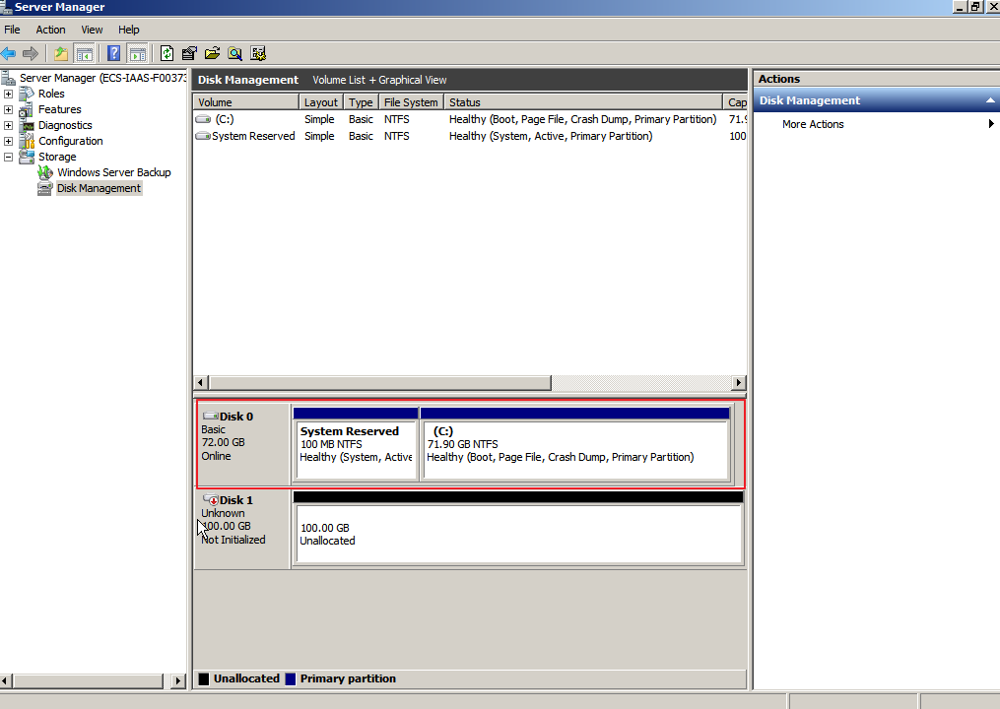

# Extending Disk Partitions and File Systems \(Windows\)

## Scenarios

After a disk has been expanded on the management console, only the disk storage capacity is enlarged, but its additional space cannot be used directly.

In Windows, you must allocate the additional space to an existing partition or a new partition.

This topic uses Windows Server 2008 R2 Enterprise 64bit as the sample OS to describe the expansion methods:

-   For a system disk:
    -   If volume \(C:\) already exists, you can add the additional space to volume \(C:\) and use it as a system volume. For details, see  [System Disk: Add Additional Space to Volume \(C:\)](#section56589192192644).
    -   If volume \(C:\) already exists, you can create a new volume such as volume \(F:\) with the additional space and use the new volume as a data volume. For details, see  [System Disk: Add Additional Space to New Volume \(F:\)](#section17412322419).

-   For a data disk:
    -   If volume \(D:\) already exists, you can add the additional space to volume \(D:\) and use it as a data volume. For details, see  [Data Disk: Add Additional Space to Volume \(D:\)](#section20686303192651).
    -   If volume \(D:\) already exists, you can create a new volume such as volume \(E:\) with the additional space and use the new volume as a data volume. For details, see  [Data Disk: Add Additional Space to New Volume \(E:\)](#section1971024320173).

The method for allocating the additional space varies depending on the server OS. This document is used for reference only. For the detailed operations and differences, see the corresponding OS documents.

> **NOTICE:**   
>Performing the expansion operations with caution. Misoperation may lead to data loss or exceptions. Therefore, you are advised to back up the disk data using backups or snapshots before expansion. For details about backups and snapshots, see  [Managing EVS Backup](managing-evs-backup.md)  and  [Creating a Snapshot](creating-a-snapshot.md), respectively.  

## Prerequisites

-   You have expanded the disk capacity and attached the disk to a server on the management console. For details, see  [Expanding Capacity for an In-use EVS Disk](expanding-capacity-for-an-in-use-evs-disk.md)  or  [Expanding Capacity for an Available EVS Disk](expanding-capacity-for-an-available-evs-disk.md).
-   You have logged in to the server.
    -   For how to log in to an ECS, see the  _Elastic Cloud Server User Guide_.
    -   For how to log in to a BMS, see the  _Bare Metal Server User Guide_.

## System Disk: Add Additional Space to Volume \(C:\)

In this example, the system disk has 50 GB originally, and 22 GB is added on the management console. The following procedure describes how to add this 22 GB to volume \(C:\) on the server. After the operation is complete, volume \(C:\) will have 72 GB of capacity and can be used as a system volume.

1.  On the desktop of the server, right-click  **Computer**  and choose  **Manage**  from the shortcut menu.

    The  **Server Manager**  window is displayed.

2.  In the navigation tree, choose  **Storage**  \>  **Disk Management**.

    The  **Disk Management**  window is displayed.

    **Figure  1**  Disk Management \(system disk\)  
    .png "disk-management-(system-disk)")

    > **NOTE:**   
    >If you cannot view the additional space, right-click  **Disk Management**  and choose  **Refresh**  from the shortcut menu.  

3.  On the  **Disk Management**  page, select the disk and volume that you want to extend. The current volume size and unallocated space are displayed.
4.  Right-click the target volume and choose  **Extend Volume**.

    **Figure  2**  Choosing  **Extend Volume**  
    

5.  On the displayed  **Extend Volume Wizard**  window, click  **Next**.

    **Figure  3**  Extend Volume Wizard  
    

6.  In the text box to the right of  **Select the amount of space in MB**, enter the amount of the additional space and click  **Next**.

    **Figure  4**  Selecting space  
    

7.  Click  **Finish**.

    After the expansion succeeded, the disk capacity is larger than the original capacity.

    **Figure  5**  Capacity expansion succeeded  
    

## System Disk: Add Additional Space to New Volume \(F:\)

In this example, the system disk has 40 GB originally, and 60 GB is added on the management console. The following procedure describes how to use this 60 GB to create a new volume, for example volume \(F:\), on the server. After the operation is complete, volume \(F:\) has 60 GB of capacity and can be used as a data volume.

1.  On the desktop of the server, right-click  **Computer**  and choose  **Manage**  from the shortcut menu.

    The  **Server Manager**  window is displayed.

2.  In the navigation tree, choose  **Storage**  \>  **Disk Management**.

    The  **Disk Management**  window is displayed.

    **Figure  6**  Refresh \(system disk\)  
    .png "refresh-(system-disk)")

3.  If you cannot view the additional space, right-click  **Disk Management**  and choose  **Refresh**  from the shortcut menu.

    After the refresh, the additional space is displayed in the right area and is unallocated.

    **Figure  7**  Unallocated disk space \(system disk\)  
    .png "unallocated-disk-space-(system-disk)")

4.  In the  **Unallocated**  area of  **Disk 0**, right-click the blank area and choose  **New Simple Volume**, as shown in  [Figure 8](#fig376153211419).

    **Figure  8**  New Simple Volume \(system disk\)  
    .png "new-simple-volume-(system-disk)")

5.  On the displayed  **New Simple Volume Wizard**  window, click  **Next**.

    **Figure  9**  New Simple Volume Wizard \(system disk\)  
    .png "new-simple-volume-wizard-(system-disk)")

6.  On the displayed  **Specify Volume Size**  page, set  **Simple volume size in MB**  and click  **Next**. In this example, the default size is used.

    **Figure  10**  Specify Volume Size \(system disk\)  
    .png "specify-volume-size-(system-disk)")

7.  On the displayed  **Assign Drive Letter and Path**  page, click  **Assign the following drive letter**, select a drive letter, and click  **Next**. In this example, drive letter  **F**  is selected.

    **Figure  11**  Assign Driver Letter or Path \(system disk\)  
    .png "assign-driver-letter-or-path-(system-disk)")

8.  On the displayed  **Format Partition**  page, click  **Format this volume with the following settings**, set parameters based on the requirements, and select  **Perform a quick format**. Then, click  **Next**.

    **Figure  12**  Format Partition \(system disk\)  
    .png "format-partition-(system-disk)")

9.  Click  **Finish**.

    After the operations are complete, new volume \(F:\) is displayed.

    **Figure  13**  Completing the New Simple Volume Wizard \(new volume F:\)  
    .png "completing-the-new-simple-volume-wizard-(new-volume-f-)")

    **Figure  14**  New Volume \(F:\)  
    .png "new-volume-(f-)")

## Data Disk: Add Additional Space to Volume \(D:\)

In this example, the data disk has 100 GB originally, and 50 GB is added on the management console. The following procedure describes how to add this 50 GB to volume \(D:\) on the server. After the operation is complete, volume \(D:\) has 150 GB of capacity and can be used as a data volume.

1.  On the desktop of the server, right-click  **Computer**  and choose  **Manage**  from the shortcut menu.

    The  **Server Manager**  window is displayed.

2.  In the navigation tree, choose  **Storage**  \>  **Disk Management**.

    The  **Disk Management**  window is displayed.

    **Figure  15**  Disk Management \(data disk\)  
    .png "disk-management-(data-disk)")

    > **NOTE:**   
    >If you cannot view the additional space, right-click  **Disk Management**  and choose  **Refresh**  from the shortcut menu.  

3.  On the  **Disk Management**  page, select the disk and volume that you want to extend. The current volume size and unallocated space are displayed.
4.  Right-click the target volume and choose  **Extend Volume**.

    **Figure  16**  Choosing Extend Volume \(Windows Server 2008\)  
    .png "choosing-extend-volume-(windows-server-2008)")

5.  On the displayed  **Extend Volume Wizard**  window, click  **Next**.

    **Figure  17**  Extend Volume Wizard \(Windows Server 2008\)  
    .png "extend-volume-wizard-(windows-server-2008)")

6.  In the text box to the right of  **Select the amount of space in MB**, enter the amount of the additional space and click  **Next**.

    **Figure  18**  Selecting space \(Windows Server 2008\)  
    .png "selecting-space-(windows-server-2008)")

7.  Click  **Finish**.

    After the expansion succeeded, the disk capacity is larger than the original capacity.

    **Figure  19**  Capacity expansion succeeded \(Windows Server 2008\)  
    .png "capacity-expansion-succeeded-(windows-server-2008)")

## Data Disk: Add Additional Space to New Volume \(E:\)

In this example, the data disk has 40 GB originally, and 60 GB is added on the management console. The following procedure describes how to use this 60 GB to create a new volume, for example volume \(E:\), on the server. After the operation is complete, volume \(E:\) has 60 GB of capacity and can be used as a data volume.

1.  On the desktop of the server, right-click  **Computer**  and choose  **Manage**  from the shortcut menu.

    The  **Server Manager**  window is displayed.

2.  In the navigation tree, choose  **Storage**  \>  **Disk Management**.

    The  **Disk Management**  window is displayed.

    **Figure  20**  Refresh \(data disk\)  
    .png "refresh-(data-disk)")

3.  If you cannot view the additional space, right-click  **Disk Management**  and choose  **Refresh**  from the shortcut menu.

    After the refresh, the additional space is displayed in the right area and is unallocated.

    **Figure  21**  Unallocated disk space \(data disk\)  
    .png "unallocated-disk-space-(data-disk)")

4.  In the  **Unallocated**  area of  **Disk 1**, right-click the blank area and choose  **New Simple Volume**.

    **Figure  22**  New Simple Volume \(data disk\)  
    .png "new-simple-volume-(data-disk)")

5.  On the displayed  **New Simple Volume Wizard**  window, click  **Next**.

    **Figure  23**  New Simple Volume Wizard \(data disk\)  
    .png "new-simple-volume-wizard-(data-disk)")

6.  On the displayed  **Specify Volume Size**  page, set  **Simple volume size in MB**  and click  **Next**. In this example, the default size is used.

    **Figure  24**  Specify Volume Size \(data disk\)  
    .png "specify-volume-size-(data-disk)")

7.  On the displayed  **Assign Drive Letter and Path**  page, click  **Assign the following drive letter**, select a drive letter, and click  **Next**. In this example, drive letter  **E**  is selected.

    **Figure  25**  Assign Driver Letter or Path \(data disk\)  
    .png "assign-driver-letter-or-path-(data-disk)")

8.  On the displayed  **Format Partition**  page, click  **Format this volume with the following settings**, set parameters based on the requirements, and select  **Perform a quick format**. Then, click  **Next**.

    **Figure  26**  Format Partition \(data disk\)  
    .png "format-partition-(data-disk)")

9.  Click  **Finish**.

    After the operations are complete, new volume \(E:\) is displayed.

    **Figure  27**  Completing the New Simple Volume Wizard \(new volume E:\)  
    .png "completing-the-new-simple-volume-wizard-(new-volume-e-)")

    **Figure  28**  New Volume \(E:\)  
    .png "new-volume-(e-)")

