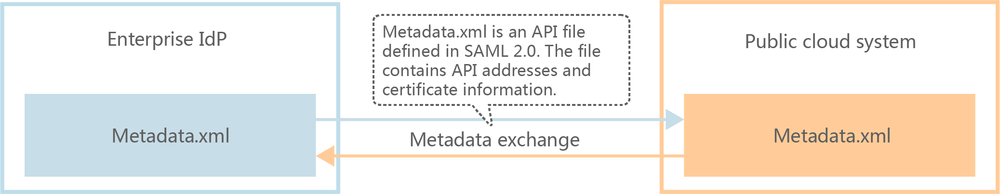
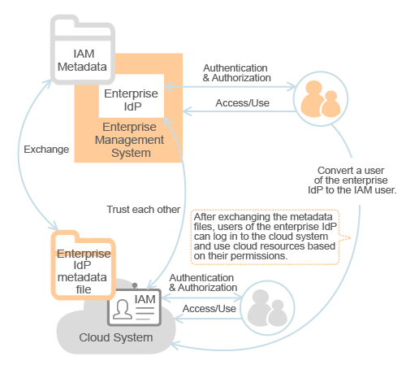

# Configuring Federated Identity Authentication

Federated identity authentication allows enterprise users to access the cloud system after being authenticated by the enterprise IdP.

> **NOTICE:**   
>The enterprise IdP server and the cloud system must use the same Universal Time Coordinated \(UTC\) time. Any time inconsistency will cause federated identity authentication failure.  

1.  Establish a trust relationship between the cloud system and the enterprise IdP. For details, see section  [Establishing a Trust Relationship](establishing-a-trust-relationship.md).

    **Figure  1**  Metadata file exchange model  
    

2.  On the IAM console, create an IdP. For details, see section  [Creating an IdP](creating-an-idp.md).
3.  On the IAM console, specify permissions for the enterprise IdP users to access the cloud system. For details, see section  [Using Rules to Control Federated User Access to the Cloud System](using-rules-to-control-federated-user-access-to-the-cloud-system.md).

    **Figure  2**  User conversion model  
    

4.  Configure a login link for the cloud system in the enterprise management system to achieve SSO. For details, see section  [Configuring SSO](configuring-sso.md).

    **Figure  3**  SSO configuration model  
    

    After logging in to the enterprise management system, enterprise IdP users can click the login link to access the resources in the cloud system.

5.  Configure the client or development tool to call APIs to access the cloud system.

