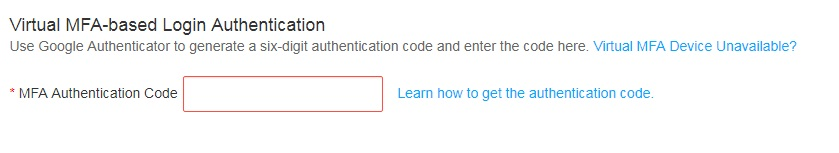

# How Do I Obtain MFA Authentication Codes?

When MFA is enabled, you need to enter an authentication code generated by your MFA application in addition to the username and password when logging in to the console.

**Figure  1**  MFA authentication code  

You need to open you MFA application and view the authentication code for the account bound to the application on the homepage of the application.

