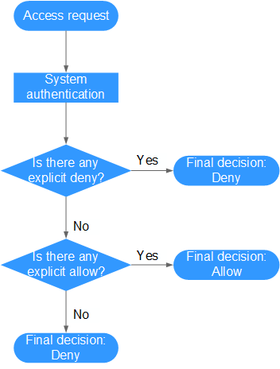

# Policy Language<a name="iam_01_0017"></a>

## Policy Content<a name="section106463610252"></a>

A fine-grained authorization policy consists of the policy version \(the  **Version**  field\) and authorization statement \(the  **Statement**  field\).

-   **Version**: Used to identify role-based access control \(RBAC\) policies and fine-grained policies.
    -   **1.0**: RBAC policies, which are preset in the system and used to grant permissions of each service as a whole. After such a policy is granted to a user, the user has all permissions of the corresponding service.
    -   **1.1**: Fine-grained policies, which enable more refined authorization based on service APIs. After such a policy is granted to a user, the user can only perform specific operations on the corresponding service. Fine-grained policies are classified into default and custom policies.
        -   Default policies: Preset common permission sets to control read and administrator permissions of different services.
        -   Custom policies: Permission sets created and managed by users as an extension and supplement of default policies. For example: A custom policy can be created to allow users only to modify ECS specifications.


-   **Statement**: Detailed information about a policy, containing the  **Effect**  and  **Action**  elements.

    -   Effect

        Valid values for Effect include Allow and Deny. In a custom policy that contains both Allow and Deny statements, the Deny statements take the precedence.

    -   Action

        The value can be one or more resource authorization items.

        The value format is  _Service name_:_Resource type_:_Action_, for example,  **vpc:ports:create**.

    > **NOTE:**   
    >-   _Service name_: indicates the product name, such as  **ecs**,  **evs**, or  **vpc**. Only lowercase letters are allowed.  
    >-   _Resource type_  and  _Action_: The values are case-insensitive, and the wildcard \(\*\) are allowed. A wildcard \(\*\) can represent all or part of information about resource types and actions for the specific service.  


## Example Policies<a name="section44276331103751"></a>

-   A policy can define a single permission, such as the permission to query ECS details.

    ```
    {
          "Version": "1.1",
          "Statement": [
                {
                      "Effect": "Allow",
                      "Action": [
                            "ecs:servers:list",
                            "ecs:servers:get",
                            "ecs:serverVolumes:use",
                            "ecs:diskConfigs:use",
                            "ecs:securityGroups:use",
                            "ecs:serverKeypairs:get",
                            "vpc:securityGroups:list",
                            "vpc:securityGroups:get",
                            "vpc:securityGroupRules:get",
                            "vpc:networks:get",
                            "vpc:subnets:get",
                            "vpc:ports:get",
                            "vpc:routers:get"
                      ]
                }
          ]
    }
    ```

-   A policy can define multiple permissions, such as the permissions to lock ECSs and create EVS disks.

    ```
    {
        "Version": "1.1",
          "Statement": [
                {
                      "Effect": "Allow",
                      "Action": [
                            "ecs:servers:lock",
                            "evs:volumes:create"
                      ]
                }
          ]
    }
    ```

-   The following example shows how to use the wildcard \(\*\) to define all permissions on Image Management Service \(IMS\) resources.

    ```
    {
            "Version": "1.1",
            "Statement": [
                    {
                            "Action": [
                                    "ims:*:*",
                                    "ecs:*:list",
                                    "ecs:*:get",
                                    "evs:*:get"
                            ],
                            "Effect": "Allow"
                    }
            ]
    }
    ```


-   
## Authentication Logic<a name="section565017773111"></a>

IAM authenticates users according to the permissions that have been granted to them. The authentication logic is as follows:

**Figure  1**  Authentication logic<a name="fig4148178111014"></a>  


> **NOTE:**   
>The actions in each policy bear the OR relationship.  

1.  A user accesses the system and initiates an operation request.
2.  IAM evaluates all the access policies that have been granted to the user.
3.  In these policies, IAM looks for explicit deny instructions. If IAM finds an explicit deny that applies, it returns a decision of Deny, and the authentication ends.
4.  If no explicit deny is found, IAM looks for Allow instructions that would apply to the request. If IAM finds an explicit permit that applies, it returns a decision of Allow, and the authentication ends.
5.  If no explicit permit is found, IAM returns a decision of Deny, and the authentication ends.

