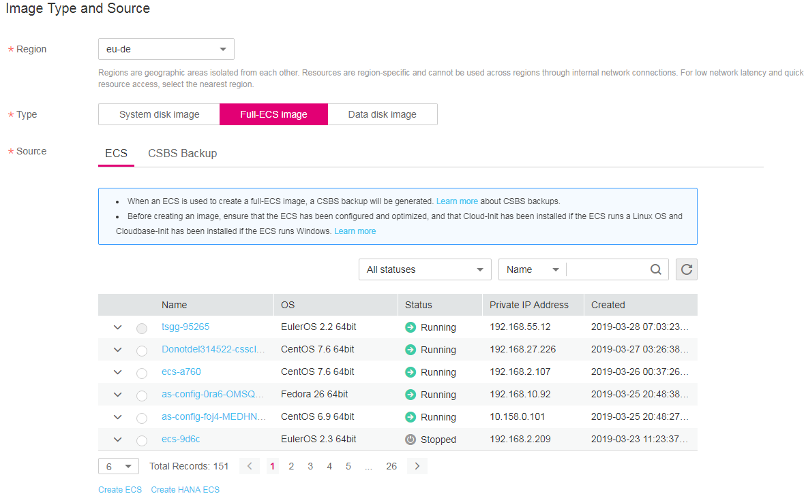

# Creating a Full-ECS Image from an ECS

## Scenarios

You can use an ECS with data disks to create a  full-ECS image, which contains an OS, application software, your service data and can be used to quickly provision identical ECSs for data migration. The ECS used to create the full-ECS image can be in the  **Running**  state.

> **NOTE:**   
>When an ECS is used to create a full-ECS image, a CSBS backup is created for the ECS and then used to create the image. Therefore, it takes some time to create the full-ECS image.  

## Constraints

-   When creating a full-ECS image from an ECS, ensure that the ECS has been properly configured. Otherwise, creating ECSs using the full-ECS image may fail.
-   Only a running or stopped ECS can be used to create a full-ECS image.
-   A Windows ECS used to create a full-ECS image cannot have a spanned volume. Otherwise, data may be lost when the full-ECS image is used to create ECSs.
-   A Linux ECS used to create a full-ECS image cannot have a disk group or logical disk that contains multiple physical disks. Otherwise, data may be lost when the full-ECS image is used to create ECSs.
-   If a full-ECS image is available in an AZ, it can be used to create ECSs only in this AZ.
-   If a full-ECS image is available in a region, the full-ECS image can be used to create ECSs only in this region.
-   The system disk cannot be detached during full-ECS image creation.
-   A full-ECS image cannot be shared with other tenants.
-   A full-ECS image cannot be published as a Marketplace image.
-   A full-ECS image cannot be exported or replicated.
-   When creating a full-ECS image using a Windows ECS, you need to change the SAN policy of the ECS to OnlineAll. Otherwise, EVS disks attached to the ECSs created using the image may be offline.

    Windows has three types of SAN policies:  **OnlineAll**,  **OfflineShared**, and  **OfflineInternal**.

    **Table  1** SAN policies  in Windows

    
    <table><thead align="left"><tr id="en-us_topic_0089178278_row1115619943013"><th class="cellrowborder" valign="top" width="15%" id="mcps1.2.3.1.1">
<strong id="b842352706201211">Type</strong>

    </th>
    <th class="cellrowborder" valign="top" width="85%" id="mcps1.2.3.1.2">
<strong id="b842352706105039">Description</strong>

    </th>
    </tr>
    </thead>
    <tbody><tr id="en-us_topic_0089178278_row151561899304"><td class="cellrowborder" valign="top" width="15%" headers="mcps1.2.3.1.1 ">
OnlineAll

    </td>
    <td class="cellrowborder" valign="top" width="85%" headers="mcps1.2.3.1.2 ">
Indicates that all newly detected disks are automatically brought online.

    </td>
    </tr>
    <tr id="en-us_topic_0089178278_row16156149183018"><td class="cellrowborder" valign="top" width="15%" headers="mcps1.2.3.1.1 ">
OfflineShared

    </td>
    <td class="cellrowborder" valign="top" width="85%" headers="mcps1.2.3.1.2 ">
Indicates that all disks on sharable buses, such as iSCSI and FC, are left offline by default, while disks on non-sharable buses are kept online.

    </td>
    </tr>
    <tr id="en-us_topic_0089178278_row41567943014"><td class="cellrowborder" valign="top" width="15%" headers="mcps1.2.3.1.1 ">
OfflineInternal

    </td>
    <td class="cellrowborder" valign="top" width="85%" headers="mcps1.2.3.1.2 ">
Indicates that all newly detected disks are left offline as default.

    </td>
    </tr>
    </tbody>
    </table>

    1.  Execute  **cmd.exe**  and run the following command to query the current SAN policy of the ECS using DiskPart:

        **diskpart**

    2.  Run the following command to view the SAN policy of the ECS:

        **san**

        -   If the SAN policy is  **OnlineAll**, run the  **exit**  command to exit DiskPart.

        -   If the SAN policy is not  **OnlineAll**, go to  [3](#en-us_topic_0089178278_li15110228143312).

    3.  Run the following command to change the SAN policy of the ECS to OnlineAll:

        **san policy=onlineall**

## Procedure

1.  Log in to the management console.
2.  Under  **Computing**, click  **Image Management Service**.

    The IMS console is displayed.

3.  In the upper right corner, click  **Create Image**.
4.  In the  **Image Type and Source**  area, select  **Full-ECS image**  for  **Type**.
5.  Select  **ECS**  for  **Source**  and then select an ECS from the list.

    **Figure  1**  Creating a full-ECS image using an ECS  
    

6.  In the  **Image Information**  area, set basic information, such as the image name and description.
7.  Click  **Create Now**.
8.  Confirm the parameters and click  **Submit**.

    When the image status changes to  **Normal**, the creation is successful.

9.  Switch back to the  **Image Management Service**  page to view the image status.

    When the image status changes to  **Normal**, the creation is successful.

## Follow-up Operations

-   If you want to use the full-ECS image to create ECSs, click  **Apply for Server**  in the  **Operation**  column. On the displayed page, create ECSs by following the instructions in  _Elastic Cloud Server User Guide_.

    > **NOTE:**   
    >If the full-ECS image contains one or more data disks, the system automatically configures data disk parameters when you use the image to create ECSs.  

