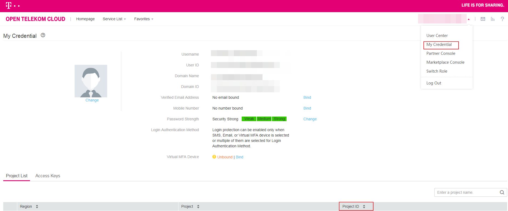

# Obtaining the Project ID

## Scenarios

Before you share an image with a tenant, you must obtain the project ID from the tenant.

## Procedure

1.  Log in to the management console.
2.  Hover the mouse over the username in the upper right corner and select  **My Credentials**  from the drop-down list.

    On the  **My Credentials**  page, view the project ID in the project list.

    **Figure  1**  Viewing the project ID  
    

