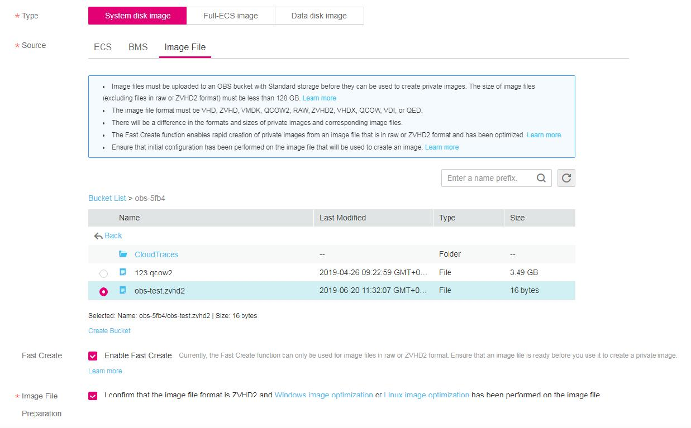

# Quickly Importing an Image File \(Windows\)

## Scenarios

This section describes how to quickly import an image file in Windows. You are advised to use a local PC running Windows for converting image formats and generating bitmap files.

In Windows, use the open-source  **qemu-img**  tool to convert image formats.  **qemu-img**  supports conversion between image files of the VHD, VMDK, QCOW2, RAW, VHDX, QCOW, VDI, and QED formats. Therefore, convert an image to the RAW format and then use  **CreateMF.jar**  in the fast import tool to generate a bitmap file.

## Prerequisites

-   The image file has been optimized. For details, see  [Optimization Process](optimization-process-(windows).md)  or  [Optimization Process](optimization-process-(linux).md). In addition, ensure that the image file meets the requirements in  [Table 1](preparing-an-image-file-(windows).md#table85212269215)  or  [Table 1](preparing-an-image-file-(linux).md#table85212269215).

    > **NOTE:**   
    >Select the reference content based on the OS type in the image file.  

-   An OBS bucket has been created on the management console, and OBS Browser has been downloaded.

## Procedure

1.  Install the open-source image conversion tool  **qemu-img**.
2.  Run the  **cmd**  command to go to the  **qemu-img**  installation directory and run the  **qemu-img**  command to convert the image file to the RAW format.

    For example, run the following command to convert an  **image.qcow2**  file to an  **image.raw**  file:

    **qemu-img convert -p -O raw image.qcow2 image.raw**

3.  Use the fast import tool to generate a bitmap file.
    1.  Obtain the fast import tool and decompress it.

        Obtain the fast import tool from the following link in the table.

        **Table  1**  Fast import tool package

        
        <table><thead align="left"><tr id="row996618490249"><th class="cellrowborder" valign="top" width="26.840000000000003%" id="mcps1.2.3.1.1">
Tool Package

        </th>
        <th class="cellrowborder" valign="top" width="73.16%" id="mcps1.2.3.1.2">
How to Obtain

        </th>
        </tr>
        </thead>
        <tbody><tr id="row1596614496243"><td class="cellrowborder" valign="top" width="26.840000000000003%" headers="mcps1.2.3.1.1 ">
quick-import-tools

        </td>
        <td class="cellrowborder" valign="top" width="73.16%" headers="mcps1.2.3.1.2 ">
<a href="https://obs-20181128.ims.obs.eu-de.otc.t-systems.com/DT-image-convert-tools.zip" target="_blank" rel="noopener noreferrer">https://obs-20181128.ims.obs.eu-de.otc.t-systems.com/DT-image-convert-tools.zip</a>

        </td>
        </tr>
        </tbody>
        </table>

    2.  Ensure that JDK has been installed in the current environment.

        You can verify the installation by performing the following operation:

        Run  **cmd.exe**  and then  **java -version**. If Java version information is displayed, JDK has been installed.

    3.  Go to the directory where  **CreateMF.jar**  is stored.

        For example, if you have downloaded  **CreateMF.jar**  to  **D:/test**, run the following commands to access the directory:

        **D:**

        **cd test**

    4.  Run the following command to generate the bitmap file corresponding to the image file in the RAW format:

        **java -jar CreateMF.jar D:/image01.raw D:/image01.mf**

4.  Use OBS Browser to upload files to the OBS bucket.

    You must upload the RAW image file and its bitmap file to the same OBS bucket.

5.  Register a private image.

    You can register a private image using the converted ZVHD2 or RAW file on the console or using an API.

    Method 1: Create a private image on the console.

    1.  Log in to the management console.
    2.  Under  **Computing**, click  **Image Management Service**.

        The IMS console is displayed.

    3.  In the upper right corner, click  **Create Image**.
    4.  In the  **Image Type and Source**  area, select  System disk image  or  **Data disk image**  for  **Type**.
    5.  Select  **Image File**  for  **Source**. Select the bucket storing the ZVHD2 or RAW image file and then select the image file. If the image file is in the RAW format, you also need to select its bitmap file.
    6.  Select  **Enable Fast Create**, ensure that the image file has been optimized, and select the sentence following  **Image File Preparation**.

        **Figure  1**  Importing an image file quickly  
        

    7.  Set parameters as prompted.

        For details about the parameters, see  [Registering an External Image File as a Private Image](registering-an-external-image-file-as-a-private-image-(windows).md)  and  [Registering an External Image File as a Private Image](registering-an-external-image-file-as-a-private-image-(linux).md).

        > **NOTICE:**   
        >-   The OS must be the same as that in the image file.  
        >-   The size of the system disk must be greater than the size in the image file.  
        >    You can use the  **qemu-img-hw**  tool to query for the image file size.  
        >    **qemu-img-hw** **info** _test.zvhd2_  

    Method 2: Create a private image using an API.

    You can use the POST /v2/cloudimages/quickimport/action API to quickly import an image file.

    For details about how to call this API, see "Creating an Image from an Image File Using the Fast Image Creation Function" in  _Image Management Service API Reference_.

