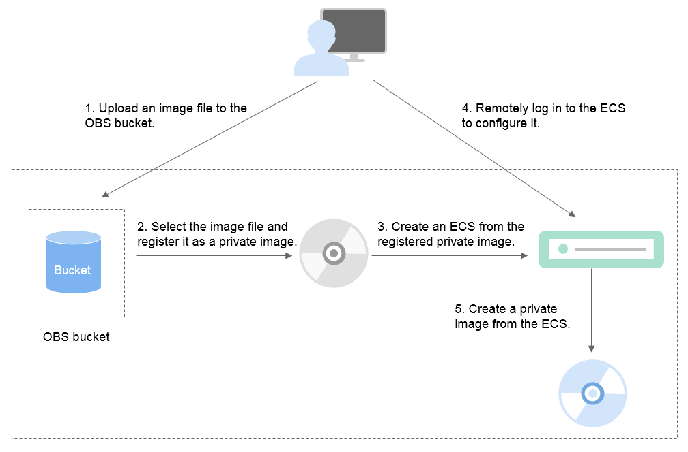

# What Do I Do If the Initial Configurations of a Linux External Image File Are Not Completed Before the File Is Exported?

The ECS where the external image file is located is not configured as instructed in  [Table 1](preparing-an-image-file-(linux).md#table85212269215)  before the image file is exported. You are advised to follow the process in  [Figure 1](#fig18196115421120)  to configure the ECS.

**Figure  1**  Image creation process  

## Step 1: Upload the Image File

Upload the external image file to the OBS bucket. For details, see  [Uploading an External Image File](uploading-an-external-image-file-(linux).md).

## Step 2 Register the External Image File as a Private Image

On the management console, select the uploaded image file and register it as an uninitialized private image. For details, see  [Registering an External Image File as a Private Image](registering-an-external-image-file-as-a-private-image-(linux).md).

## Step 3: Create an ECS

Create an ECS from the uninitialized private image.

1.  Log in to the management console.
2.  Under  **Computing**, click  **Image Management Service**.

    The  **Private Images**  page is displayed.

3.  Click the  **Private Images**  tab to display the image list.
4.  Locate the row that contains the uninitialized private image and click  **Apply for Server**  in the  **Operation**  column.
5.  Set parameters as promoted to create the ECS. Pay attention to the following:

    -   You must add inbound rules for the security group of the ECS to ensure that the ECS can be accessed.
    -   If Cloud-Init has been installed in the image file, set a login password as prompted. If Cloud-Init is not installed, use the password or certificate contained in the image file to log in.

    For details, see  _Elastic Cloud Server User Guide_.

6.  Perform the following steps to check whether the private image is available:

    1.  Check whether the ECS can start successfully. If yes, the native Xen and KVM drivers required by the ECS have been automatically installed on the cloud platform. If no, install the native Xen and KVM drivers by referring to  [3](#li32851343163416)  in  [Step 4: Configure the ECS](#section51410413191).
    2.  Check whether you can log in to the ECS using your configured password or key. If yes, Cloud-Init has been installed. If no, use the password or key contained in the image file to log in to the ECS and install Cloud-Init as instructed in  [Installing Cloud-Init](installing-cloud-init.md).
    3.  Check the network configuration by referring to  [Step 4: Configure the ECS](#section51410413191).

    If the ECS meets the preceding requirements, the private image is available. You can clear the environment as instructed in  [\(Optional\) Clear the Environment](#section1353318394289).

## Step 4: Configure the ECS

Remotely log in to the ECS created in  [Step 3: Create an ECS](#section1762434871317)  to configure the network and install drivers.

1.  Log in to the ECS.
2.  Configuring the network.
    -   Run the  **ifconfig**  command to check whether the private IP address of the ECS is the same as that displayed on the console. If they are inconsistent, delete files in the network rule directory as instructed in  [Deleting Files in the Network Rule Directory](deleting-files-in-the-network-rule-directory.md).
    -   Check whether the NIC is set to DHCP. If the ECS is configured with a static IP address, change its IP address assignment mode to DHCP as instructed in  [Setting the NIC to DHCP \(Linux\)](setting-the-nic-to-dhcp-(linux).md).
    -   Run the  **service sshd status**  command to check whether the SSH service is enabled. If it is disabled, run the  **service sshd start**  command to enable it. Ensure that your firewall \(for example, Linux iptables\) allows SSH access.

3.  Install drivers.

    To ensure the network performance and basic functions of the ECS created from the private image, you must install native Xen and KVM drivers on the ECS from which the image is created. Before installing native Xen and KVM drivers, uninstall the PV driver.

    > **NOTE:**   
    >It is recommended that you disable your antivirus and intrusion detection software. You can enable the software again after Xen and KVM drivers are installed.  

    -   Uninstall the PV driver. For details, see  [Uninstalling the PV Driver from a Linux ECS](uninstalling-the-pv-driver-from-a-linux-ecs.md).
    -   Install native Xen and KVM drivers. For details, see  [Installing Native Xen and KVM Drivers](installing-native-xen-and-kvm-drivers.md).

    After the drivers are installed, you need to clear log files and historical records. For details, see  [Clearing System Logs](clearing-system-logs-(linux).md).

4.  Configure a file system.
    -   Change the disk identifier of the GRUB configuration file to UUID. For details, see  [Changing the Disk Identifier in the GRUB Configuration File to UUID](changing-the-disk-identifier-in-the-grub-configuration-file-to-uuid.md).
    -   Change the disk identifier of the fstab file to UUID. For details, see  [Changing the Disk Identifier in the fstab File to UUID](changing-the-disk-identifier-in-the-fstab-file-to-uuid.md).
    -   Clear the automatic attachment information of non-system disks in the  **/etc/fstab**  file to prevent impacts on subsequent data disk attachment. For details, see  [Detaching Data Disks from an ECS](detaching-data-disks-from-an-ecs.md).

5.  \(Optional\) Configure value-added functions.
    -   Install and configure Cloud-Init. For details, see  [Installing Cloud-Init](installing-cloud-init.md)  and  [Configuring Cloud-Init](configuring-cloud-init.md).
    -   Enable NIC multi-queue. For details, see  [How Do I Set NIC Multi-Queue Feature of an Image?](how-do-i-set-nic-multi-queue-feature-of-an-image.md).

## Step 5: Create an Image from the ECS

Create a private image from the ECS. For details, see  [Creating a System Disk Image from a Linux ECS](creating-a-system-disk-image-from-a-linux-ecs.md).

## \(Optional\) Clear the Environment

In the preceding steps, the uninitialized image file and created ECS occupy storage and computing resources. Therefore, you are advised to clear the environment after the image is registered.

-   Delete the uninitialized image registered in  [Step 2 Register the External Image File as a Private Image](#section4198749842).
-   Delete the ECS created in  [Step 3: Create an ECS](#section1762434871317).
-   Delete the image files stored in the OBS bucket.

