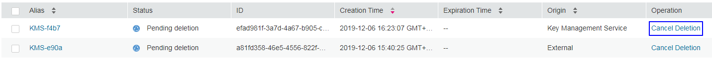

# Canceling the Scheduled Deletion of One or Multiple CMKs

## Scenario

This section describes how to use the management console to cancel the scheduled deletion of one or multiple CMKs prior to deletion execution.

## Prerequisites

-   You have obtained an account and its password for logging in to the management console.
-   The CMK for which you want to cancel the scheduled deletion is in  **Pending deletion**  status.

## Procedure

-   Canceling the scheduled deletion of one CMK

1.  Log in to the management console.
2.  Click    in the upper left corner of the management console and select a region or project.
3.  Choose  **Security**  \>  **Key Management Service**. The  **Key Management Service**  page is displayed.
4.  In the row containing the desired CMK, click  **Cancel Deletion**.

    **Figure  1**  Canceling the scheduled deletion of one CMK  
    

5.  In the displayed dialog box, click  **OK**  to cancel the scheduled deletion for the CMK.

    -   If the CMK is created using KMS generated material, its status becomes  **Disabled**  after the cancelation. To enable the CMK, see  [Enabling One or Multiple CMKs](enabling-one-or-multiple-cmks.md).
    -   If the CMK is created using imported material, its status becomes  **Disabled**  after the cancelation. To enable the CMK, see  [Enabling One or Multiple CMKs](enabling-one-or-multiple-cmks.md).
    -   If the CMK is created using imported material and no key material has been imported for it, its status becomes  **Pending import**  after the cancelation. To use the CMK, perform  [Creating CMKs Using Imported Key Material](creating_cmks_using_imported_key_material).

-   Canceling the scheduled deletion of multiple CMKs

1.  Log in to the management console.
2.  Click    in the upper left corner of the management console and select a region or project.
3.  Choose  **Security**  \>  **Key Management Service**. The  **Key Management Service**  page is displayed.
4.  In the list of CMKs, select desired CMKs and click  **Cancel Deletion**.

    **Figure  2**  Canceling the scheduled deletion of multiple CMKs  
    

5.  In the displayed dialog box, click  **Yes**  to cancel the scheduled deletion for the CMKs.

    -   If the CMK is created using KMS generated material, its status becomes  **Disabled**  after the cancelation. To enable the CMK, see  [Enabling One or Multiple CMKs](enabling-one-or-multiple-cmks.md).
    -   If the CMK is created using imported material, its status becomes  **Disabled**  after the cancelation. To enable the CMK, see  [Enabling One or Multiple CMKs](enabling-one-or-multiple-cmks.md).
    -   If the CMK is created using imported material and no key material has been imported for it, its status becomes  **Pending import**  after the cancelation. To use the CMK, perform  [Creating CMKs Using Imported Key Material](creating_cmks_using_imported_key_material).

