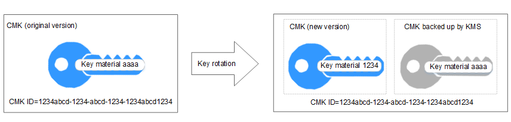

# Context

Security risks exist when a DEK is extensively and repeatedly used. For security purposes, you can configure KMS to create new key materials for the CMK.

New key materials can be created in two methods:

-   Manual key rotation

    Create a CMK on the KMS management console to replace the original CMK.

    > **NOTE:**   
    >If cloud services \(such as OBS\) use a CMK to encrypt and decrypt data, you need to create a new CMK on the KMS management console and replace the original one used for KMS encryption on OBS Console.  

-   Automatic key rotation

    Enable rotation for an existing CMK so that KMS automatically generates new key material for the CMK.

    Key rotation only changes the key material of a CMK. The CMK's attributes \(such as ID, alias, description, and permissions settings\) remain unchanged.

    The key rotation function enables KMS to automatically rotate CMKs according to the specified rotation interval \(365 days by default\). For a CMK with the key rotation function enabled, a new version is generated upon each rotation. See  [Figure 1](#fig9231144353)  for details.

    **Figure  1**  Working principle of key rotation  
    

    KMS retains all versions associated of the CMK, so that you can decrypt any ciphertext encrypted using the CMK.

    -   KMS uses the latest version of the CMK to encrypt data.
    -   KMS uses the same version of the CMK to decrypt data as that used to encrypt the data.

    **Table  1**  Key rotation modes

    
    <table><thead align="left"><tr id="row3231184420513"><th class="cellrowborder" valign="top" width="24.08%" id="mcps1.2.3.1.1">
Key Type

    </th>
    <th class="cellrowborder" valign="top" width="75.92%" id="mcps1.2.3.1.2">
Support for Key Rotation

    </th>
    </tr>
    </thead>
    <tbody><tr id="row152325447513"><td class="cellrowborder" valign="top" width="24.08%" headers="mcps1.2.3.1.1 ">
Default Master Key

    </td>
    <td class="cellrowborder" valign="top" width="75.92%" headers="mcps1.2.3.1.2 ">
Keys cannot be rotated.

    </td>
    </tr>
    <tr id="row1023219447513"><td class="cellrowborder" valign="top" width="24.08%" headers="mcps1.2.3.1.1 ">
Imported CMK

    </td>
    <td class="cellrowborder" valign="top" width="75.92%" headers="mcps1.2.3.1.2 ">
Keys can only be rotated manually.

    </td>
    </tr>
    <tr id="row202328441951"><td class="cellrowborder" valign="top" width="24.08%" headers="mcps1.2.3.1.1 ">
Disabled CMK

    </td>
    <td class="cellrowborder" valign="top" width="75.92%" headers="mcps1.2.3.1.2 ">
KMS does not rotate disabled CMKs and keeps their rotation status unchanged. After a CMK is enabled, if the backup CMK has been used for longer than the rotation period, KMS will immediately rotate keys. If the backup CMK has been used for shorter than the rotation period, KMS will implement the original rotation plan.

    </td>
    </tr>
    <tr id="row1123215449515"><td class="cellrowborder" valign="top" width="24.08%" headers="mcps1.2.3.1.1 ">
CMK in pending deletion status

    </td>
    <td class="cellrowborder" valign="top" width="75.92%" headers="mcps1.2.3.1.2 ">
KMS does not rotate CMKs in pending deletion status. After you cancel the deletion of a CMK, the previous key rotation status will be restored. If the backup CMK has been used for longer than the rotation period, KMS will immediately rotate keys. If the backup CMK has been used for shorter than the rotation period, KMS will implement the original rotation plan.

    </td>
    </tr>
    </tbody>
    </table>

