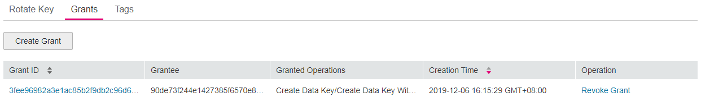

# Creating a Grant

## Scenario

You can create grants for other users to use the CMK. You can create a maximum of 100 grants for a CMK.

The owner of a CMK can create a grant for the CMK on the KMS management console or by making the API calls. A user, who has been granted with the grant creation permission by the owner of the CMK, can create grants for the CMK only by making the API calls.

## Prerequisites

-   You have obtained an account and its password for logging in to the management console.
-   You have obtained the user ID of the grantee \(user to whom permissions are to be authorized\).
-   The desired CMK is in  **Enabled**  status.

## Procedure

1.  Log in to the management console.
2.  Click    in the upper left corner of the management console and select a region or project.
3.  Choose  **Security**  \>  **Key Management Service**. The  **Key Management Service**  page is displayed.
4.  Click the alias of the desired CMK to go to the page displaying its details. You can create grants on the  **Grants**  tab page.

    **Figure  1**  Grants tab  
    

5.  Click  **Create Grant**. The  **Create Grant**  dialog box is displayed.

    **Figure  2**  Creating a grant  
    

6.  In the dialog box that is displayed, enter the ID of the user to be authorized and select permissions to be granted.

    > **NOTICE:**   
    >A grantee can perform the authorized operations only by calling the necessary API. For details, see the  _Key Management Service API Reference_.  

    **Table  1**  Parameter description

    
    <table><thead align="left"><tr id="row30007999105354"><th class="cellrowborder" valign="top" width="20.79%" id="mcps1.2.4.1.1">
<strong>Parameter</strong>

    </th>
    <th class="cellrowborder" valign="top" width="57.769999999999996%" id="mcps1.2.4.1.2">
<strong id="b842352706193336">Description</strong>

    </th>
    <th class="cellrowborder" valign="top" width="21.44%" id="mcps1.2.4.1.3">
<strong id="b842352706191839">Example Value</strong>

    </th>
    </tr>
    </thead>
    <tbody><tr id="row66499537105354"><td class="cellrowborder" valign="top" width="20.79%" headers="mcps1.2.4.1.1 ">
Key ID

    </td>
    <td class="cellrowborder" valign="top" width="57.769999999999996%" headers="mcps1.2.4.1.2 ">
ID of a CMK (automatically read by the system)

    </td>
    <td class="cellrowborder" valign="top" width="21.44%" headers="mcps1.2.4.1.3 ">
-

    </td>
    </tr>
    <tr id="row57352501105354"><td class="cellrowborder" valign="top" width="20.79%" headers="mcps1.2.4.1.1 ">
Grantee

    </td>
    <td class="cellrowborder" valign="top" width="57.769999999999996%" headers="mcps1.2.4.1.2 ">
The user ID of the grantee is required.

    
 NOTE: 

The user IDs are provided by grantees who can obtain their IDs by clicking their portraits and choosing <strong id="b842352706153032">My Credential</strong> &gt; <strong id="b842352706153036">User ID</strong>.

    

    </td>
    <td class="cellrowborder" valign="top" width="21.44%" headers="mcps1.2.4.1.3 ">
d9a6b2bdaedd4ba586cabe6372d1b312

    </td>
    </tr>
    <tr id="row26165823105354"><td class="cellrowborder" valign="top" width="20.79%" headers="mcps1.2.4.1.1 ">
Granted Operations

    </td>
    <td class="cellrowborder" valign="top" width="57.769999999999996%" headers="mcps1.2.4.1.2 ">
The following permissions can be authorized:

    
 NOTE: 
<ul id="ul11971183416718"><li>You can create multiple grants on a CMK to provide different permissions to the same user. The user's permissions on the CMK are the combination of all the grants.</li><li>This parameter cannot be left blank.</li><li><strong id="b842352706111632">Create Grant</strong> cannot be selected exclusively.</li></ul>
    

    <ul id="ul2209518113624"><li><strong id="b842352706154510">Create Data Key Without Plaintext</strong></li><li><strong id="b84235270615163">Create Data Key</strong></li><li><strong id="b842352706151612">Encrypt Data Key</strong></li><li><strong id="b842352706151616">Decrypt Data Key</strong></li><li><strong id="b842352706151627">Query Key Information</strong></li><li><strong id="b842352706151632">Create Grant</strong></li><li><strong id="b842352706151544">Retire Grant</strong><ul id="ul168911571675"><li>A grantee can retire a grant if the grantee does not need that permission.</li><li>If, before retiring a grant, the grantee has granted the permission to another user, that user's permission will not be affected by the grant retirement.</li></ul>
    </li></ul>
    </td>
    <td class="cellrowborder" valign="top" width="21.44%" headers="mcps1.2.4.1.3 ">
-

    </td>
    </tr>
    </tbody>
    </table>

7.  Click  **OK**. When message  **Grant of  _key alias_  created successfully**  is displayed in the upper right corner, the grant has been created.

    In the list of grants, you can view the grant ID, grantee ID, granted operation, and creation time of the grant.

